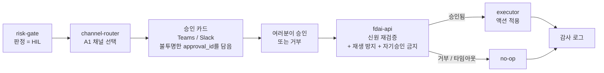

# 승인과 알림 채널(Approvals and channels)

FDAI는 승격된 저위험 이벤트를 사람 없이 처리하도록 설계되었으며, 고위험 이벤트는
사람의 검토를 기다립니다. 이 페이지에서는 **시스템이 여러분에게 도달하는 방식**을
설명합니다. 어떤 채널이 승인 요청을 전달하는지, 유출된 메시지가 왜 유효한 승인이 될 수 없는지,
그리고 승인이 타임아웃되거나 모든 채널이 다운되면 무슨 일이 벌어지는지.

오퍼레이터 콘솔은 **읽기 전용**입니다. 상태와 대기 중인 승인 큐를 렌더링하지만
권한이 필요한 호출은 하지 않습니다. 여러분은 콘솔의 버튼을 눌러 승인하지 않습니다. 승인은
여러분이 이미 쓰는 채널(Teams, Slack)이나 수정 PR을 통해 전달됩니다 -
결코 콘솔의 신원으로는 아닙니다.

## 네 가지 메시지 종류

FDAI가 사람에게 보내는 모든 것은 **카테고리 태그**를 지니며, 각 카테고리는 신뢰와
방향에 대한 고유한 규칙을 가집니다.

| 카테고리 | 방향 | 예시 | 전달 가능한 채널 |
|----------|------|------|---------------------|
| **A1 - 승인** | 여러분이 결정하고 결과가 시스템으로 반환됨 | 고위험 액션 승인, enforce 승격, 면제(exemption), 오버라이드 | 신원이 검증된 채널만 |
| **A2 - 알림** | 발신 전용 | SLO 소진, 데드레터 적체, 드리프트, 비정상 어댑터 | 페이징 포함 모든 채널 |
| **A3 - 챗 명령** | 여러분이 묻고, 시스템이 답함 | `status`, `shadow-report`, `override draft` | 명령별 역할 게이팅 |
| **A4 - 다이제스트** | 발신 전용 | 일간 shadow 정확도, 주간 회고, 월간 KPI + 비용 | 수신 범위 한정, 모든 채널 |

핵심 경계는 **A1**(결정이 돌아옴)과 나머지 사이입니다. A2, A4, 읽기 전용 A3는
정보만 전달하고 승인 권한은 전달하지 않으므로 신뢰도가 낮은 채널로도 보낼 수 있습니다.

## 승인이 여러분에게 도달하는 방식

안전성 검토가 액션을 **사람 승인**로 분류하면([risk-tiers-ko.md](risk-tiers-ko.md)
참고) FDAI는 실행을 멈추고 A1 가능 채널로 승인 요청을 라우팅합니다. 여러분이
승인하거나 거부해야만 executor가 동작합니다.

이를 안전하게 만드는 두 가지 속성:

- **메시지는 결정을 담지 않습니다.** 카드는 특정 대기 액션에 묶인 불투명한
  `approval_id`를 지닐 뿐, 액션 페이로드를 담지 않습니다. 실제 결정은
  `fdai-api`로 되돌아가며, 여기서 여러분을 재인증하고 `idempotency_key` +
  `action_hash`를 재검사합니다. 따라서 전달되거나 유출된 카드는 유효한 승인이
  **아닙니다**.
- **승인과 실행은 별개의 주체입니다.** 승인하는 사람은 결코 executor가 아니며,
  어떤 에이전트도 판단과 실행을 동시에 하지 않습니다. 자기승인은 없습니다.

## 승인 요청이 증명하는 것

A1 요청은 운영자의 결정을 변경할 수 없는 하나의 대기 액션에 연결합니다. 승인 레코드에는
다음 정보가 포함됩니다:

- 불투명한 `approval_id`, 이벤트 ID, correlation ID.
- 요청을 저장할 때 캡처한 action hash와 idempotency key.
- 요청자, 승인 가능한 역할, 자기 승인 금지 검사 결과.
- 필요한 정족수, 현재 결정 수, 요청 TTL.
- 정확한 액션 버전, 대상 범위, 롤백 참조.

액션 페이로드, 범위, 버전이 바뀌면 대기 요청은 무효가 됩니다. FDAI는 다른 액션에 기존
동의를 재사용하지 않고 새 요청을 만듭니다.

## 저장, 결정, 안전한 재개

사람 승인은 사람이 판단하는 동안 이벤트 consumer를 차단하지 않습니다. FDAI는 대기 액션을
저장하고 이벤트 루프로 돌아갑니다. 유효한 승인이 도착하면 신원, hash, 역할, 정족수,
TTL, replay 방지 검사를 통과한 뒤 저장된 액션을 정확히 한 번 재개합니다.

거부와 시간 초과는 요청을 감사되는 no-op으로 종료합니다. 중복 승인 응답은 idempotent하게
처리합니다. 충돌하는 응답은 거부하고 검토 대상으로 표시하며 두 실행이 경쟁하게 하지
않습니다. 되돌릴 수 없는 액션은 서로 다른 승인자 두 명의 정족수가 필요합니다.

## 신뢰 등급이 나뉜 채널

채널은 여러분의 신원을 처음부터 끝까지 증명할 수 있을 때만 승인을 전달할 수 있습니다.
정보성 트래픽은 훨씬 덜 까다롭습니다.

| 채널 | 승인(A1)을 나를 수 있는가? | 함께 나르는 것 |
|------|----------------------------|----------------|
| **Teams (동일 테넌트)** | 예 - 검증된 Entra 신원 | A2, A3, A4 |
| **Slack** (Entra-OID 매핑 있을 때) | 예 - 승인이 `fdai-api`를 거쳐 재인증됨 | A2, A3, A4 |
| **이메일** | 아니오 | A2, A4만 |
| **웹훅** | 아니오 | A2만 |
| **PagerDuty / Opsgenie / SMS** | 아니오 | A2만 - 호출 채널 |

매직 링크 승인은 어떤 채널에서도 지원되지 않습니다. 승인은 항상 `fdai-api`를 거친
재인증 왕복을 요구합니다. 여러분이 누구인지 검증할 수 없는 채널은 정보를 줄 수는
있어도 승인 결정을 전달할 수는 없습니다.

## on-call, 에스컬레이션, 타임아웃

불확실할 때는 안전한 쪽을 선택합니다. 사람이 응답하지 않았다고 해서 자동 실행되는 일은
없습니다.

- **모든 A1 요청에는 마감 시한(TTL)이 있습니다.** 시간 내에 결정이 오지 않으면
  그 요청은 **no-op**이 되고 - 액션은 실행되지 않습니다 - FDAI는 감사 항목과 A2
  알림을 기록합니다. 안전하게 닫히며 자동 실행으로 전환되지 않습니다.
- **폴백은 신뢰 등급 안에 머뭅니다.** 실패한 Teams 승인이 이메일로 떨어지는 일은
  없습니다. 다른 A1 가능 채널로, 도달 가능한 채널이 없으면 **사람 승인 큐**로
  넘어갑니다.
- **모든 A1 채널이 다운되면** 요청은 큐에 쌓이고 **운영 레인을 페이징**합니다
  (PagerDuty / Opsgenie / SMS) - 그래도 결코 자동 실행되지 않습니다.
- **kill-switch**는 모든 A1 발송을 즉시 중단하고 열려 있는 승인을 다시 대기열에 넣을 수
  있습니다. 흐름을 한 번에 멈춰야 하는 경우를 위한 장치입니다.

## 메시지 수신 대상

FDAI는 사용자별로 수신자 목록을 만들지 않습니다. **각 채널이 하나의 수신 대상
그룹**이며,
멤버십은 컨트롤 플레인 바깥에서 관리됩니다 - 보통 채널을 Entra 보안 그룹(예:
`aw-approvers`)에 바인딩하는 방식입니다. Entra에서 그 그룹에 사람을 추가하는 것이
그를 승인 채널에 올리는 행위입니다. 컨트롤 플레인은 그 그룹을 읽을 뿐, 자체 사본을
유지하지 않습니다.

## 배포 환경에서 구성할 항목

FDAI는 채널 계약, 라우팅 카테고리, 신원 검사, idempotent한 승인 lifecycle, 감사 필드를
제공합니다. 각 배포 환경은 자체 자격 증명, 채널 ID, Entra 그룹 바인딩, Slack과 Entra의
신원 매핑, 수신자 멤버십, TTL, 에스컬레이션 대상을 제공합니다. 이 값은 일반 목적의
업스트림 저장소 밖에서 관리합니다.

## 여러분은 승인-거부 수준에 머뭅니다

- **승격된 저위험 액션은 자동 처리할 수 있습니다.** Stop-condition, 롤백 경로,
  영향 범위 제한, 감사 항목을 갖춥니다. 실제 커버리지는 배포 환경에서 측정한 결과입니다.
- **고위험 액션은 여러분의 승인을 기다리고**, 여러분은 이미 쓰는 채널에서 결정합니다.
  거부와 타임아웃은 둘 다 no-op이며 감사 로그에 기록됩니다.
- 여러분은 executor의 특권 신원을 결코 쥐지 않고도 챗 명령이나 내레이터를 통해
  **질문**할 수 있습니다.

## 다음 단계

| 알고 싶은 것 | 읽을 문서 |
|--------------|-----------|
| 승인/거부 엔드투엔드 워크스루 | [../guides/approve-change-ko.md](../guides/approve-change-ko.md) |
| 액션이 AUTO / 사람 승인 / DENY로 분류되는 방식 | [risk-tiers-ko.md](risk-tiers-ko.md) |
| 여러분의 승인을 나르는 에이전트와 실행하는 주체 | [agents-and-self-healing-ko.md](agents-and-self-healing-ko.md) |
| 전체 채널 추상화, 신뢰 매트릭스, 라우팅 정책 | [../../roadmap/interfaces/channels-and-notifications-ko.md](../../roadmap/interfaces/channels-and-notifications-ko.md) |
