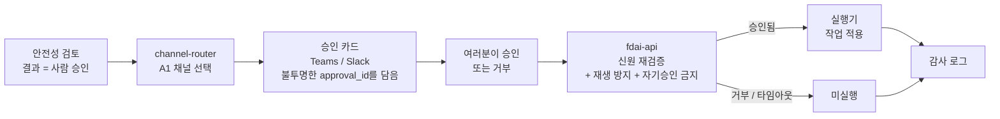

# 승인과 알림 채널(Approvals and channels)

FDAI는 승격된 저위험 이벤트를 사람 없이 처리하고, 고위험 이벤트는 사람의 검토를
기다립니다. 이 페이지에서는 **시스템이 여러분에게 도달하는 방식**을 설명합니다. 어떤
채널이 승인 요청을 나를 수 있는지, 유출된 메시지가 왜 유효한 승인이 될 수 없는지,
그리고 승인이 시간 초과되거나 모든 채널이 멈추면 어떻게 되는지 다룹니다.

운영자 콘솔은 **읽기 전용**입니다. 상태와 승인 대기 목록을 보여 주지만 권한이 필요한
호출은 하지 않습니다. 여러분은 콘솔의 버튼을 눌러 승인하지 않습니다. 승인은 여러분이
이미 쓰는 Teams나 Slack 같은 채널, 또는 수정 pull request로 전달됩니다. 콘솔의 신원은
쓰지 않습니다.

## 네 가지 메시지 종류

FDAI가 사람에게 보내는 모든 메시지는 **카테고리 태그**를 지니며, 각 카테고리는 신뢰와
방향에 대한 고유한 규칙을 가집니다.

| 카테고리 | 방향 | 예시 | 전달 가능한 채널 |
|----------|------|------|---------------------|
| **A1, 승인** | 여러분이 결정하고 결과가 시스템으로 돌아옴 | 고위험 작업 승인, 적용 모드 승격, 면제, 오버라이드 | 신원이 검증된 채널만 |
| **A2, 알림** | 발신 전용 | SLO 소진, 데드레터 적체, 드리프트, 비정상 어댑터 | 페이징 포함 모든 채널 |
| **A3, 챗 명령** | 여러분이 묻고 시스템이 답함 | `status`, `shadow-report`, `override draft` | 명령별 역할 게이팅 |
| **A4, 다이제스트** | 발신 전용 | 일간 관찰 정확도, 주간 회고, 월간 KPI와 비용 | 수신 범위 한정, 모든 채널 |

핵심 경계는 결정이 돌아오는 **A1**과 나머지 사이입니다. A2, A4, 읽기 전용 A3는 정보만
전달하고 권한은 전달하지 않으므로 신뢰도가 낮은 채널로도 보낼 수 있습니다.

## 챗 명령이 거부될 때

A3 명령은 채널이 아니라 명령 단위로 역할 게이팅됩니다. FDAI는 여러분을 대신해 도구를 호출하기
전에, narrator가 자연어를 명령으로 번역한 경우에도 여러분의 역할을 그 도구가 요구하는 최소
역할과 비교합니다. 역할이 미달하면 도구까지 도달하지 않습니다. FDAI는 호출을 거부하고 그 이유를
설명하는 감사 가능한 시스템 turn을 기록하며, tool-call turn은 만들어지지 않습니다.

예시: Contributor가 Bragi에게 "보류 중인 사람 승인 항목을 승인해줘"라고 요청했는데, 이 명령은
Approver 역할이 필요합니다. FDAI는 이렇게 답합니다: `Tool access denied: 'approve_hil'
requires role 'approver'; current role is 'contributor'. No tool was called.` 당직 중이거나
페이징 채널로 연락 가능한 상태라고 해서 이 최소 역할이 올라가지는 않습니다.

## 승인이 여러분에게 도달하는 방식

안전성 검토가 작업을 **사람 승인**으로 분류하면([risk-tiers-ko.md](risk-tiers-ko.md)
참고) FDAI는 실행을 멈추고 A1 가능 채널로 승인 요청을 보냅니다. 여러분이 승인하거나
거부해야만 실행기가 움직입니다.

```mermaid
flowchart LR
  RG["안전성 검토<br/>결과 = 사람 승인"] --> R["channel-router<br/>A1 채널 선택"]
  R --> C["승인 카드<br/>Teams / Slack<br/>불투명한 approval_id를 담음"]
  C --> H["여러분이 승인<br/>또는 거부"]
  H --> API["fdai-api<br/>신원 재검증<br/>+ 재생 방지 + 자기승인 금지"]
  API -->|승인됨| EX["실행기<br/>작업 적용"]
  API -->|거부 / 타임아웃| NO["미실행"]
  EX --> AUD["감사 로그"]
  NO --> AUD
```

이를 안전하게 만드는 두 가지 속성이 있습니다.

- **메시지는 결정을 담지 않습니다.** 카드는 특정 대기 작업에 묶인 불투명한
  `approval_id`를 지닐 뿐, 작업 페이로드를 담지 않습니다. 실제 결정은
  `fdai-api`로 되돌아가며, 여기서 여러분을 다시 인증하고 `idempotency_key`와
  `action_hash`를 다시 검사합니다. 따라서 전달되거나 유출된 카드는 유효한 승인이
  **아닙니다**.
- **승인과 실행은 별개의 주체입니다.** 승인하는 사람은 결코 실행기가 아니며,
  어떤 에이전트도 판단과 실행을 동시에 하지 않습니다. 자기 승인은 불가능합니다.

## 승인 요청이 증명하는 것

A1 요청은 여러분의 결정을 바꿀 수 없는 하나의 대기 작업에 연결합니다. 승인 레코드에는
다음이 들어갑니다.

- 불투명한 `approval_id`, 이벤트 ID, correlation ID
- 요청을 저장할 때 캡처한 action hash와 idempotency key
- 요청자, 승인 가능한 역할, 자기 승인 금지 검사 결과
- 필요한 정족수, 현재 결정 수, 요청의 유효 시간
- 정확한 작업 버전, 대상 범위, 롤백 참조

작업 페이로드, 범위, 버전이 바뀌면 대기 요청은 무효가 됩니다. FDAI는 다른 작업에 기존
동의를 재사용하지 않고 새 요청을 만듭니다.

## 저장, 결정, 안전한 재개

사람을 기다리는 동안 이벤트 소비자가 멈추지는 않습니다. FDAI는 대기 작업을 저장하고
이벤트 루프로 돌아갑니다. 유효한 승인이 도착하면 신원, hash, 역할, 정족수, 유효 시간,
재생 방지 검사를 통과한 뒤 저장된 작업을 딱 한 번 재개합니다.

거부와 시간 초과는 요청을 감사되는 미실행으로 닫습니다. 중복 승인 응답은 다시 보내도
안전합니다. 충돌하는 응답은 거부하고 검토 대상으로 표시하며, 두 실행이 경쟁하게 하지
않습니다. 되돌릴 수 없는 작업은 서로 다른 승인자 두 명의 정족수가 필요합니다.

## 신뢰 등급이 나뉜 채널

채널은 여러분의 신원을 처음부터 끝까지 증명할 수 있을 때만 승인을 전달할 수 있습니다.
정보성 트래픽은 훨씬 덜 까다롭습니다.

| 채널 | 승인(A1)을 나를 수 있는가? | 함께 나르는 것 |
|------|----------------------------|----------------|
| **Teams (동일 테넌트)** | 예, 검증된 Entra 신원으로 | A2, A3, A4 |
| **Slack** (Entra OID 매핑이 있을 때) | 예, 승인이 `fdai-api`를 거쳐 재인증됨 | A2, A3, A4 |
| **이메일** | 아니오 | A2, A4만 |
| **웹훅** | 아니오 | A2만 |
| **PagerDuty, Opsgenie, SMS** | 아니오 | A2만, 호출 채널 |

매직 링크 승인은 어느 채널에서도 지원되지 않습니다. 승인은 항상 `fdai-api`를 거친 재인증
왕복이 필요합니다. 여러분이 누구인지 확인할 수 없는 채널은 정보를 줄 수는 있어도 결정을
전달할 수는 없습니다.

## 온콜, 에스컬레이션, 시간 초과

불확실할 때는 안전한 쪽을 선택합니다. 사람이 응답하지 않았다고 해서 자동 실행되는 일은
없습니다.

- **모든 A1 요청에는 마감 시한이 있습니다.** 시간 안에 결정이 오지 않으면 그 요청은
  미실행이 되고 작업은 실행되지 않으며, FDAI는 감사 항목과 A2 알림을 기록합니다.
- **폴백은 신뢰 등급 안에 머뭅니다.** 실패한 Teams 승인이 이메일로 내려가는 일은
  없습니다. 다른 A1 가능 채널로, 도달 가능한 채널이 없으면 승인 대기 목록으로
  넘어갑니다.
- **모든 A1 채널이 멈추면** 요청은 대기열에 쌓이고 PagerDuty, Opsgenie, SMS 같은 운영
  레인을 호출합니다. 그래도 스스로 실행하지는 않습니다.
- **kill-switch**는 모든 A1 발송을 즉시 멈추고 열려 있는 승인을 다시 대기열에 넣습니다.
  흐름을 한 번에 멈춰야 할 때 씁니다.

## 메시지 수신 대상

FDAI는 사용자별로 수신자 목록을 만들지 않습니다. **각 채널이 하나의 수신 대상
그룹**이며, 멤버십은 컨트롤 플레인 바깥에서 관리됩니다. 보통 채널을 `aw-approvers` 같은
Entra 보안 그룹에 바인딩합니다. Entra에서 그 그룹에 사람을 추가하는 것이 그를 승인
채널에 올리는 행위입니다. 컨트롤 플레인은 그 그룹을 읽을 뿐 자체 사본을 유지하지
않습니다.

## 배포 환경에서 구성할 항목

FDAI는 채널 계약, 라우팅 카테고리, 신원 검사, 다시 보내도 안전한 승인 생애주기, 감사
필드를 제공합니다. 각 배포 환경은 자체 자격 증명, 채널 ID, Entra 그룹 바인딩, Slack과
Entra의 신원 매핑, 수신자 멤버십, 마감 시한, 에스컬레이션 대상을 제공합니다. 이 값은
일반 목적의 상위 저장소 밖에서 관리합니다.

## 여러분은 승인과 거부 수준에 머무릅니다

- **승격된 저위험 작업은 스스로 처리할 수 있습니다.** 중단 조건, 롤백 경로, 영향 범위
  제한, 감사 항목을 갖추며, 실제 범위는 배포 환경에서 측정한 결과입니다.
- **위험한 소수는 여러분을 기다리고**, 여러분은 이미 쓰는 채널에서 결정합니다. 거부와
  시간 초과는 모두 감사되는 미실행입니다.
- 여러분은 실행기의 특권 신원을 전혀 쓰지 않고도 챗 명령이나 내레이터를 통해
  **질문**할 수 있습니다.

## 다음 단계

| 알고 싶은 것 | 읽을 문서 |
|--------------|-----------|
| 승인과 거부 전체 워크스루 | [../guides/approve-change-ko.md](../guides/approve-change-ko.md) |
| 작업이 AUTO, 사람 승인, DENY로 분류되는 방식 | [risk-tiers-ko.md](risk-tiers-ko.md) |
| 여러분의 승인을 나르는 에이전트와 실행하는 주체 | [agents-and-self-healing-ko.md](agents-and-self-healing-ko.md) |
| 전체 채널 추상화, 신뢰 매트릭스, 라우팅 정책 | [../../roadmap/interfaces/channels-and-notifications-ko.md](../../roadmap/interfaces/channels-and-notifications-ko.md) |
