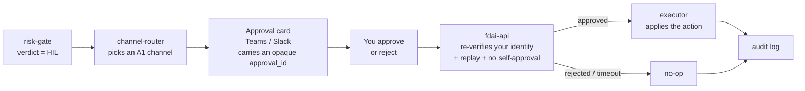

# Approvals and channels

FDAI resolves the safe majority of events on its own, but the risky few pause
for a human. This page explains **how the system reaches you** - which channels
carry an approval request, why a leaked message is never a valid approval, and
what happens when an approval times out or every channel is down.

The operator console is **read-only**: it renders state and the pending-approval
queue but issues no privileged calls. You never approve by clicking a button in
the console. Approvals travel through the channels you already use (Teams, Slack)
or through a remediation PR - never through the console's identity.

## Four kinds of message

Everything FDAI sends a human carries a **category tag**, and each category has
its own rules about trust and direction.

| Category | Direction | Examples | Who can carry it |
|----------|-----------|----------|------------------|
| **A1 - approval** | you decide, and the decision returns | high-risk action approval, enforce-promotion, exemption, override | only identity-verified channels |
| **A2 - alert** | outbound only | SLO burn, dead-letter depth, drift, an unhealthy adapter | any channel, including paging |
| **A3 - chat command** | you ask, it answers | `status`, `shadow-report`, `override draft` | role-gated per command |
| **A4 - digest** | outbound only | daily shadow-accuracy, weekly retros, monthly KPI + cost | any channel, recipient-scoped |

The important line is between **A1** (a decision comes back) and everything
else. A2, A4, and read-only A3 can flow through a less-trusted channel because
they carry information, never authority.

## How an approval reaches you

When the risk gate classifies an action as **HIL** (see
[risk-tiers.md](risk-tiers.md)), FDAI pauses execution and routes an approval
request to an A1-capable channel. You approve or reject; only then does the
executor act.

Two properties make this safe:

- **The message carries no decision.** The card holds an opaque `approval_id`
  bound to a specific pending action, not the action payload. The real decision
  is posted back to `fdai-api`, which re-authenticates you and re-checks
  `idempotency_key` + `action_hash`. A forwarded or leaked card is therefore
  **not** a valid approval.
- **Approval and execution are separate principals.** The person who approves is
  never the executor, and no agent both judges and executes. There is no
  self-approval.

## Trust-tiered channels

A channel may carry an approval only if it can prove your identity end to end.
Informational traffic is far less picky.

| Channel | Can it carry an approval (A1)? | Also carries |
|---------|-------------------------------|--------------|
| **Teams (same tenant)** | yes - verified Entra identity | A2, A3, A4 |
| **Slack** (with an Entra-OID mapping) | yes - approval bounces through `fdai-api` for re-auth | A2, A3, A4 |
| **Email** | no | A2, A4 only |
| **Webhook** | no | A2 only |
| **PagerDuty / Opsgenie / SMS** | no | A2 only - the paging lane |

Magic-link approvals are not supported on any channel; an approval always
requires a re-authenticated round-trip through `fdai-api`. A channel that cannot
verify who you are can inform you, but it can never carry a decision.

## On-call, escalation, and timeouts

Autonomy fails toward safety. Nothing auto-executes because a human did not
answer.

- **Every A1 request has a deadline (TTL).** If no decision arrives in time, the
  request is a **no-op** - the action does not run - and FDAI writes an audit
  entry plus an A2 alert. Fail-closed, never fail-open.
- **Fallback stays inside the trust tier.** A failed Teams approval never drops
  down to email. It falls to another A1-capable channel, or to the **HIL queue**
  if none are reachable.
- **When every A1 channel is down**, the request queues and **pages the
  operational lane** (PagerDuty / Opsgenie / SMS) - it still never
  auto-executes.
- **A kill-switch** can halt every A1 dispatch immediately and re-queue open
  approvals, for the case where you need to stop the flow at once.

## Who gets the message

FDAI does not build recipient lists per user. **Each channel is an audience**,
and membership is managed outside the control plane - typically by binding the
channel to an Entra security group (for example, `aw-approvers`). Adding a
person to that group in Entra is what puts them on the approval channel; the
control plane reads the group, it does not maintain its own copy.

## You stay at approve-or-reject

- The **safe majority auto-resolves** with a stop-condition, rollback path,
  blast-radius limit, and audit entry - no message reaches you at all.
- The **risky few pause for you**, and you decide in the channel you already
  use. Rejection and timeout are both no-ops, and both are audited.
- You can **ask questions** through a chat command or the narrator without ever
  holding the executor's privileged identity.

## Next steps

| To learn about | Read |
|----------------|------|
| The end-to-end approve/reject walkthrough | [../guides/approve-change.md](../guides/approve-change.md) |
| How an action is classified AUTO / HIL / DENY | [risk-tiers.md](risk-tiers.md) |
| Which agent carries your approval, and who executes | [agents-and-self-healing.md](agents-and-self-healing.md) |
| The full channel abstraction, trust matrix, and routing policy | [../../roadmap/channels-and-notifications.md](../../roadmap/channels-and-notifications.md) |
