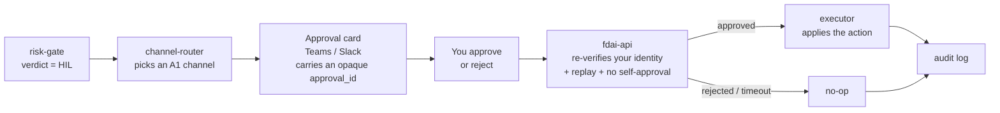

# Approvals and channels

FDAI resolves promoted low-risk events without a person, and pauses high-risk
events for review. This page explains **how the system reaches you**: which
channels can carry an approval request, why a leaked message is never a valid
approval, and what happens when an approval times out or every channel is down.

The operator console is **read-only**. It shows state and the pending-approval
queue, and it makes no privileged calls. You never approve by clicking a button
in the console. Approvals travel through the channels you already use, such as
Teams and Slack, or through a fix pull request. They never use the console's
identity.

## Four kinds of message

Everything FDAI sends to a person carries a **category tag**, and each category
has its own rules about trust and direction.

| Category | Direction | Examples | Who can carry it |
|----------|-----------|----------|------------------|
| **A1, approval** | You decide, and the decision comes back | High-risk action approval, promotion to enforcement, exemption, override | Identity-verified channels only |
| **A2, alert** | Outbound only | SLO burn, dead-letter depth, drift, an unhealthy adapter | Any channel, including paging |
| **A3, chat command** | You ask, it answers | `status`, `shadow-report`, `override draft` | Role-gated per command |
| **A4, digest** | Outbound only | Daily observation accuracy, weekly retros, monthly KPI and cost | Any channel, scoped to recipients |

The important line runs between **A1**, where a decision comes back, and
everything else. A2, A4, and read-only A3 can travel over a less-trusted channel,
because they carry information and never authority.

## How an approval reaches you

When the safety check classifies an action as **human approval** (see
[risk-tiers.md](risk-tiers.md)), FDAI pauses execution and routes an approval
request to an A1-capable channel. You approve or reject it, and only then does
the executor act.

```mermaid
flowchart LR
  RG["risk-gate<br/>verdict = HIL"] --> R["channel-router<br/>picks an A1 channel"]
  R --> C["Approval card<br/>Teams / Slack<br/>carries an opaque approval_id"]
  C --> H["You approve<br/>or reject"]
  H --> API["fdai-api<br/>re-verifies your identity<br/>+ replay + no self-approval"]
  API -->|approved| EX["executor<br/>applies the action"]
  API -->|rejected / timeout| NO["no-op"]
  EX --> AUD["audit log"]
  NO --> AUD
```

Two properties make this safe:

- **The message carries no decision.** The card holds an opaque `approval_id`
  bound to one specific pending action, not the action payload itself. The real
  decision is posted back to `fdai-api`, which re-authenticates you and re-checks
  the `idempotency_key` and `action_hash`. A forwarded or leaked card is
  therefore **not** a valid approval.
- **Approval and execution are separate principals.** The person who approves is
  never the executor, and no agent both judges and executes. Self-approval is not
  possible.

## What an approval request proves

An A1 request ties your decision to one unchangeable pending action. The approval
record includes:

- an opaque `approval_id`, the event ID, and the correlation ID
- the action hash and idempotency key captured when the request was parked
- the requester, the eligible approver role, and the no-self-approval result
- the required quorum, the current decision count, and the request's time to live
- the exact action version, the target scope, and the rollback reference

If the action payload, scope, or version changes, the pending request becomes
invalid. FDAI creates a new request rather than reusing your consent for a
different action.

## Park, decide, and resume safely

Waiting for a person does not block the event consumer. FDAI stores the pending
action and returns to the event loop. A valid approval resumes that stored action
exactly once, after the identity, hash, role, quorum, time-to-live, and replay
checks pass.

A rejection or a timeout closes the request as an audited no-op. Duplicate
approval responses are safe to retry. Conflicting responses are rejected and
raised for review, and they never race two executions. An irreversible action
needs a quorum of two different approvers.

## Trust-tiered channels

A channel can carry an approval only if it can prove your identity end to end.
Informational traffic is far less picky.

| Channel | Can it carry an approval (A1)? | Also carries |
|---------|-------------------------------|--------------|
| **Teams (same tenant)** | Yes, through a verified Entra identity | A2, A3, A4 |
| **Slack** with an Entra OID mapping | Yes, and the approval bounces through `fdai-api` for re-authentication | A2, A3, A4 |
| **Email** | No | A2 and A4 only |
| **Webhook** | No | A2 only |
| **PagerDuty, Opsgenie, SMS** | No | A2 only, the paging lane |

Magic-link approvals are not supported on any channel. An approval always needs a
re-authenticated round trip through `fdai-api`. A channel that cannot verify who
you are can inform you, but it can never carry a decision.

## On-call, escalation, and timeouts

When the outcome is uncertain, FDAI picks the safer default. Nothing runs
automatically just because nobody answered.

- **Every A1 request has a deadline.** If no decision arrives in time, the
  request becomes a no-op, the action does not run, and FDAI writes an audit
  entry plus an A2 alert.
- **Fallback stays inside the trust tier.** A failed Teams approval never drops
  down to email. It moves to another A1-capable channel, or to the pending
  approval queue if none are reachable.
- **If every A1 channel is down**, the request queues and pages the operational
  lane through PagerDuty, Opsgenie, or SMS. It still never runs on its own.
- **A kill-switch** can stop every A1 dispatch immediately and re-queue open
  approvals, for when you need the flow to halt at once.

## Who gets the message

FDAI does not build a recipient list per user. **Each channel is an audience**,
and membership is managed outside the control plane, usually by binding the
channel to an Entra security group such as `aw-approvers`. Adding someone to that
group in Entra is what puts them on the approval channel. The control plane reads
the group and never keeps its own copy.

## What your deployment configures

FDAI supplies the channel contract, the routing categories, the identity checks,
the approval lifecycle that is safe to retry, and the audit fields. Each
deployment supplies its own credentials, channel IDs, Entra group bindings, Slack
to Entra identity mapping, recipient memberships, deadlines, and escalation
destinations. Those values stay outside the generic upstream repository.

## You stay at approve-or-reject

- **Promoted low-risk actions can resolve themselves** with a stop condition, a
  rollback path, an impact scope limit, and an audit entry. How much they cover
  is a measured result in your deployment.
- **The risky few wait for you**, and you decide in the channel you already use.
  A rejection and a timeout are both audited no-ops.
- **You can ask questions** through a chat command or the narrator without ever
  holding the executor's privileged identity.

## Next steps

| To learn about | Read |
|----------------|------|
| The end-to-end approve or reject walkthrough | [../guides/approve-change.md](../guides/approve-change.md) |
| How an action becomes AUTO, human approval, or DENY | [risk-tiers.md](risk-tiers.md) |
| Which agent carries your approval, and who executes | [agents-and-self-healing.md](agents-and-self-healing.md) |
| The full channel abstraction, trust matrix, and routing policy | [../../roadmap/interfaces/channels-and-notifications.md](../../roadmap/interfaces/channels-and-notifications.md) |
