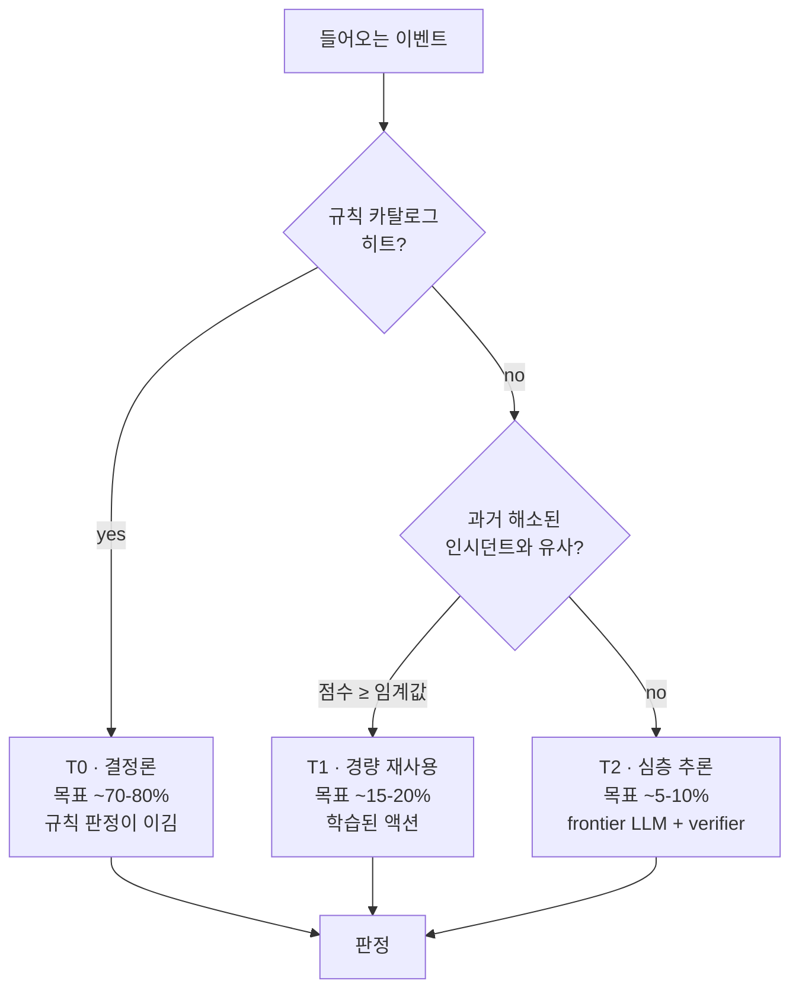

# 결정론 우선(Deterministic first)

**결정론 우선(Deterministic first)**은 FDAI의 중심 설계 원칙입니다. 정책 ·
규칙 · 체크리스트로 결정할 수 있는 이벤트는 그렇게 결정하고, LLM은 이 층에서
명시적으로 abstain 한 잔여 소수에서만 돌립니다.

## 이 원칙이 해결하는 문제

모든 클라우드 운영 이벤트를 언어 모델에 보내면 세 가지가 깨집니다:

- **비용** - 전체 이벤트 볼륨에 대한 추론은 비싸며 트래픽에 비례해 증가합니다.
  대부분 이벤트가 지루하게 반복 가능한데도.
- **예측 가능성** - 같은 이벤트에 대해 월요일과 수요일의 같은 모델이 다른 결정을
  낼 수 있습니다. 새 케이스에는 괜찮지만 정례 케이스에는 재앙입니다.
- **감사 가능성** - 사고 후 "모델이 auto-approve 하기로 골랐다"는 방어하기 어렵고,
  "정책 X (버전 1.4) 규칙이 매칭됐다"는 그렇지 않습니다.

## FDAI가 해결하는 방식

들어오는 모든 이벤트는 **trust router**를 거쳐 케이스를 결정할 수 있는 가장 낮은
티어로 라우팅됩니다:

- **T0 - 결정론 (목표 이벤트의 ~70-80%)**. policy-as-code (OPA), 체크리스트,
  임계값, allow/deny 리스트. 규칙이 히트하면 그 규칙의 판정이 이깁니다. 모델 호출
  없음, 애매함 없음.
- **T1 - 경량 재사용 (목표 ~15-20%)**. 과거 인시던트와의 임베딩 유사도, 저비용
  분류기, 소형 모델 검색. frontier LLM 없음, 여전히 완전 설명 가능.
- **T2 - 심층 추론 (목표 ~5-10%)**. 새롭거나 본질적으로 애매한 케이스만. frontier
  LLM이 생성하고, **verifier**가 제안 액션을 policy-as-code와 인출된 문서에
  대해 재검증하고 grounding 합니다. LLM은 제안하고, verifier가 판정합니다.

## 실무에서 의미하는 것

- 규칙 카탈로그는 **1급 자산**이지 nice-to-have가 아닙니다 - 트래픽 중 얼마가
  LLM을 만나지 않는지가 여기서 결정됩니다.
- 모든 T2 결정은 소스를 인용(grounding)합니다. 인용이 verifier를 통과하지 못하면
  케이스는 '최선의 추측'이 아니라 사람에게 에스컬레이션됩니다.
- 포크 친화적: T0 커버리지를 높이려면 규칙을 추가합니다. 모델을 재훈련하지 않습니다.

## 다음 단계

| 학습 대상 | 문서 |
|-----------|------|
| T0/T1/T2 판정이 auto vs HIL로 어떻게 분류되나 | [risk-tiers-ko.md](risk-tiers-ko.md) |
| 새 액션이 shadow에서 enforce로 넘어가는 방식 | [shadow-then-enforce-ko.md](shadow-then-enforce-ko.md) |
| 전체 컨트롤 루프 설계 | [../../../.github/instructions/architecture.instructions.md](../../../.github/instructions/architecture.instructions.md) |
| 카탈로그 스키마와 소스 | [../../roadmap/rule-catalog-collection-ko.md](../../roadmap/rule-catalog-collection-ko.md) |
