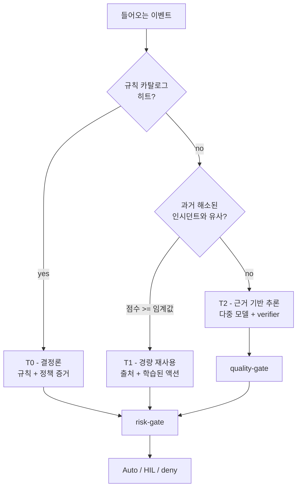

# 결정론 우선(Deterministic first)

**결정론 우선(Deterministic first)**은 FDAI의 중심 설계 원칙입니다. 정책, 규칙,
체크리스트로 결정할 수 있는 이벤트는 결정론적으로 처리하고, LLM 추론은 이 계층에서
명시적으로 판단을 보류한 소수의 사례에만 사용합니다.

티어 선택은 **판정을 만드는 방법**을 결정합니다. 실행 권한을 부여하는 것은 아닙니다.
T0 규칙이 일치한 경우를 포함해 모든 판정은 액션 실행 전에 안전성 검토를 통과해야 합니다.

## 이 원칙이 해결하는 문제

모든 클라우드 운영 이벤트를 언어 모델에 보내면 세 가지 운영 속성을 유지하기
어려워집니다:

- **비용** - 전체 이벤트 볼륨에 대한 추론 비용은 트래픽에 비례해 증가합니다.
  대부분의 이벤트가 반복적이어도 모든 이벤트에 추론 비용이 발생합니다.
- **예측 가능성** - 같은 이벤트에 대해 월요일과 수요일의 같은 모델이 다른 결정을
  내릴 수 있습니다. 새로운 사례를 탐색할 때는 도움이 될 수 있지만 반복 업무의
  계약으로는 적합하지 않습니다.
- **감사 가능성** - 사고 후 "모델이 자동 승인을 선택했다"는 설명은 검증하기 어렵지만,
  "정책 X 버전 1.4의 규칙이 일치했다"는 설명은 재현할 수 있습니다.

## FDAI가 해결하는 방식

들어오는 모든 이벤트는 **trust router**를 거쳐 케이스를 결정할 수 있는 가장 낮은
티어로 라우팅됩니다:

- **T0 - 결정론 (목표 ~70-80%)**. policy-as-code (OPA), 체크리스트,
  임계값, allow/deny 목록이 재현 가능한 판정을 만듭니다. 여러 규칙이 충돌하면
  카탈로그 우선순위를 적용하고, 우선순위가 같은 충돌은 사람 승인으로 전달합니다.
- **T1 - 경량 재사용 (목표 ~15-20%)**. 과거 인시던트와의 임베딩 유사도, 저비용
  분류기, 소형 모델 검색을 사용합니다. 일치한 인시던트, 유사도 점수, 선택된 학습
  액션을 감사 증거로 확인할 수 있습니다.
- **T2 - 심층 추론 (목표 ~5-10%)**. 새롭거나 본질적으로 모호한 사례만 다룹니다.
  서로 다른 모델이 구조화된 액션을 제안하고, **verifier(결정론적 검증기)**가 합의된
  제안을 policy-as-code 및 근거 자료와 대조한 뒤 quality-gate 통과 여부를 정합니다.

이 백분율은 관측된 성과가 아니라 설계 목표입니다. FDAI는 이름이 지정된 시나리오
세트나 배포 기간, 표본 크기, 베이스라인과 함께 실제 티어 비율을 보고합니다.

## 티어가 판단할 수 없는 경우

각 티어에는 명시적인 판단 보류 경계가 있습니다. 다음 티어로 넘어가는 것은 숨겨야 할
오류가 아니라 정상적인 컨트롤 루프 결과입니다.

| 티어 | 판단할 수 있는 조건 | 판단을 보류하거나 에스컬레이션하는 조건 |
|------|---------------------|-------------------------------------------|
| T0 | 유효한 규칙이나 정책이 모호하지 않은 판정을 생성 | 일치하는 규칙이 없거나, 입력이 유효하지 않거나, 같은 우선순위의 규칙이 충돌 |
| T1 | 유사도가 설정 임계값을 넘고 과거 인시던트에 재사용할 액션이 존재 | 유사도가 낮거나, 출처가 없거나, 재사용할 액션이 없음 |
| T2 | 독립된 모델이 구조화된 액션에 합의하고 모든 quality-gate 검사를 통과 | 모델 불일치, 근거 부족, verifier 실패, 신뢰도 임계값 미달 |

T0 또는 T1에서 판단을 보류하면 다음으로 판단 가능한 티어로 이동합니다. T2에서 판단을
보류하면 자율 변경 없이 사람 승인으로 전달합니다. 예상하지 못한 오류도 같은 안전한 경로를
따르며 감사 추적에 기록됩니다.

## T2가 증명해야 하는 것

T2는 누락된 규칙을 모델의 자신감으로 대체하는 권한이 아닙니다. T2 제안이 안전성 검토에
도달하려면 quality-gate에서 다음 조건을 충족해야 합니다:

1. **독립된 합의**: 서로 다른 두 개 이상의 모델 계열이 호환되는 구조화된 액션을
   제안합니다.
2. **결정론적 검증**: 제안된 액션이 스키마, 정책, what-if, 보안 검사를 모두
   통과합니다.
3. **근거 제시**: 제안한 액션을 직접 뒷받침하는 규칙이나 문서를 인용합니다. 근거가
   부족하면 사람 검토를 위해 보류합니다.
4. **설정된 신뢰도**: 배포 환경에 설정된 임계값을 넘습니다. 임계값은 코드에 내장하지
   않고 구성으로 관리합니다.

모델 불일치는 유용한 증거입니다. FDAI는 경쟁하는 제안을 보존하고 사람 승인으로 전달합니다.
다른 모델에 최종 선택을 맡겨 불일치를 숨기지 않습니다.

## 확인할 수 있는 증거

각 티어는 서로 다른 형태의 재구성 가능한 설명을 남깁니다:

- **T0**: 일치한 규칙 ID와 버전, 정책 결과, 입력 사실, 충돌 해소 결과.
- **T1**: 과거 인시던트 참조, 유사도 점수, 과거 결과, 학습 액션 버전.
- **T2**: 모델 식별자, 구조화된 제안, 합의 결과, verifier 검사, 근거 인용,
  판단 보류 사유.
- **안전성 검토**: 일치한 리스크 규칙, 카탈로그 버전, 가장 엄격한 자율성 상한,
  최종 auto, 사람 승인, deny 판정.

이 증거를 사용하면 반복 가능한 판정과 그럴듯한 설명을 구분할 수 있습니다. 실제 액션을
다시 실행하지 않고도 판단 과정을 replay할 수 있습니다.

## 실무에서 의미하는 것

- 규칙 카탈로그는 **핵심 운영 자산**입니다. 전체 트래픽 중 얼마를 LLM 추론 없이
  처리할 수 있는지가 여기서 결정됩니다.
- 모든 T2 결정은 근거를 인용합니다. 인용이 verifier를 통과하지 못하면 해당 사례는
  최선의 추측으로 처리하지 않고 사람 검토로 전달합니다.
- 포크 친화적: T0 커버리지를 높이려면 규칙을 추가합니다. 모델을 재훈련하지 않습니다.

## 전략을 측정하는 방법

티어 비율은 그 자체로 성공 지표가 아니라 진단 신호로 사용하세요. 건전한 측정 화면에는
다음 항목이 포함됩니다:

- 티어별 이벤트 볼륨과 지연 시간.
- T1 임계값 미달 및 출처 검증 실패.
- T2 모델 불일치, verifier 실패, 근거 부족에 따른 판단 보류 비율.
- 해결된 이벤트당 비용과 인시던트당 사람 개입 횟수.
- enforce 이후 롤백과 정책 위반 escape 방지 지표.

같은 고정 시나리오 세트와 배포 기간을 기준으로 값을 비교하세요. T0 비율 증가는 false
negative, 롤백 비율, 정책 위반 escape가 함께 악화되지 않을 때만 의미가 있습니다.

## 다음 단계

| 학습 대상 | 문서 |
|-----------|------|
| T0/T1/T2 판정이 auto vs 사람 승인으로 어떻게 분류되나 | [risk-tiers-ko.md](risk-tiers-ko.md) |
| 새 액션이 shadow에서 적용 모드로 넘어가는 방식 | [shadow-then-enforce-ko.md](shadow-then-enforce-ko.md) |
| 전체 컨트롤 루프 설계 | [../../../.github/instructions/architecture.instructions.md](../../../.github/instructions/architecture.instructions.md) |
| 카탈로그 스키마와 소스 | [../../roadmap/rules-and-detection/rule-catalog-collection-ko.md](../../roadmap/rules-and-detection/rule-catalog-collection-ko.md) |
| 측정 정의와 증거 요구 사항 | [../../roadmap/architecture/goals-and-metrics-ko.md](../../roadmap/architecture/goals-and-metrics-ko.md) |
