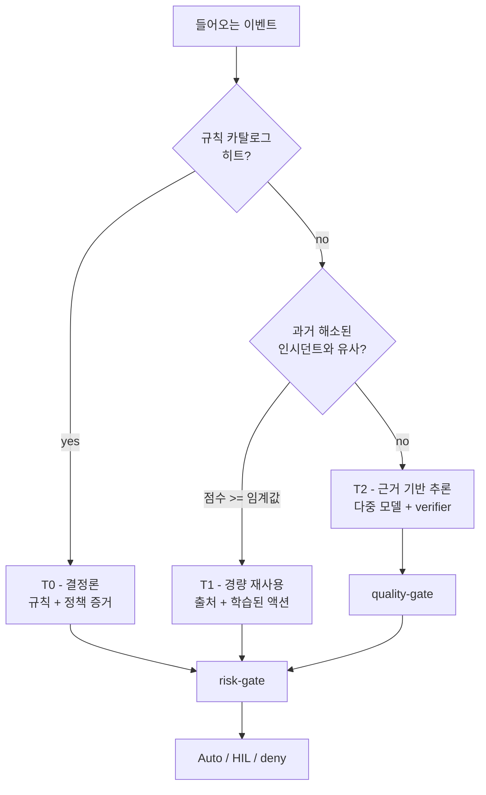

# 결정론 우선(결정론적 first)

**결정론 우선(결정론적 first)**은 FDAI의 중심 설계 원칙입니다. 정책, 규칙,
체크리스트로 결정할 수 있는 이벤트는 결정론적으로 처리하고, LLM 추론은 이 계층에서
명시적으로 판단을 보류한 소수의 사례에만 사용합니다.

티어 선택은 **판정을 만드는 방법**을 결정합니다. 실행 권한을 부여하는 것은 아닙니다.
T0 규칙이 일치한 경우를 포함해 모든 판정은 액션 실행 전에 안전성 검토를 통과해야 합니다.

## 이 원칙이 해결하는 문제

모든 클라우드 운영 이벤트를 언어 모델에 보내면 세 가지 운영 속성을 유지하기
어려워집니다.

- **비용**: 전체 이벤트에 추론을 돌리면 비용이 트래픽에 비례해 늘어납니다. 대부분의
  이벤트가 지루할 만큼 반복적인데도 그렇습니다.
- **예측 가능성**: 같은 이벤트인데 월요일과 수요일에 같은 모델이 다른 답을 낼 수
  있습니다. 새로운 사례를 탐색할 때는 도움이 되지만, 반복 업무의 약속으로는 적합하지
  않습니다.
- **감사 가능성**: 사고 후에 "모델이 자동 승인을 선택했다"는 설명은 방어하기
  어렵습니다. "정책 X 버전 1.4의 룰이 일치했다"는 설명은 그렇지 않습니다.

## FDAI가 해결하는 방식

들어오는 모든 이벤트는 **trust 라우터**를 거쳐 케이스를 결정할 수 있는 가장 낮은
티어로 라우팅됩니다:

```mermaid
flowchart TB
  E[들어오는 이벤트]
  E --> R{규칙 카탈로그<br/>히트?}
  R -->|yes| T0[T0 - 결정론<br/>규칙 + 정책 증거]
  R -->|no| S{과거 해소된<br/>인시던트와 유사?}
  S -->|점수 >= 임계값| T1[T1 - 경량 재사용<br/>출처 + 학습된 액션]
  S -->|no| T2[T2 - 근거 기반 추론<br/>다중 모델 + verifier]
  T0 --> G[risk-gate]
  T1 --> G
  T2 --> Q[quality-gate]
  Q --> G
  G --> V[Auto / HIL / deny]
```

- **T0, 결정론(목표 70-80%)**. policy-as-code(OPA), 체크리스트, 임계값, 허용 및 차단
  목록이 반복 가능한 판단을 만듭니다. 여러 룰이 충돌하면 카탈로그 우선순위로
  정리하고, 우선순위로도 갈리지 않으면 사람 승인으로 보냅니다.
- **T1, 경량 재사용(목표 15-20%)**. 과거 인시던트와의 임베딩 유사도, 저비용 분류기,
  소형 모델 검색을 씁니다. 일치한 인시던트, 유사도 점수, 재사용한 작업이 모두 감사
  근거로 남습니다.
- **T2, 심층 추론(목표 5-10%)**. 새롭거나 본질적으로 모호한 사례만 다룹니다. 서로
  다른 모델이 구조화된 작업을 제안하고, 검증기가 합의된 제안을 policy-as-code와 근거
  자료에 대조한 뒤에야 quality-gate를 통과시킵니다.

이 백분율은 관측된 성과가 아니라 설계 목표입니다. FDAI는 이름이 지정된 시나리오
세트나 배포 기간을 기준으로, 표본 크기와 기준선을 함께 밝혀야 실제 티어 비율을
보고합니다.

## 티어가 판단할 수 없는 경우

각 티어에는 판단을 멈추고 다음으로 넘기는 지점이 분명히 있습니다. 이 경계를 넘기는
것은 숨겨야 할 오류가 아니라 정상적인 컨트롤 루프 결과입니다.

| 티어 | 판단할 수 있는 조건 | 판단을 보류하거나 에스컬레이션하는 조건 |
|------|---------------------|-------------------------------------------|
| T0 | 유효한 규칙이나 정책이 모호하지 않은 판정을 생성 | 일치하는 규칙이 없거나, 입력이 유효하지 않거나, 같은 우선순위의 규칙이 충돌 |
| T1 | 유사도가 설정 임계값을 넘고 과거 인시던트에 재사용할 액션이 존재 | 유사도가 낮거나, 출처가 없거나, 재사용할 액션이 없음 |
| T2 | 독립된 모델이 구조화된 액션에 합의하고 모든 quality-gate 검사를 통과 | 모델 불일치, 근거 부족, 검증기 실패, 신뢰도 임계값 미달 |

T0 또는 T1에서 판단을 보류하면 다음으로 판단 가능한 티어로 이동합니다. T2에서 판단을
보류하면 자율 변경 없이 사람 승인으로 전달합니다. 예상하지 못한 오류도 같은 안전한 경로를
따르며 감사 추적에 기록됩니다.

## T2가 증명해야 하는 것

T2는 누락된 규칙을 모델의 자신감으로 대체하는 권한이 아닙니다. T2 제안이 안전성 검토에
도달하려면 quality-gate에서 다음 조건을 충족해야 합니다:

1. **독립된 합의**: 서로 다른 두 개 이상의 모델 계열이 호환되는 구조화된 액션을
   제안합니다.
2. **결정론적 검증**: 제안된 액션이 스키마, 정책, what-if, 보안 검사를 모두
   통과합니다.
3. **근거 제시**: 제안한 액션을 직접 뒷받침하는 규칙이나 문서를 인용합니다. 근거가
   부족하면 사람 검토를 위해 보류합니다.
4. **설정된 신뢰도**: 배포 환경에 설정된 임계값을 넘습니다. 임계값은 코드에 내장하지
   않고 구성으로 관리합니다.

모델 불일치는 유용한 증거입니다. FDAI는 경쟁하는 제안을 보존하고 사람 승인으로 전달합니다.
다른 모델에 최종 선택을 맡겨 불일치를 숨기지 않습니다.

## 확인할 수 있는 증거

각 티어는 서로 다른 형태의 재구성 가능한 설명을 남깁니다:

- **T0**: 일치한 규칙 ID와 버전, 정책 결과, 입력 사실, 충돌 해소 결과.
- **T1**: 과거 인시던트 참조, 유사도 점수, 과거 결과, 학습 액션 버전.
- **T2**: 모델 식별자, 구조화된 제안, 합의 결과, 검증기 검사, 근거 인용,
  판단 보류 사유.
- **안전성 검토**: 일치한 리스크 규칙, 카탈로그 버전, 가장 엄격한 자율성 상한,
  최종 auto, 사람 승인, 거부 판정.

이 증거를 사용하면 반복 가능한 판정과 그럴듯한 설명을 구분할 수 있습니다. 실제 액션을
다시 실행하지 않고도 판단 과정을 재생할 수 있습니다.

## 실무에서 의미하는 것

- 규칙 카탈로그는 **핵심 운영 자산**입니다. 전체 트래픽 중 얼마를 LLM 추론 없이
  처리할 수 있는지가 여기서 결정됩니다.
- 모든 T2 결정은 근거를 인용합니다. 인용이 검증기를 통과하지 못하면 해당 사례는
  최선의 추측으로 처리하지 않고 사람 검토로 전달합니다.
- 포크 친화적: T0 커버리지를 높이려면 규칙을 추가합니다. 모델을 재훈련하지 않습니다.

## 전략을 측정하는 방법

티어 비율은 그 자체로 성공 지표가 아니라 진단 신호로 사용하세요. 건전한 측정 화면에는
다음 항목이 포함됩니다:

- 티어별 이벤트 볼륨과 지연 시간
- T1 임계값 미달과 출처 누락 사례
- T2 모델 불일치, 검증기 실패, 근거 부족으로 판단을 보류한 비율
- 해결된 이벤트당 비용과 인시던트당 사람 개입 횟수
- 적용 이후 롤백과 정책 우회 방지 지표

같은 고정 시나리오 세트와 배포 기간을 기준으로 값을 비교하세요. T0 비율이 올라간 것은
오탐지, 롤백 비율, 정책 우회가 함께 나빠지지 않았을 때만 의미가 있습니다.

## 팁: T0 판정에서 OPA와 Rego의 역할

**열림 Policy 에이전트(OPA)**는 FDAI가 policy-as-code 검사에 사용하는 정책 평가
엔진입니다. **Rego**는 OPA가 평가할 규칙을 작성하는 선언형 정책 언어입니다. 즉,
Rego가 조건을 기술하고 OPA가 정규화된 리소스 사실을 조건에 대조해 실행합니다.

T0 이벤트가 들어오면 FDAI는 먼저 리소스 유형과 신호 유형으로 후보 카탈로그 규칙을
선택합니다. 그런 다음 현재 리소스 속성과 규칙 매개 변수를 OPA에 전달합니다. Rego
정책이 `deny = true`를 반환하면 해당 규칙이 결정론적으로 일치한 것이며 FDAI는 규칙
ID와 버전이 포함된 점검 결과를 기록합니다. `deny = false`이면 리소스가 해당 검사를
통과한 것입니다. 결과가 정의되지 않았거나 정책 누락, 시간 초과, 잘못된 출력이 발생하면
추측하지 않고 해당 규칙의 판단을 보류합니다.

예를 들어 object-storage 규칙은 `enable_https_traffic_only`가 `true`가 아닐 때
`deny = true`를 반환할 수 있습니다. FDAI는 이 결과를 모델이 생성한 판단이 아니라
특정 버전의 정책 위반으로 설명할 수 있습니다.

## 다음 단계

| 학습 대상 | 문서 |
|-----------|------|
| T0, T1, T2 판단이 자동 실행과 사람 승인으로 갈리는 기준 | [risk-tiers-ko.md](risk-tiers-ko.md) |
| 새 작업이 먼저 관찰하고 나중에 적용되는 방식 | [shadow-then-enforce-ko.md](shadow-then-enforce-ko.md) |
| 전체 컨트롤 루프 설계 | [../../../.github/instructions/architecture.instructions.md](../../../.github/instructions/architecture.instructions.md) |
| 카탈로그 스키마와 소스 | [../../roadmap/rules-and-detection/rule-catalog-collection-ko.md](../../roadmap/rules-and-detection/rule-catalog-collection-ko.md) |
| 측정 정의와 증거 요구 사항 | [../../roadmap/architecture/goals-and-metrics-ko.md](../../roadmap/architecture/goals-and-metrics-ko.md) |
