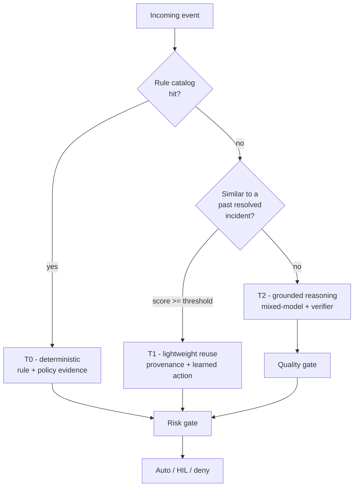

# Deterministic first

**Deterministic first** is FDAI's central design commitment: any event
that a policy, rule, or checklist can decide is decided that way, and no LLM
runs on it. LLM inference is reserved for the residual minority that the
deterministic layer explicitly holds for review on.

Tier selection answers **how a decision is produced**. It does not grant
permission to execute. Every decision, including a T0 rule match, still passes
through the safety check before an action can run.

## The problem this addresses

If you route every cloud-operations event to a language model, three operating
properties become harder to preserve:

- **Cost** - inference over the full event volume is expensive and grows with
  traffic, even though most events are boringly repeatable.
- **Predictability** - the same event on Monday and Wednesday can get
  different decisions from the same model. That may help explore a novel case,
  but it is a poor contract for a routine one.
- **Auditability** - "the model chose to auto-approve" is hard to
  defend after an incident. "The rule matched policy X, version 1.4" is not.

## How FDAI resolves it

Every incoming event flows through a **trust router** that picks the lowest
tier competent to decide the case:

- **T0 - deterministic (target ~70-80% of events)**. Policy-as-code (OPA),
  checklists, thresholds, and allow/deny lists produce a reproducible decision.
  Conflicting rules follow catalog precedence; unresolved ties go to human approval.
- **T1 - lightweight reuse (target ~15-20%)**. Embedding similarity to
  historical incidents, inexpensive classifiers, and small-model retrieval.
  The matched incident, similarity score, and selected learned action remain
  available for audit.
- **T2 - deep reasoning (target ~5-10%)**. Only novel or intrinsically
  ambiguous cases. Distinct models propose structured actions; a
  **verifier** re-checks the agreed proposal against policy-as-code and
  evidence check sources before it can leave the quality gate.

The percentages are design targets, not observed results. FDAI reports actual
tier share only from a named scenario set or deployment window with its sample
size and baseline.

## When a tier cannot decide

Each tier has an explicit abstention boundary. Falling through a boundary is a
normal control-loop result, not an error to hide.

| Tier | It can decide when | It holds or escalates when |
|------|--------------------|----------------------------|
| T0 | A valid rule or policy produces an unambiguous decision | No rule matches, input is invalid, or equal-precedence rules conflict |
| T1 | Similarity clears the configured threshold and the prior incident has a learned action | Similarity is too low, provenance is missing, or no reusable action exists |
| T2 | Independent models agree on the structured action and every quality check passes | Models disagree, evidence check is unsupported, the verifier fails, or the confidence threshold is missed |

A T0 or T1 hold moves to the next competent tier. A T2 hold moves to human approval with
no autonomous mutation. Unexpected errors follow the same safer path and are
recorded in the audit trail.

## What T2 must prove

T2 is not permission to replace a missing rule with model confidence. Before a
T2 proposal reaches the safety check, the quality gate requires:

1. **Independent agreement**: Two or more distinct model families produce
   compatible structured actions.
2. **Deterministic verification**: Schema, policy, what-if, and security checks
   all pass against the proposed action.
3. **Evidence check**: The proposal cites rules or documents that support the exact
   action. Unsupported claims cause a hold for review.
4. **Configured confidence**: The result clears the deployment's threshold.
   The threshold is configuration, not a value embedded in code.

Model disagreement is useful evidence. FDAI preserves the competing proposals
and routes the case to human approval instead of asking another model to silently choose a
winner.

## Evidence you can inspect

Every tier leaves a different but reconstructable explanation:

- **T0**: matched rule ID and version, policy result, input facts, and conflict
  resolution.
- **T1**: prior incident reference, similarity score, historical outcome, and
  learned action version.
- **T2**: model identifiers, structured proposals, agreement result, verifier
  checks, evidence check citations, and abstention reason when held.
- **Safety check**: matched risk rule, catalog version, the strictest autonomy
  ceiling, and the final auto, human approval, or deny decision.

This evidence separates a repeatable decision from a plausible explanation. It
also lets you replay the judgment without re-executing the underlying action.

## What this means in practice

- The rule catalog is a **first-class asset**, not a nice-to-have - it
  determines how much of the traffic never reaches an LLM.
- Every T2 decision cites its sources (evidence check). If those citations don't
  survive the verifier, the case goes to human review, not to a "best guess".
- Fork-friendly: to raise your T0 coverage, you add rules; you don't retrain
  a model.

## How to measure the strategy

Use tier share as a diagnostic, not a success claim by itself. A healthy
measurement view includes:

- per-tier event volume and latency;
- T1 threshold misses and provenance failures;
- T2 disagreement, verifier-failure, and evidence check-abstention rates;
- cost per resolved event and human touchpoints per incident;
- rollback and policy-escape guard metrics after enforcement.

Compare those values against the same frozen scenario set and deployment
window. A higher T0 share is useful only when false negatives, rollback rate,
and policy escapes do not regress.

## Next steps

| To learn about | Read |
|----------------|------|
| How T0/T1/T2 decisions become auto vs human approval | [risk-tiers.md](risk-tiers.md) |
| How new actions ship in shadow before enforcing | [shadow-then-enforce.md](shadow-then-enforce.md) |
| The full control-loop design | [../../../.github/instructions/architecture.instructions.md](../../../.github/instructions/architecture.instructions.md) |
| The catalog schema and sources | [../../roadmap/rules-and-detection/rule-catalog-collection.md](../../roadmap/rules-and-detection/rule-catalog-collection.md) |
| Measurement definitions and evidence requirements | [../../roadmap/architecture/goals-and-metrics.md](../../roadmap/architecture/goals-and-metrics.md) |
