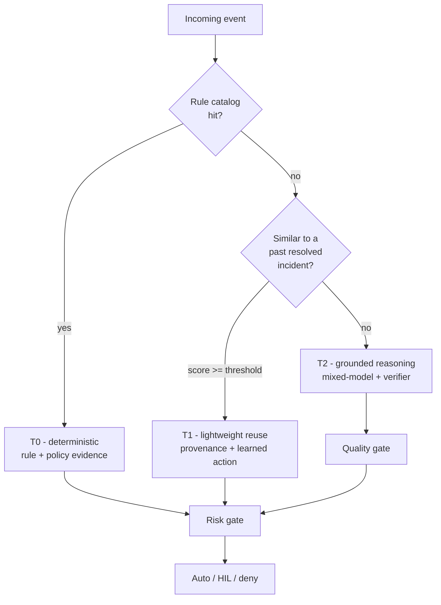

# Deterministic first

**Deterministic first** is FDAI's central design commitment. If a policy, rule,
or checklist can decide an event, FDAI decides it that way and no language model
runs on it. Model inference is reserved for the small remainder that the
deterministic layer explicitly holds for review.

Tier selection answers **how a decision is produced**. It does not grant
permission to execute. Every decision, including a T0 rule match, still goes
through the safety check before an action can run.

## The problem this addresses

If you send every cloud-operations event to a language model, three operating
properties get harder to keep:

- **Cost**: inference over the full event volume is expensive and grows with
  traffic, even though most events are boringly repeatable.
- **Predictability**: the same event on Monday and on Wednesday can get
  different answers from the same model. That can help on a novel case, but it
  is a poor contract for a routine one.
- **Auditability**: "the model chose to auto-approve" is hard to defend after
  an incident. "The rule matched policy X, version 1.4" is not.

## How FDAI resolves it

Every incoming event flows through a **trust router** that picks the lowest
tier competent to decide the case:

```mermaid
flowchart TB
  E[Incoming event]
  E --> R{Rule catalog<br/>hit?}
  R -->|yes| T0[T0 - deterministic<br/>rule + policy evidence]
  R -->|no| S{Similar to a<br/>past resolved<br/>incident?}
  S -->|score >= threshold| T1[T1 - lightweight reuse<br/>provenance + learned action]
  S -->|no| T2[T2 - grounded reasoning<br/>mixed-model + verifier]
  T0 --> G[Risk gate]
  T1 --> G
  T2 --> Q[Quality gate]
  Q --> G
  G --> V[Auto / HIL / deny]
```

- **T0, deterministic (target 70-80% of events)**. Policy-as-code (OPA),
  checklists, thresholds, and allow or deny lists produce a repeatable decision.
  When rules conflict, catalog precedence decides. A tie that precedence cannot
  break goes to human approval.
- **T1, lightweight reuse (target 15-20%)**. Embedding similarity to past
  incidents, cheap classifiers, and small-model retrieval. The matched incident,
  the similarity score, and the reused action all stay available for audit.
- **T2, deep reasoning (target 5-10%)**. Only new or genuinely ambiguous cases.
  Different models propose structured actions, and a **verifier** re-checks the
  agreed proposal against policy-as-code and evidence sources before it can leave
  the quality gate.

Those percentages are design targets, not observed results. FDAI reports an
actual tier share only from a named scenario set or deployment window, together
with its sample size and baseline.

## When a tier cannot decide

Each tier has a clear point where it stops and hands the case on. Falling through
that boundary is a normal outcome of the control loop, not an error to hide.

| Tier | It can decide when | It holds or escalates when |
|------|--------------------|----------------------------|
| T0 | A valid rule or policy gives one unambiguous answer | No rule matches, the input is invalid, or rules of equal precedence conflict |
| T1 | Similarity clears the configured threshold and the earlier incident has a reusable action | Similarity is too low, provenance is missing, or no reusable action exists |
| T2 | Independent models agree on the structured action and every quality check passes | Models disagree, evidence does not support the action, the verifier fails, or confidence is below the threshold |

A hold at T0 or T1 moves the case to the next tier that can decide it. A hold at
T2 goes to human approval, and nothing runs automatically. Unexpected errors take
the same safer path and are written to the audit trail.

## What T2 must prove

T2 is not permission to replace a missing rule with model confidence. Before a
T2 proposal reaches the safety check, the quality gate requires all of this:

1. **Independent agreement**: two or more different model families produce
   compatible structured actions.
2. **Deterministic verification**: schema, policy, what-if, and security checks
   all pass against the proposed action.
3. **Evidence check**: the proposal cites rules or documents that support this
   exact action. An unsupported claim holds the case for review.
4. **Configured confidence**: the result clears the deployment's threshold. That
   threshold is configuration, not a number baked into the code.

Disagreement between models is useful evidence. FDAI keeps the competing
proposals and sends the case to human approval instead of asking yet another
model to quietly pick a winner.

## Evidence you can inspect

Every tier leaves a different explanation, and you can rebuild any of them:

- **T0**: the matched rule ID and version, the policy result, the input facts,
  and how a conflict was resolved.
- **T1**: the earlier incident it referenced, the similarity score, the past
  outcome, and the reused action version.
- **T2**: model identifiers, the structured proposals, the agreement result, the
  verifier checks, the evidence citations, and the reason it was held.
- **Safety check**: the matched risk rule, the catalog version, the strictest
  autonomy ceiling that applied, and the final decision of auto, human approval,
  or deny.

This evidence tells a repeatable decision apart from a plausible explanation. It
also lets you replay the judgment without running the action again.

## What this means in practice

- The rule catalog is a **first-class asset**, not a nice-to-have. It decides
  how much of your traffic never reaches a language model.
- Every T2 decision cites its sources. If those citations do not survive the
  verifier, the case goes to human review rather than to a best guess.
- It is fork-friendly. To raise your T0 coverage you add rules. You do not
  retrain a model.

## How to measure the strategy

Use tier share as a diagnostic, not as a success claim on its own. A healthy
measurement view includes:

- event volume and latency per tier
- T1 threshold misses and missing-provenance cases
- how often T2 models disagree, the verifier fails, or evidence is missing
- cost per resolved event and human touchpoints per incident
- rollback and policy-escape guard metrics after enforcement

Compare those values against the same frozen scenario set and deployment window.
A higher T0 share only means something when false negatives, rollback rate, and
policy escapes do not get worse.

## Tip: OPA and Rego in T0 decisions

**Open Policy Agent (OPA)** is the policy evaluation engine FDAI uses for
policy-as-code checks. **Rego** is the declarative policy language used to write
the rules that OPA evaluates. In other words, Rego describes the condition and
OPA runs it against the normalized resource facts.

For a T0 event, FDAI first selects candidate catalog rules by resource type and
signal type. It then supplies the current resource properties and rule parameters
to OPA. If the Rego policy returns `deny = true`, the rule is a deterministic hit
and FDAI records a detected issue with the rule ID and version. `deny = false` means the
resource passed that check. An undefined result, missing policy, timeout, or
invalid output holds the rule for review instead of guessing.

Example: an object-storage rule can return `deny = true` when
`enable_https_traffic_only` is not `true`. FDAI can then explain the result as a
specific versioned policy violation rather than a model-generated judgment.

## Next steps

| To learn about | Read |
|----------------|------|
| How T0, T1, and T2 decisions become auto or human approval | [risk-tiers.md](risk-tiers.md) |
| How new actions observe first and enforce later | [shadow-then-enforce.md](shadow-then-enforce.md) |
| The full control-loop design | [../../../.github/instructions/architecture.instructions.md](../../../.github/instructions/architecture.instructions.md) |
| The catalog schema and sources | [../../roadmap/rules-and-detection/rule-catalog-collection.md](../../roadmap/rules-and-detection/rule-catalog-collection.md) |
| Measurement definitions and evidence requirements | [../../roadmap/architecture/goals-and-metrics.md](../../roadmap/architecture/goals-and-metrics.md) |
