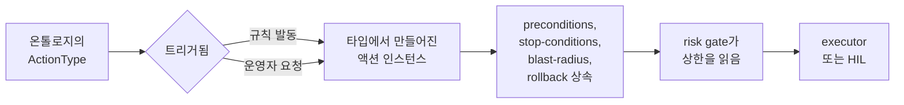

# 온톨로지 기반 자동화(Ontology-driven automation)

FDAI는 무엇을 할 수 있는지 하드코딩하지 않습니다. FDAI가 할 수 있는 모든 변경은
catalog-as-code **온톨로지**의 타입 있는 **`ActionType`**으로 한 번 기술됩니다.
규칙이 발동하거나 운영자가 요청하면, 그 타입이 타입의 안전 계약을 물려받는 구체
액션으로 *인스턴스화*되어 하나의 공유 파이프라인을 흐르고 감사된 결과로 착지합니다.
새 기능을 추가하는 것은 YAML 파일 하나입니다. 엔진에 새 분기도, 새 executor도
없습니다.

이 페이지는 온톨로지, 엔트리가 실행 액션이 되는 과정, 그리고 신호에서 감사까지
운반하는 비즈니스 파이프라인을 설명합니다.

## 온톨로지란

온톨로지는 `ActionType` 엔트리의 버전 있는 카탈로그입니다. 각 엔트리는 FDAI가 할
수 있는 하나의 일에 대한 권위 있는 정의입니다 - `remediate.disable-public-access`,
`ops.restart-service`, `remediate.right-size`, `governance.promote-action-type`
등. 엔트리는 세 카테고리로 묶입니다:

- **`remediation`** - 규칙 발동, config-drift 스타일 변경.
- **`ops`** - 운영자 요청 런타임 액션(재시작·스케일·flush).
- **`governance`** - 카탈로그·exemption·승격 변경.

온톨로지는 코드가 아니라 데이터이므로, 포크는 코어 엔진을 건드리지 않고 config로
엔트리를 추가·오버라이드합니다.

## ActionType의 해부

`ActionType`은 이름만이 아닙니다 - 자체 가드레일을 선언합니다. FDAI가 요구하는
안전 불변식(stop-condition·롤백 경로·blast-radius 제한·감사 엔트리)이 타입 위에
있으므로 모든 인스턴스는 태생부터 안전합니다. 축약 예:

```yaml
name: remediate.disable-public-access
category: remediation
trigger_kind:
  kind: rule_violation
execution_path: pr_native
rollback_contract: state_forward_only
default_mode: shadow          # 승격 전까지 판단하고 로그만
promotion_gate:
  min_shadow_days: 14
  min_accuracy: 0.98
  max_policy_escapes: 0
preconditions:
  - kind: resource_property_equals
    property: public_access
    value: enabled
stop_conditions:
  - kind: dependent_resource_degraded
  - kind: time_box_exceeded_seconds
    seconds: 300
blast_radius:
  max_affected_resources: 5
  traversal_depth: 2
ceiling_by_tier:
  t0: { max_autonomy: enforce_hil, min_role: approver }
```

- **`preconditions`** - 액션이 적격이 되기 전에 성립해야 합니다.
- **`stop_conditions`** - 세계가 적대적으로 변하면 실행 중 액션을 중단합니다.
- **`blast_radius`** - 하나의 액션이 미칠 수 있는 범위를 제한합니다.
- **`rollback_contract`** - 변경을 되돌리는 방법을 지정합니다.
- **`ceiling_by_tier`** - 신뢰 티어별 자율성 상한. 어떤 코드 경로도 타입을 선언된
  상한 위로 올릴 수 없습니다.

## 타입에서 인스턴스로

인스턴스화는 정적 온톨로지 엔트리가 살아있는 액션이 되는 순간입니다.



- T0/T1/T2에서의 **규칙 위반**은 매칭된 규칙과 finding으로 인스턴스를 구성합니다 -
  리소스·파라미터·스코프는 이벤트에서 옵니다.
- 콘솔을 통한 **운영자 요청**은 채팅 의도와 principal·인자로 인스턴스를 구성합니다.

어느 쪽이든 인스턴스는 타입의 계약을 지닙니다. 엔진은 드리프트를 교정하는지 pod를
재시작하는지 알 필요가 없습니다. 같은 보장을 가진 같은 파이프라인을 돌립니다.

## 두 트리거, 하나의 온톨로지

온톨로지는 단일 `trigger_kind` 축으로 양방향 자동화를 모두 처리합니다:

- **`rule_violation`** - 컨트롤 루프가 액션을 제안(push 방향).
- **`operator_request`** - 사람이 콘솔로 요청(pull 방향).
- **`both`** - 어느 표면에도 속하는 액션. `ops.restart-service`는 운영자("이거
  재시작")나 health-probe 규칙 어느 쪽으로도 트리거될 수 있습니다.

스키마의 나머지는 트리거에 특정되지 않습니다. executor·risk gate·감사 계약은 둘 다
동일하므로, 운영자 주도 액션도 규칙 주도 액션과 같은 안전 봉투를 받습니다.

## 비즈니스 파이프라인

인스턴스화된 액션은 하나의 파이프라인을 흐릅니다. 온톨로지가 각 단계에서 안전
계약을 공급하고, 에이전트가 각 단계를 소유합니다([agents-and-self-healing-ko.md](agents-and-self-healing-ko.md)).

```text
event -> event-ingest -> trust-router -> T0 | T1 | (T2 -> quality-gate)
      -> risk-gate    -> auto | HIL | abstain
      -> executor     -> delivery -> audit
```

1. **Ingest** - 신호를 정규화·상관하여 인시던트로 만듭니다.
2. **Route** - 신뢰도를 점수화하고 가장 저렴한 적격 티어를 선택합니다.
3. **Gate** - 타입의 티어 상한을 읽어 auto·HIL·deny를 판정합니다.
4. **Execute** - preconditions 통과와 per-resource 락 확보 후에만 변경을 적용하며,
   stop-conditions와 blast-radius를 준수합니다.
5. **Deliver** - remediation PR 또는 직접 API 호출로 변경을 배포합니다.
6. **Audit** - no-op·거부·타임아웃 포함, 불변 엔트리를 추가합니다.

계약이 타입 위에 있으므로, 기능을 shadow에서 enforce로 승격하는 것은 타입의
`promotion_gate`에 대해 측정되고 별도로 리뷰되는 변경이지 결코 기습이 아닙니다
([shadow-then-enforce-ko.md](shadow-then-enforce-ko.md)).

## 다음 단계

| 학습 대상 | 문서 |
|-----------|------|
| 어떤 에이전트가 각 파이프라인 단계를 소유하는가 | [agents-and-self-healing-ko.md](agents-and-self-healing-ko.md) |
| risk gate가 티어 상한을 읽는 방식 | [risk-tiers-ko.md](risk-tiers-ko.md) |
| 새 액션이 자동 실행 권한을 얻는 방식 | [shadow-then-enforce-ko.md](shadow-then-enforce-ko.md) |
| 전체 온톨로지 스키마와 포크 seam | [../../roadmap/action-ontology-ko.md](../../roadmap/action-ontology-ko.md) |
