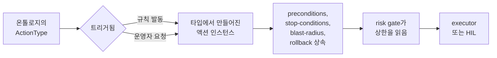

# 온톨로지 기반 자동화(Ontology-driven automation)

FDAI는 무엇을 할 수 있는지 하드코딩하지 않습니다. FDAI가 할 수 있는 모든 변경은
catalog-as-code **온톨로지**의 타입 있는 **`ActionType`**으로 한 번 기술됩니다.
규칙이 발동하거나 운영자가 요청하면, 그 타입이 타입의 안전 계약을 물려받는 구체
액션으로 *인스턴스화*되어 하나의 공유 파이프라인을 흐르고 감사 로그에 기록된 결과로
이어집니다. 기존 실행 경로와 provider가 작업을 지원한다면 새 기능은 코어 엔진에 분기를
추가하는 대신 데이터 변경으로 정의할 수 있습니다. 실행 dispatcher가 없는 선언은
비활성 상태로 남으며 실행할 수 없습니다.

이 페이지는 온톨로지, 엔트리가 실행 액션이 되는 과정, 그리고 신호에서 감사까지
전달하는 비즈니스 파이프라인을 설명합니다.

## 온톨로지란

온톨로지는 `ActionType` 엔트리의 버전 있는 카탈로그입니다. 각 엔트리는 FDAI가 할
수 있는 하나의 일에 대한 권위 있는 정의입니다 - `remediate.disable-public-access`,
`ops.restart-service`, `remediate.right-size`, `governance.promote-action-type`
등이 있습니다. 엔트리는 네 카테고리로 묶입니다:

- **`remediation`** - 규칙 발동, config-drift 스타일 변경.
- **`ops`** - 운영자 요청 런타임 액션(재시작, 스케일, flush).
- **`governance`** - 카탈로그, exemption, 승격 변경.
- **`tool`** - `tool_call`을 통해 등록된 함수를 호출합니다. 문서 생성, 알림 전송,
  티켓 생성처럼 클라우드 기반 리소스를 변경하지 않는 작업을 다룹니다.

온톨로지는 코드가 아니라 데이터이므로 포크는 코어 엔진을 건드리지 않고 구성으로
엔트리를 추가하거나 오버라이드할 수 있습니다. 실제로 실행하려면 지원되는 실행 경로와
등록된 provider도 선택해야 합니다.

## ActionType 구성

`ActionType`은 이름만이 아니라 자체 가드레일을 선언합니다. FDAI가 요구하는
안전 불변식(stop-condition, 롤백 경로, blast-radius 제한, 감사 엔트리)이 타입 위에
있으므로 모든 인스턴스는 태생부터 안전합니다. 축약 예:

```yaml
name: remediate.disable-public-access
category: remediation
trigger_kind:
  kind: rule_violation
execution_path: pr_native
rollback_contract: state_forward_only
default_mode: shadow          # 승격 전까지 판단하고 로그만
promotion_gate:
  min_shadow_days: 14
  min_accuracy: 0.98
  max_policy_escapes: 0
preconditions:
  - kind: resource_property_equals
    property: public_access
    value: enabled
stop_conditions:
  - kind: dependent_resource_degraded
  - kind: time_box_exceeded_seconds
    seconds: 300
blast_radius:
  max_affected_resources: 5
  traversal_depth: 2
ceiling_by_tier:
  t0: { max_autonomy: enforce_hil, min_role: approver }
```

- **`preconditions`** - 액션이 적격이 되기 전에 성립해야 합니다.
- **`stop_conditions`** - 실행 환경이 위험한 상태로 바뀌면 실행 중 액션을 중단합니다.
- **`blast_radius`** - 하나의 액션이 미칠 수 있는 범위를 제한합니다.
- **`rollback_contract`** - 변경을 되돌리는 방법을 지정합니다.
- **`ceiling_by_tier`** - 신뢰 티어별 자율성 상한. 어떤 코드 경로도 타입을 선언된
  상한 위로 올릴 수 없습니다.

## 타입에서 인스턴스로

인스턴스화는 정적 온톨로지 엔트리가 살아있는 액션이 되는 순간입니다.



- T0/T1/T2에서의 **규칙 위반**은 일치한 규칙과 탐지 결과로 인스턴스를 구성합니다.
  리소스, 매개 변수, 범위는 이벤트에서 가져옵니다.
- **운영자 요청**은 해당 액션의 쓰기 방향 coordinator가 활성화된 경우 타입이 지정된
  의도, 요청 주체, 인자로 인스턴스를 구성할 수 있습니다. 대화 자체는 실행 권한을
  만들지 않습니다.

어느 쪽이든 인스턴스는 타입의 계약을 지닙니다. 엔진은 드리프트를 교정하는지 pod를
재시작하는지 알 필요가 없습니다. 같은 보장을 가진 같은 파이프라인을 돌립니다.

## 두 트리거, 하나의 온톨로지

온톨로지는 단일 `trigger_kind` 축으로 양방향 자동화를 모두 처리합니다:

- **`rule_violation`** - 컨트롤 루프가 액션을 제안(push 방향).
- **`operator_request`** - 사람이 콘솔로 요청(pull 방향).
- **`both`** - 어느 쪽 표면에든 속하는 액션. `ops.restart-service`는 운영자("이거
  재시작")나 health-probe 규칙 어느 쪽으로도 트리거될 수 있습니다.

스키마의 나머지는 트리거 종류에 종속되지 않습니다. risk-gate와 감사 계약은 두 경로에
동일하게 적용되므로 운영자 주도 액션도 규칙 주도 액션과 같은 안전 계약을 적용받습니다.
트리거 coordinator나 실행 provider가 등록되지 않았다면 선언은 검증 및 shadow 확인에
사용할 수 있지만 어떤 리소스도 변경할 수 없습니다.

## 선언과 실행 가능 상태의 차이

카탈로그는 액션의 의미를 설명합니다. 런타임 연결은 현재 배포 환경에서 그 액션을 실제로
수행할 수 있는지 결정합니다.

| 계층 | 책임 | 계층이 없을 때의 동작 |
|------|------|-----------------------|
| `ActionType` 선언 | 스키마, 안전 계약, 트리거, 실행 경로, 역할 바인딩 | 유효하지 않거나 알 수 없는 선언은 카탈로그 로드를 실패시킴 |
| Coordinator 또는 dispatcher | 유효한 트리거를 범위가 제한된 액션 인스턴스로 변환 | 트리거를 거부하거나 판단과 기록만 수행 |
| 실행 provider | `pr_native`, `direct_api`, `pr_manual`, `tool_call` 구현 | 리소스를 변경하지 않고 감사 가능한 사유와 함께 보류 |
| 전달 및 감사 | 효과를 전달하고 모든 종료 경로를 기록 | 감사 또는 롤백 지원이 없으면 불완전한 액션으로 처리 |

이 구분을 통해 카탈로그가 구현보다 먼저 설계될 수 있지만 YAML 파일이 특권 통합을
만든다고 오해하지 않게 합니다. 포크는 composition root에서 provider를 등록해 기존
경로를 재사용할 수 있습니다. 새로운 기반 리소스 동작에는 승인된 provider 인터페이스
뒤의 구현이 필요합니다.

## 안전하게 실행을 막는 방식

온톨로지 검증은 액션이 실행 대상이 되기 전에 이루어집니다. 대표적인 안전 종료 결과는
다음과 같습니다:

- 알 수 없는 카테고리, 실행 경로, 역할, `ActionType` 참조는 카탈로그 로드를
  실패시킵니다.
- 유효하지 않은 인자나 충족되지 않은 precondition은 액션 인스턴스를 거부합니다.
- dispatcher나 provider가 없으면 선언은 비활성 상태로 남습니다.
- 최신 상태가 필요한 인벤토리 그래프가 오래되면 risk-gate가 deny합니다.
- 안전 불변식이 누락되면 액션은 불완전하므로 실행할 수 없습니다.
- 지원되지 않거나 모호한 결과는 변경 없이 HIL로 보류합니다.

이 결과들은 조용히 버려지지 않고 타입이 지정된 종료 결과로 기록됩니다. 무엇이 왜
실행되지 않았는지 설명할 수 있도록 이벤트와 correlation 참조를 함께 남깁니다.

## 비즈니스 파이프라인

인스턴스화된 액션은 하나의 파이프라인을 흐릅니다. 온톨로지가 각 단계에서 안전
계약을 공급하고, 에이전트가 각 단계를 소유합니다([agents-and-self-healing-ko.md](agents-and-self-healing-ko.md)).

```text
event -> event-ingest -> trust-router -> T0 | T1 | (T2 -> quality-gate)
      -> risk-gate    -> auto | HIL | abstain
      -> executor     -> delivery -> audit
```

1. **Ingest** - 신호를 정규화하고 연계하여 인시던트로 만듭니다.
2. **Route** - 신뢰도를 점수화하고 가장 저렴한 적격 티어를 선택합니다.
3. **Gate** - 타입의 티어 상한을 읽어 auto·HIL·deny를 판정합니다.
4. **Execute** - preconditions 통과와 per-resource 락 확보 후에만 변경을 적용하며,
   stop-conditions와 blast-radius를 준수합니다.
5. **Deliver** - remediation PR 또는 직접 API 호출로 변경을 배포합니다.
6. **Audit** - no-op, 거부, 시간 초과를 포함한 변경 불가능한 엔트리를 추가합니다.

계약이 타입 위에 있으므로, 기능을 shadow에서 enforce로 승격하는 것은 타입의
`promotion_gate`에 대해 측정되고 별도로 검토되는 변경이며 예고 없이 적용되지 않습니다
([shadow-then-enforce-ko.md](shadow-then-enforce-ko.md)).

## 액션이 허용된 이유

리스크 테이블과 적용 가능한 모든 상한을 비교해 가장 제한적인 결과를 선택합니다. 감사
레코드는 이를 `resolved_ceiling`으로 보여 줍니다. 여기에는 일치한 리스크 규칙, 신뢰
티어, `ActionType` 상한, 선언된 blast radius와 실시간 blast radius, 호출자 역할, 환경,
컨트롤 플레인 상태, 필요한 정족수, 최종 실행 경로가 포함됩니다.

이 증거도 온톨로지 계약의 일부입니다. 트리거가 존재하거나 운영자가 요청했다는 이유만으로
액션이 실행 권한을 얻지 않았음을 증명합니다.

## 다음 단계

| 학습 대상 | 문서 |
|-----------|------|
| 어떤 에이전트가 각 파이프라인 단계를 소유하는가 | [agents-and-self-healing-ko.md](agents-and-self-healing-ko.md) |
| risk gate가 티어 상한을 읽는 방식 | [risk-tiers-ko.md](risk-tiers-ko.md) |
| 새 액션이 자동 실행 권한을 얻는 방식 | [shadow-then-enforce-ko.md](shadow-then-enforce-ko.md) |
| 전체 온톨로지 스키마와 포크 확장 지점 | [../../roadmap/decisioning/action-ontology-ko.md](../../roadmap/decisioning/action-ontology-ko.md) |
| 런타임 상한과 provider 경로 | [../../roadmap/decisioning/execution-model-ko.md](../../roadmap/decisioning/execution-model-ko.md) |
