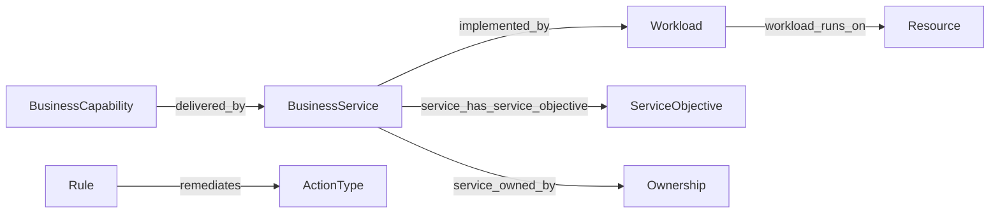
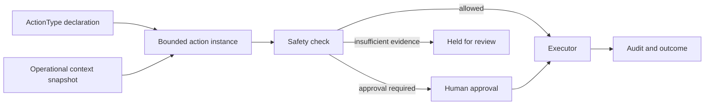

# 에이전트 기반 자동화(Agent-driven automation)

FDAI의 에이전트가 cloud operations를 수행합니다. 에이전트는 typed event로 관측, 판단, 계획,
승인, 실행, 검증, 복구, 감사, 학습을 수행합니다. **온톨로지**는 에이전트의 공유 정확성
인프라입니다. 에이전트가 사용할 service, resource, objective, evidence, relationship, 허용
action을 정의하지만 graph 자체를 actor 또는 execution surface로 만들지 않습니다.

이 페이지에서는 에이전트가 세 가지 declaration type을 사용하는 방식, deployment observation이
bounded context가 되는 방식, `ActionType` proposal이 governed control loop를 통과하는 과정을
설명합니다.

> **권한 경계:** 온톨로지는 의미를 제공하는 읽기 모델입니다. 이벤트, 승인된 구성,
> 텔레메트리 provider, catalog-as-code, 추가 전용 감사 원장은 각자 담당하는 사실의
> 권위 있는 원본으로 유지됩니다.
>
> **안전 경계:** 온톨로지 컨텍스트는 자율성을 유지하거나 낮출 수만 있습니다. 컨텍스트가
> 누락되거나 오래됐거나 충돌하거나 근거가 부족하면 bounded evidence recovery, 더 작은 safe
> plan, no-op 또는 review를 유발하며 실행 권한을 부여하지 않습니다.

## 온톨로지의 구성

온톨로지는 액션 카탈로그보다 넓은 개념입니다. 버전이 지정된 세 가지 선언 타입을
결합합니다.

| 선언 | 정의하는 내용 | 예시 |
|------|---------------|------|
| **`ObjectType`** | 대상의 종류, 형식화된 속성, 키, 수명주기, 소유 에이전트, 근거 출처 | `BusinessService`, `Workload`, `ServiceObjective`, `Finding`, `Decision` |
| **`LinkType`** | 허용된 관계, 양 끝점 타입, 카디널리티, 인과 또는 시간 의미, 근거 출처 | `implemented_by`, `workload_runs_on`, `service_owned_by` |
| **`ActionType`** | 트리거, 사전 조건, 중단 조건, 복구, 영향 범위, 실행 경로, 자율성 상한이 있는 통제된 작업 | `ops.restart-service`, `remediate.right-size` |

선언은 Git에 저장되며 카탈로그를 로드할 때 검증됩니다. 특정 워크로드, 발견된 문제,
관계 같은 런타임 인스턴스는 승인된 배포 소스에서 projection되고 공유 온톨로지 provider를
통해 저장됩니다. 선언은 유효한 의미를 기술하고, 인스턴스는 한 배포에서 무엇이 존재하거나
발생했는지 기록합니다.

배포되는 모든 선언에는 출처가 포함됩니다. 카탈로그 loader는 content hash를 다시 계산하고
오래되거나 알 수 없는 참조를 차단하므로 관계나 작업의 의미가 조용히 바뀌지 않습니다.

## 운영 모델의 연결 방식

운영 온톨로지는 조직이 무엇을 운영하는지, 좋은 상태가 무엇인지, 현재 무슨 일이 일어나는지,
FDAI가 무엇을 검토했는지, 작업이 어떤 효과를 냈는지를 연결합니다.


```mermaid
flowchart LR
  BC[BusinessCapability] -->|delivered_by| BS[BusinessService]
  BS -->|implemented_by| W[Workload]
  W -->|workload_runs_on| R[Resource]
  BS -->|service_has_service_objective| O[ServiceObjective]
  BS -->|service_owned_by| OW[Ownership]
  RL[Rule] -->|remediates| AT[ActionType]
```

이 모델은 교체 가능한 클라우드 리소스 위에 안정적인 서비스와 워크로드 ID를 추가합니다.
목표와 담당 체계도 타입 없는 컨텍스트 묶음에 숨기지 않고 명시적으로 유지합니다. 변경
불가능한 운영 컨텍스트, 결정 사례, 응답 결과 계약은 이 의미를 결정과 효과 확인까지
전달합니다. 따라서 FDAI는 다음과 같은 질문에 결정론적으로 답할 수 있습니다.

- **영향:** 이 리소스에 의존하는 비즈니스 서비스와 목표는 무엇인가요?
- **권한:** 영향을 받는 워크로드의 담당자는 누구이며 검토된 제약 조건은 무엇인가요?
- **결정:** 보류와 미실행을 포함하여 어떤 제한된 선택지를 검토했나요?
- **효과:** 작업이 목표를 복구했나요, 롤백이 필요했나요, 문제가 다시 발생했나요?

각 `ObjectType`은 수명주기 기준과 하나의 소유 에이전트를 선언할 수 있습니다. 각
`LinkType`은 명시적인 카디널리티와 함께 하나의 소스 타입과 하나의 대상 타입을 허용합니다.
이 구조로 쓰기 책임을 분명히 하고 endpoint를 결정론적으로 검증합니다.

## ActionType 구성

`ActionType`은 하나의 작업과 모든 인스턴스가 물려받는 안전 계약을 정의합니다. 다음은
현재 제공되는 서비스 재시작 작업을 축약한 예입니다.

```yaml
schema_version: 1.0.0
name: ops.restart-service
version: 1.0.0
category: ops
operation: restart
interfaces: [ControlPlane]
trigger_kind:
  kind: both
execution_path: direct_api
rollback_contract: state_forward_only
irreversible: true
default_mode: shadow
promotion_gate:
  min_shadow_days: 14
  min_samples: 30
  min_accuracy: 0.98
  max_policy_escapes: 0
preconditions:
  - kind: graph_fresh_within_seconds
    value: 300
stop_conditions:
  - kind: provider_api_error_streak
    count: 3
  - kind: time_box_exceeded_seconds
    seconds: 300
blast_radius:
  computation: static_enum
  static_bucket: resource
ceiling_by_tier:
  t0: {max_autonomy: enforce_hil, min_role: contributor}
  t1: {max_autonomy: shadow_only, min_role: contributor}
  t2: {max_autonomy: shadow_only, min_role: approver}
```

- **실행 자격:** `preconditions`는 작업을 진행하기 전에 충족되어야 합니다.
- **런타임 중단:** `stop_conditions`는 측정 조건이 위험해질 때 작업을 중단합니다.
- **영향 범위:** `blast_radius`가 선언된 범위를 제한하고, 실시간 probe가 범위를 더 낮출 수
  있습니다.
- **복구:** `rollback_contract`는 FDAI가 되돌리거나 안전하게 다음 상태로 진행하는 방법을
  설명합니다.
- **권한:** `ceiling_by_tier`, 환경별 하향 조정, 호출자 역할, 승격 상태가 자율성을 제한합니다.
  어떤 경로도 적용 가능한 가장 엄격한 상한보다 권한을 높일 수 없습니다.

네 가지 작업 범주는 `remediation`, `ops`, `governance`, `tool`입니다. Tool 작업은
`tool_call`로 등록된 함수를 호출합니다. 클라우드 리소스를 직접 변경하지는 않지만 형식화된
인자, 안전성 검토, 감사 기록은 동일하게 적용됩니다.

## 선언에서 실행 중인 작업으로

인스턴스화는 정적 `ActionType` 선언을 특정 대상과 이벤트에 대한 하나의 제한된 작업으로
바꿉니다.


```mermaid
flowchart LR
  T[ActionType declaration] --> I[Bounded action instance]
  C[Operational context snapshot] --> I
  I --> G[Safety check]
  G -->|allowed| X[Executor]
  G -->|approval required| H[Human approval]
  G -->|insufficient evidence| R[Held for review]
  X --> A[Audit and outcome]
  H --> X
```

- **규칙 위반:** 컨트롤 루프가 일치한 규칙, 발견된 문제, 리소스, 타입 계약으로 인스턴스를
  만듭니다.
- **운영자 요청:** 작업의 쓰기 coordinator가 활성화된 경우 콘솔이 형식화된 의도, 요청자,
  검증된 인자로 인스턴스를 만들 수 있습니다.
- **두 트리거:** `trigger_kind: both`는 실행 및 감사 계약을 바꾸지 않고 두 경로를 모두
  허용합니다.

대화, 그래프 edge, 선언만으로는 실행 권한이 생기지 않습니다. 인스턴스는 동일한 정책,
리스크, 역할, 근거, 승격, 잠금, 감사 검사를 모두 통과해야 합니다.

## 선언과 실행 가능 상태의 차이

카탈로그는 의미를 정의합니다. 런타임 연결은 배포 환경이 실제로 수행할 수 있는지
결정합니다.

| 계층 | 책임 | 누락되거나 유효하지 않을 때 |
|------|------|-----------------------------|
| 선언 카탈로그 | 객체, 관계, 작업 스키마와 참조, 수명주기, 출처 검증 | 시작 또는 카탈로그 로드가 차단됨 |
| 인스턴스 projection | 최신 서비스, 워크로드, 목표, 리소스, 관계 인스턴스 제공 | 컨텍스트를 알 수 없음 또는 오래됨으로 표시하고 자율성을 낮춤 |
| Coordinator 또는 dispatcher | 허용된 트리거를 범위가 제한된 작업 인스턴스로 변환 | 트리거를 차단하거나 관찰 모드로 유지 |
| 실행 provider | `pr_native`, `direct_api`, `pr_manual`, `tool_call` 구현 | 변경을 적용하지 않고 사유를 감사에 기록 |
| 전달 및 감사 | 효과를 전달하고 모든 종료 경로 기록 | 작업을 불완전 상태로 처리하며 성공으로 간주하지 않음 |

이 분리를 통해 downstream 배포판은 코어 엔진을 바꾸지 않고 지원되는 composition 확장
지점에서 선언과 provider 구현을 추가할 수 있습니다. YAML 파일만으로 권한 있는 클라우드
통합이 만들어지지는 않습니다.

## 통제된 작업 파이프라인

모든 작업 인스턴스는 같은 파이프라인을 따릅니다.

```text
event -> ingest -> trust route -> T0 | T1 | (T2 -> quality checks)
      -> operational context -> safety check -> auto | human approval | hold | deny
      -> executor -> delivery -> audit -> observed outcome
```

1. **수집:** FDAI가 신호를 정규화하고 연계합니다.
2. **라우팅:** 신뢰 라우터가 T0(결정론적 규칙), T1(검증된 재사용), T2(근거 기반 모델 추론)
   중 하나를 선택합니다.
3. **컨텍스트 구체화:** 관련 서비스, 목표, 담당자, 변경, 근거 최신성, 의존 범위에 대한 변경
   불가능한 snapshot을 만듭니다.
4. **안전성 검토:** 정책 리스크와 타입의 티어 상한, 영향 범위, 호출자 역할, 환경, 승격 상태,
   컨트롤 플레인 상태를 결합합니다.
5. **실행 및 전달:** Executor가 리소스별 잠금을 확보하고 중단 및 복구 계약을 지키면서 선택된
   실행 경로를 적용합니다.
6. **감사 및 관측:** 미실행, 승인, 차단, 시간 초과, 실행 시도, 최종 receipt, 독립적으로 관측된
   효과를 기록합니다.

감사 레코드에는 최종 상한과 근거 참조가 포함됩니다. 이를 통해 작업을 허용하거나 보류하거나
차단한 이유를 증명하고 당시 시점 기준으로 replay할 수 있습니다.

## 온톨로지 확인

Reader 역할로 접근하는 `GET /ontology/graph` endpoint는 결정론적인 읽기 전용 projection을
제공합니다. ObjectType과 LinkType node 및 edge, ActionType 안전 계약, Mermaid rendering,
카탈로그 개수, source revision과 집계된 인스턴스 개수를 포함한 운영 모델 상태를 반환합니다.

이 endpoint는 배포 인스턴스 속성을 노출하지 않습니다. 그래프는 점검과 설명을 위한 것이며
변경을 수행하지 않습니다. 콘솔의 온톨로지 화면도 같은 projection을 사용합니다.

## 팁: 아리스토텔레스에서 현대 온톨로지까지

아리스토텔레스가 소프트웨어 온톨로지를 만든 것은 아니지만, 그의 질문은 좋은 출발점입니다.
어떤 종류의 것이 존재하는지, 그 대상에 어떤 속성을 말할 수 있는지, 대상을 어떻게 분류할지
묻습니다. 철학에서 온톨로지는 존재와 존재 범주를 연구하는 분야가 되었습니다. 지식 공학에서는
이를 실용적으로 바꾸어, 특정 도메인의 개념, 관계, 제약, 허용되는 해석을 명시하고 공유하는
명세를 온톨로지라고 부릅니다.

이 흐름에 따라 FDAI의 세 선언을 다음과 같이 이해할 수 있습니다.

- **`ObjectType`:** 운영 세계에는 어떤 종류의 대상이 존재하나요?
- **`LinkType`:** 그 대상들은 어떤 제약 아래 어떻게 관계를 맺을 수 있나요?
- **`ActionType`:** 그 대상에 어떤 통제된 변경을 적용할 수 있나요?

온톨로지와 Graph DB는 서로 다른 문제를 해결합니다.

| 질문 | 온톨로지 | 그래프 데이터베이스(Graph DB) |
|------|----------|-------------------------------|
| 주된 목적 | 공유 의미와 유효한 해석을 정의 | 연결된 데이터를 저장하고 그래프 질의 또는 순회를 최적화 |
| 핵심 내용 | 타입, 관계, 제약, 수명주기, 출처, 경우에 따라 추론 규칙 | node, edge, property, index, 질의 언어, 영속성 동작 |
| 정확성의 의미 | 도메인에서 어떤 개념과 관계가 유효한지 규정 | 저장된 그래프가 데이터베이스 스키마와 트랜잭션 규칙을 따르도록 보장 |
| 저장소 의존성 | 관계형 테이블, 문서, RDF store, 메모리, Graph DB 모두 사용 가능 | 도메인 온톨로지가 거의 없거나 전혀 없는 데이터도 저장 가능 |
| FDAI의 선택 | Git의 카탈로그 선언과 PostgreSQL의 런타임 인스턴스 | 현재 전용 Graph DB가 필요하지 않음 |

짧게 말하면 **온톨로지는 의미 계약이고, Graph DB는 가능한 저장 및 질의 엔진 중 하나**입니다.
RDF와 OWL은 온톨로지에 자주 쓰이는 표현 및 논리 표준이지만 Graph DB와 같은 뜻은 아닙니다.
FDAI는 측정된 dispatch 경로가 제한된 교집합과 짧은 순회이므로 현재 관계형 index를 사용합니다.
향후 다중 hop workload가 필요성을 입증하면 전용 그래프 엔진을 선택할 수 있지만, 이는 구현
선택이지 온톨로지 자체의 변경은 아닙니다.

## 다음 단계

| 학습 대상 | 문서 |
|-----------|------|
| 서비스, 목표, 결정, 결과에 대한 공유 의미 | [../../roadmap/architecture/operating-ontology-ko.md](../../roadmap/architecture/operating-ontology-ko.md) |
| 전체 ActionType 스키마와 확장 지점 | [../../roadmap/decisioning/action-ontology-ko.md](../../roadmap/decisioning/action-ontology-ko.md) |
| 런타임 상한과 실행 경로 | [../../roadmap/decisioning/execution-model-ko.md](../../roadmap/decisioning/execution-model-ko.md) |
| 온톨로지 저장 구조와 Graph DB 결정 | [../../roadmap/architecture/rule-lookup-ontology-storage-ko.md](../../roadmap/architecture/rule-lookup-ontology-storage-ko.md) |
| 작업이 적용 권한을 얻는 방식 | [shadow-then-enforce-ko.md](shadow-then-enforce-ko.md) |
