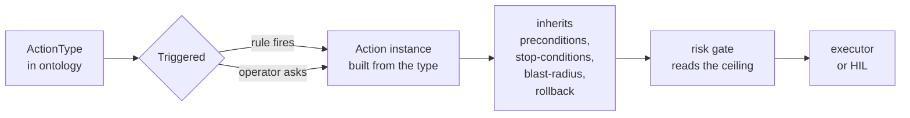

# Ontology-driven automation

FDAI does not hard-code what it is allowed to do. Every change it can make is
described once as a typed **`ActionType`** in a catalog-as-code **ontology**.
When a rule fires or an operator asks, that type is *instantiated* into a
concrete action that inherits the type's safety contract, flows through one
shared pipeline, and lands as an audited outcome. When an existing execution
path and provider already support the operation, a new capability can be a data
change rather than a new branch in the core engine. A declaration without a
live dispatcher remains inert and cannot execute.

This page explains the ontology, how an entry becomes a running action, and the
business pipeline that carries it from signal to audit.

## What the ontology is

The ontology is a versioned catalog of `ActionType` entries. Each entry is the
authoritative definition of one thing FDAI can do - `remediate.disable-public-access`,
`ops.restart-service`, `remediate.right-size`, `governance.promote-action-type`,
and so on. Entries are grouped into four categories:

- **`remediation`** - rule-fired, config-drift-style changes.
- **`ops`** - operator-requested runtime actions (restart, scale, flush).
- **`governance`** - catalog, exemption, and promotion changes.
- **`tool`** - invokes a registered function through `tool_call`, such as
  generating a document, sending a notification, or opening a ticket. Tool
  actions do not mutate the cloud substrate.

Because the ontology is data, not code, a fork adds or overrides entries through
config without touching the core engine. The entry must still select a supported
execution path and a registered provider before it can become live.

## Anatomy of an ActionType

An `ActionType` is not just a name - it declares its own guardrails. The safety
invariants FDAI requires (stop-condition, rollback path, impact scope limit,
audit entry) live on the type, so every instance is born safe. A trimmed
example:

```yaml
name: remediate.disable-public-access
category: remediation
trigger_kind:
  kind: rule_violation
execution_path: pr_native
rollback_contract: state_forward_only
default_mode: shadow          # judge and log only until promoted
promotion_gate:
  min_shadow_days: 14
  min_accuracy: 0.98
  max_policy_escapes: 0
preconditions:
  - kind: resource_property_equals
    property: public_access
    value: enabled
stop_conditions:
  - kind: dependent_resource_degraded
  - kind: time_box_exceeded_seconds
    seconds: 300
blast_radius:
  max_affected_resources: 5
  traversal_depth: 2
ceiling_by_tier:
  t0: { max_autonomy: enforce_hil, min_role: approver }
```

- **`preconditions`** must hold before the action is eligible.
- **`stop_conditions`** abort a running action if the world turns hostile.
- **`blast_radius`** caps how far one action may reach.
- **`rollback_contract`** names how the change is undone.
- **`ceiling_by_tier`** caps autonomy per trust tier - a type can never be
  raised above its declared ceiling by any code path.

## From type to instance

Instantiation is the moment a static ontology entry becomes a live action.



- A **rule violation** at T0/T1/T2 constructs the instance from the matched
  rule plus the detected issue - the resources, parameters, and scope come from the
  event.
- An **operator request** can construct the instance from the typed intent,
  principal, and arguments when the write-direction coordinator for that action
  is enabled. Conversation alone never creates execution authority.

Either way, the instance carries the type's contract. The engine does not need
to know whether it is remediating drift or restarting a pod; it runs the same
pipeline with the same guarantees.

## Two triggers, one ontology

The ontology handles both directions of automation with a single `trigger_kind`
axis:

- **`rule_violation`** - the control loop proposes the action (push direction).
- **`operator_request`** - a human requests it via the console (pull direction).
- **`both`** - some actions belong to either surface. `ops.restart-service` can
  be triggered by an operator ("restart this") or by a health-probe rule.

Nothing else in the schema is trigger-specific. The safety check and audit contract
are identical for both, so an operator-driven action gets the same safety
contract as a rule-driven one. If the trigger coordinator or execution provider
is not registered, the declaration remains available for validation and shadow
inspection but cannot mutate anything.

## Declared does not mean executable

The catalog describes what an action means. Runtime wiring decides whether the
current deployment can carry it out.

| Layer | Responsibility | Missing-layer behavior |
|-------|----------------|------------------------|
| `ActionType` declaration | Schema, safety contract, trigger, execution path, role bindings | Invalid or unknown declarations fail catalog loading |
| Coordinator or dispatcher | Converts a valid trigger into a bounded action instance | Trigger is rejected or remains judge-and-log only |
| Execution provider | Implements `pr_native`, `direct_api`, `pr_manual`, or `tool_call` | No mutation; the action is held with an auditable reason |
| Delivery and audit | Delivers the effect and records every terminal path | Missing audit or rollback support makes the action incomplete |

This distinction lets the catalog lead implementation without pretending that a
YAML file creates a privileged integration. A fork can reuse an existing path by
registering its provider at the composition root. New substrate behavior still
requires an implementation behind the approved provider interface.

## How actions fail closed

Ontology validation happens before an action is eligible to run. Common closed
outcomes include:

- an unknown category, execution path, role, or `ActionType` reference fails
  catalog loading;
- invalid arguments or failed preconditions reject the action instance;
- a missing dispatcher or provider leaves the declaration inert;
- a stale required inventory graph causes the safety check to deny;
- a missing safety invariant makes the action incomplete and unable to ship;
- an unsupported or ambiguous outcome is held for human approval with no mutation.

These are typed terminal outcomes, not silent drops. Each carries the event and
correlation references needed to explain what did not run and why.

## The business pipeline

An instantiated action flows through one pipeline. The ontology supplies the
safety contract at each stage; the agents own the stages (see
[agents-and-self-healing.md](agents-and-self-healing.md)).

```text
event -> event-ingest -> trust-router -> T0 | T1 | (T2 -> quality-gate)
      -> risk-gate    -> auto | HIL | abstain
      -> executor     -> delivery -> audit
```

1. **Ingest** normalizes and correlates the signal into an incident.
2. **Route** scores confidence and picks the cheapest competent tier.
3. **Gate** reads the type's tier ceiling and rules auto, human approval, or deny.
4. **Execute** applies the change only after preconditions pass and the
   per-resource lock is held, honoring stop-conditions and impact scope.
5. **Deliver** ships the change as a fix PR or a direct API call.
6. **Audit** appends an immutable entry - including no-ops, rejects, and
   timeouts.

Because the contract is on the type, promoting a capability from shadow to
enforce is a measured, separately reviewed change against the type's
`promotion_gate` - never a surprise (see
[shadow-then-enforce.md](shadow-then-enforce.md)).

## Why an action was allowed

The risk table and every applicable ceiling are combined by choosing the most
restrictive result. The audit record exposes this as `resolved_ceiling`, which
includes the matched risk rule, trust tier, `ActionType` ceiling, declared and
live impact scope, caller role, environment, control-plane health, required
quorum, and final execution path.

That evidence is part of the ontology contract. It proves that an action did not
gain authority merely because a trigger existed or an operator requested it.

## Next steps

| To learn about | Read |
|----------------|------|
| Which agents own each pipeline stage | [agents-and-self-healing.md](agents-and-self-healing.md) |
| How the safety check reads the tier ceiling | [risk-tiers.md](risk-tiers.md) |
| How a new action earns the right to auto-run | [shadow-then-enforce.md](shadow-then-enforce.md) |
| The full ontology schema and fork seams | [../../roadmap/decisioning/action-ontology.md](../../roadmap/decisioning/action-ontology.md) |
| Runtime ceilings and provider paths | [../../roadmap/decisioning/execution-model.md](../../roadmap/decisioning/execution-model.md) |
