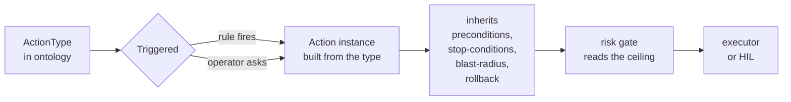

# Ontology-driven automation

FDAI does not hard-code what it is allowed to do. Every change it can make is
described once as a typed **`ActionType`** in an **ontology** that lives in the
catalog as code. When a rule fires or an operator asks for something, FDAI turns
that type into a concrete action. The action inherits the type's safety contract,
runs through one shared pipeline, and ends as an audited outcome. If an execution
path and a provider already exist for the operation, adding a capability can be a
data change instead of a new branch in the core engine. A declaration with no
live dispatcher stays inactive and cannot execute.

This page explains the ontology, how an entry becomes a running action, and the
pipeline that carries it from signal to audit.

## What the ontology is

The ontology is a versioned catalog of `ActionType` entries. Each entry is the
authoritative definition of one thing FDAI can do, such as
`remediate.disable-public-access`, `ops.restart-service`,
`remediate.right-size`, or `governance.promote-action-type`. Entries fall into
four categories:

- **`remediation`**: rule-fired changes, typically config drift.
- **`ops`**: runtime actions an operator requests, such as restart, scale, or
  flush.
- **`governance`**: catalog, exemption, and promotion changes.
- **`tool`**: calls a registered function through `tool_call`, for example to
  generate a document, send a notification, or open a ticket. Tool actions never
  change cloud resources.

Because the ontology is data rather than code, a fork adds or overrides entries
through configuration without touching the core engine. The entry still has to
pick a supported execution path and a registered provider before it can go live.

## Anatomy of an ActionType

An `ActionType` is more than a name. It declares its own guardrails. The safety
controls FDAI requires, meaning the stop condition, the rollback path, the impact
scope limit, and the audit entry, live on the type, so every instance is born
safe. Here is a trimmed example:

```yaml
name: remediate.disable-public-access
category: remediation
trigger_kind:
  kind: rule_violation
execution_path: pr_native
rollback_contract: state_forward_only
default_mode: shadow          # judge and log only until promoted
promotion_gate:
  min_shadow_days: 14
  min_accuracy: 0.98
  max_policy_escapes: 0
preconditions:
  - kind: resource_property_equals
    property: public_access
    value: enabled
stop_conditions:
  - kind: dependent_resource_degraded
  - kind: time_box_exceeded_seconds
    seconds: 300
blast_radius:
  max_affected_resources: 5
  traversal_depth: 2
ceiling_by_tier:
  t0: { max_autonomy: enforce_hil, min_role: approver }
```

- **`preconditions`** have to hold before the action is eligible.
- **`stop_conditions`** abort a running action when the world turns hostile.
- **`blast_radius`** caps how far one action may reach.
- **`rollback_contract`** names how the change is undone.
- **`ceiling_by_tier`** caps autonomy per trust tier. No code path can raise a
  type above its declared ceiling.

## From type to instance

Instantiation is the moment a static ontology entry becomes a live action.


```mermaid
flowchart LR
  T[ActionType<br/>in ontology] --> M{Triggered}
  M -->|rule fires| I[Action instance<br/>built from the type]
  M -->|operator asks| I
  I --> C[inherits<br/>preconditions,<br/>stop-conditions,<br/>blast-radius,<br/>rollback]
  C --> G[risk gate<br/>reads the ceiling]
  G --> X[executor<br/>or HIL]
```

- A **rule violation** at T0, T1, or T2 builds the instance from the matched rule
  and the detected issue. The resources, parameters, and scope all come from the
  event.
- An **operator request** can build the instance from the typed intent, the
  principal, and the arguments, but only when the write coordinator for that
  action is enabled. A conversation alone never creates execution authority.

Either way, the instance carries the type's contract. The engine does not need to
know whether it is fixing drift or restarting a pod. It runs the same pipeline
with the same guarantees.

## Two triggers, one ontology

The ontology covers both directions of automation with a single `trigger_kind`
field:

- **`rule_violation`**: the control loop proposes the action.
- **`operator_request`**: a person asks for it through the console.
- **`both`**: some actions belong to either surface. A health-probe rule or an
  operator can both trigger `ops.restart-service`.

Nothing else in the schema depends on the trigger. The safety check and the audit
contract are identical, so an operator-driven action gets the same safety
contract as a rule-driven one. If the trigger coordinator or the execution
provider is not registered, the declaration is still available for validation and
observation, but it cannot change anything.

## Declared does not mean executable

The catalog describes what an action means. The runtime wiring decides whether
your deployment can actually carry it out.

| Layer | Responsibility | Missing-layer behavior |
|-------|----------------|------------------------|
| `ActionType` declaration | Schema, safety contract, trigger, execution path, role bindings | Invalid or unknown declarations fail catalog loading |
| Coordinator or dispatcher | Converts a valid trigger into a bounded action instance | Trigger is rejected or remains judge-and-log only |
| Execution provider | Implements `pr_native`, `direct_api`, `pr_manual`, or `tool_call` | No mutation; the action is held with an auditable reason |
| Delivery and audit | Delivers the effect and records every terminal path | Missing audit or rollback support makes the action incomplete |

This split lets the catalog lead the implementation without pretending that a
YAML file creates a privileged integration. A fork can reuse an existing path by
registering its provider at the composition root. New behavior against the cloud
still needs an implementation behind the approved provider interface.

## How actions choose the safer default

FDAI validates the ontology before an action becomes eligible to run. Common
safe outcomes include these:

- An unknown category, execution path, role, or `ActionType` reference makes the
  catalog fail to load.
- Invalid arguments or failed preconditions reject the action instance.
- A missing dispatcher or provider leaves the declaration inactive.
- A stale inventory graph makes the safety check deny the action.
- A missing safety control makes the action incomplete, so it cannot ship.
- An unsupported or ambiguous outcome waits for human approval and changes
  nothing.

These are typed outcomes, not silent drops. Each one carries the event and
correlation references you need to explain what did not run and why.

## The business pipeline

An action instance flows through one pipeline. The ontology supplies the safety
contract at each stage, and the agents own the stages (see
[agents-and-self-healing.md](agents-and-self-healing.md)).

```text
event -> event-ingest -> trust-router -> T0 | T1 | (T2 -> quality-gate)
      -> risk-gate    -> auto | HIL | abstain
      -> executor     -> delivery -> audit
```

1. **Ingest** normalizes the signal and correlates it into an incident.
2. **Route** scores confidence and picks the cheapest tier that can decide.
3. **Gate** reads the type's tier ceiling and answers auto, human approval, or
   deny.
4. **Execute** applies the change only after the preconditions pass and the
   per-resource lock is held, respecting stop conditions and impact scope.
5. **Deliver** ships the change as a fix pull request or a direct API call.
6. **Audit** appends an immutable entry, including no-ops, rejections, and
   timeouts.

Because the contract lives on the type, moving a capability from observation to
enforcement is a measured, separately reviewed change against the type's
`promotion_gate`. It is never a surprise (see
[shadow-then-enforce.md](shadow-then-enforce.md)).

## Why an action was allowed

FDAI combines the risk table with every applicable ceiling by choosing the most
restrictive result. The audit record shows this as `resolved_ceiling`, which
includes the matched risk rule, the trust tier, the `ActionType` ceiling, the
declared and live impact scope, the caller's role, the environment,
control-plane health, the required quorum, and the final execution path.

That evidence is part of the ontology contract. It proves that an action did not
gain authority just because a trigger existed or an operator asked for it.

## Next steps

| To learn about | Read |
|----------------|------|
| Which agents own each pipeline stage | [agents-and-self-healing.md](agents-and-self-healing.md) |
| How the safety check reads the tier ceiling | [risk-tiers.md](risk-tiers.md) |
| How a new action earns the right to run on its own | [shadow-then-enforce.md](shadow-then-enforce.md) |
| The full ontology schema and fork seams | [../../roadmap/decisioning/action-ontology.md](../../roadmap/decisioning/action-ontology.md) |
| Runtime ceilings and provider paths | [../../roadmap/decisioning/execution-model.md](../../roadmap/decisioning/execution-model.md) |
