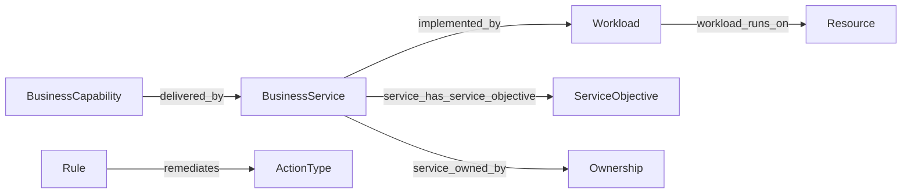
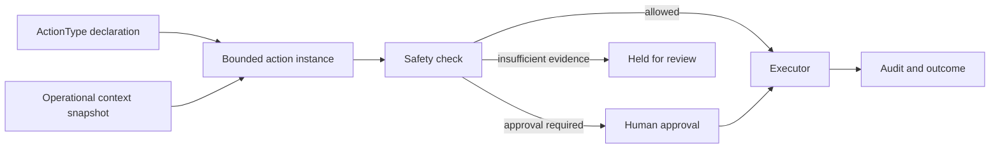

# Ontology-driven automation

FDAI uses an **ontology**, a typed model of operational concepts and their relationships, to give
its agents one shared meaning for services, resources, objectives, evidence, decisions, and
actions. The ontology connects that meaning to governed automation without turning the graph
itself into an execution surface.

This page explains the three declaration types, how deployment instances form an operating model,
and how an `ActionType` becomes an audited action.

> **Authority boundary:** The ontology is a semantic read model. Events, approved configuration,
> telemetry providers, catalog-as-code, and the append-only audit ledger remain authoritative for
> their own facts.
>
> **Safety boundary:** Ontology context can preserve or lower autonomy. Missing, stale,
> conflicting, or unproven context holds a decision for review and never grants execution
> permission.

## What the ontology contains

The ontology is broader than an action catalog. It combines three versioned declaration types:

| Declaration | Defines | Example |
|-------------|---------|---------|
| **`ObjectType`** | A kind of thing, its typed properties, key, lifecycle, owning agent, and evidence provenance | `BusinessService`, `Workload`, `ServiceObjective`, `Finding`, `Decision` |
| **`LinkType`** | An allowed relationship, endpoint types, cardinality, causal or temporal meaning, and evidence provenance | `implemented_by`, `workload_runs_on`, `service_owned_by` |
| **`ActionType`** | A governed operation with triggers, preconditions, stop conditions, rollback, impact scope, execution path, and autonomy ceilings | `ops.restart-service`, `remediate.right-size` |

Declarations live in Git and are validated when the catalog loads. Runtime instances, such as a
particular workload, detected issue (a `Finding`), or relationship, are projected from approved
deployment sources and stored through the shared ontology provider. A declaration describes valid
meaning; an instance records what exists or happened in one deployment.

Every shipped declaration carries provenance. Catalog loaders recompute its content hash and block
stale or unknown references, so a relation or action cannot silently change meaning.

## How the operating model fits together

The operating ontology connects what the organization operates, what good means, what is happening,
what FDAI considered, and what effect an action produced.


```mermaid
flowchart LR
  BC[BusinessCapability] -->|delivered_by| BS[BusinessService]
  BS -->|implemented_by| W[Workload]
  W -->|workload_runs_on| R[Resource]
  BS -->|service_has_service_objective| O[ServiceObjective]
  BS -->|service_owned_by| OW[Ownership]
  RL[Rule] -->|remediates| AT[ActionType]
```

This model adds stable service and workload identity above replaceable cloud resources. It also
keeps objectives and ownership explicit instead of hiding them in untyped context bags. Immutable
operational-context, decision-case, and response-outcome contracts carry that meaning through
decision and effect closure. FDAI can therefore ask deterministic questions such as:

- **Impact:** Which business service and objectives depend on this resource?
- **Authority:** Who owns the affected workload, and which reviewed constraints apply?
- **Decision:** Which bounded options were considered, including hold and no-op?
- **Effect:** Did the action restore the objective, require rollback, or recur later?

Each `ObjectType` can declare lifecycle criteria and one owning agent. Each `LinkType` permits one
source type and one target type with an explicit cardinality. This keeps writes accountable and
endpoint validation deterministic.

## Anatomy of an ActionType

An `ActionType` defines one operation and the safety contract every instance inherits. Here is a
trimmed version of the shipped service-restart action:

```yaml
schema_version: 1.0.0
name: ops.restart-service
version: 1.0.0
category: ops
operation: restart
interfaces: [ControlPlane]
trigger_kind:
  kind: both
execution_path: direct_api
rollback_contract: state_forward_only
irreversible: true
default_mode: shadow
promotion_gate:
  min_shadow_days: 14
  min_samples: 30
  min_accuracy: 0.98
  max_policy_escapes: 0
preconditions:
  - kind: graph_fresh_within_seconds
    value: 300
stop_conditions:
  - kind: provider_api_error_streak
    count: 3
  - kind: time_box_exceeded_seconds
    seconds: 300
blast_radius:
  computation: static_enum
  static_bucket: resource
ceiling_by_tier:
  t0: {max_autonomy: enforce_hil, min_role: contributor}
  t1: {max_autonomy: shadow_only, min_role: contributor}
  t2: {max_autonomy: shadow_only, min_role: approver}
```

- **Eligibility:** `preconditions` must hold before an action can proceed.
- **Runtime stop:** `stop_conditions` halt an action when measured conditions become unsafe.
- **Impact scope:** `blast_radius` caps the declared reach, while a live probe can lower it further.
- **Recovery:** `rollback_contract` describes how FDAI recovers or moves state forward safely.
- **Authority:** `ceiling_by_tier`, environment downgrade, caller role, and promotion state limit
  autonomy. No path can raise authority above the strictest applicable ceiling.

The four action categories are `remediation`, `ops`, `governance`, and `tool`. Tool actions call a
registered function through `tool_call`; they don't mutate cloud resources directly, but they still
use typed arguments, safety checks, and audit records.

## From declaration to running action

Instantiation turns a static `ActionType` declaration into one bounded action for a specific target
and event.


```mermaid
flowchart LR
  T[ActionType declaration] --> I[Bounded action instance]
  C[Operational context snapshot] --> I
  I --> G[Safety check]
  G -->|allowed| X[Executor]
  G -->|approval required| H[Human approval]
  G -->|insufficient evidence| R[Held for review]
  X --> A[Audit and outcome]
  H --> X
```

- **Rule violation:** The control loop builds the instance from a matched rule, detected issue,
  resource, and the type's contract.
- **Operator request:** The console can build it from typed intent, principal, and validated
  arguments when the action's write coordinator is enabled.
- **Either trigger:** `trigger_kind: both` allows both paths without changing the execution or
  audit contract.

A conversation, graph edge, or declaration alone never creates execution authority. The instance
must still pass the same policy, risk, role, evidence, promotion, locking, and audit checks.

## Declared does not mean executable

The catalog defines meaning. Runtime wiring determines whether a deployment can carry it out.

| Layer | Responsibility | When missing or invalid |
|-------|----------------|-------------------------|
| Declaration catalog | Validates object, link, and action schemas, references, lifecycle, and provenance | Startup or catalog loading is blocked |
| Instance projection | Supplies fresh service, workload, objective, resource, and relationship instances | Context is marked unknown or stale, and autonomy is lowered |
| Coordinator or dispatcher | Converts an allowed trigger into a bounded action instance | The trigger is rejected or remains observation-only |
| Execution provider | Implements `pr_native`, `direct_api`, `pr_manual`, or `tool_call` | No mutation occurs; the reason is audited |
| Delivery and audit | Delivers the effect and records every terminal path | The action is incomplete and cannot be treated as successful |

This separation lets a downstream distribution add declarations and provider implementations
through supported composition seams without changing the core engine. A YAML file never creates a
privileged cloud integration by itself.

## The governed action pipeline

Every action instance follows the same pipeline:

```text
event -> ingest -> trust route -> T0 | T1 | (T2 -> quality checks)
      -> operational context -> safety check -> auto | human approval | hold | deny
      -> executor -> delivery -> audit -> observed outcome
```

1. **Ingest:** FDAI normalizes and correlates the signal.
2. **Route:** The trust router picks T0 (deterministic rules), T1 (verified reuse), or T2 (grounded
   model reasoning).
3. **Materialize context:** FDAI creates an immutable snapshot of relevant services, objectives,
   ownership, changes, evidence freshness, and dependency scope.
4. **Check safety:** The safety check combines policy risk with the type's tier ceiling, impact
   scope, caller role, environment, promotion state, and control-plane health.
5. **Execute and deliver:** The executor acquires a per-resource lock and applies the selected
   execution path while honoring stop and recovery contracts.
6. **Audit and observe:** FDAI records no-ops, approvals, rejections, timeouts, attempts, terminal
   receipts, and independently observed effects.

The audit record includes the resolved ceiling and evidence references. This proves why an action
was allowed, held, or denied and supports time-consistent replay.

## Inspect the ontology

The Reader-gated `GET /ontology/graph` endpoint exposes a deterministic read-only projection. It
returns ObjectType and LinkType nodes and edges, ActionType safety contracts, a Mermaid rendering,
catalog counts, and operating-model status with its source revision and aggregate instance counts.

The endpoint doesn't expose deployment instance properties. The graph is for inspection and
explanation, not mutation. The console's ontology views use the same projection.

## Tip: From Aristotle to modern ontology

Aristotle did not design a software ontology, but his questions are a useful starting point: what
kinds of things exist, what properties can be said of them, and how should they be classified? In
philosophy, ontology became the study of being and the categories of existence. In knowledge
engineering, the term became practical: an ontology is an explicit, shared specification of the
concepts, relationships, constraints, and allowed interpretations in a domain.

You can read FDAI's three declarations through that progression:

- **`ObjectType`:** What kinds of operational things exist?
- **`LinkType`:** How may those things relate, and with what constraints?
- **`ActionType`:** What governed changes may be applied to them?

An ontology and a Graph DB solve different problems:

| Question | Ontology | Graph database |
|----------|----------|----------------|
| Primary purpose | Defines shared meaning and valid interpretations | Stores connected data and optimizes graph queries or traversal |
| Core content | Types, relationships, constraints, lifecycle, provenance, and sometimes inference rules | Nodes, edges, properties, indexes, query language, and persistence behavior |
| Correctness claim | Says which concepts and relations are valid in the domain | Ensures stored graph data follows the database's schema and transaction rules |
| Storage dependency | Can use relational tables, documents, RDF stores, memory, or a Graph DB | Can store data with little or no domain ontology |
| FDAI choice | Catalog declarations in Git and runtime instances in PostgreSQL | No dedicated Graph DB is currently required |

The short version is: **an ontology is the meaning contract; a Graph DB is one possible storage and
query engine**. RDF and OWL are representation and logic standards often used for ontologies, but
they are also not synonyms for a Graph DB. FDAI currently uses relational indexes because its
measured dispatch paths are bounded intersections and short traversals. A dedicated graph engine
would be an implementation choice if future multi-hop workloads justified it, not a change to the
ontology itself.

## Next steps

| To learn about | Read |
|----------------|------|
| Shared service, objective, decision, and outcome meaning | [../../roadmap/architecture/operating-ontology.md](../../roadmap/architecture/operating-ontology.md) |
| The complete ActionType schema and extension seams | [../../roadmap/decisioning/action-ontology.md](../../roadmap/decisioning/action-ontology.md) |
| Runtime ceilings and execution paths | [../../roadmap/decisioning/execution-model.md](../../roadmap/decisioning/execution-model.md) |
| Ontology storage and the Graph DB decision | [../../roadmap/architecture/rule-lookup-ontology-storage.md](../../roadmap/architecture/rule-lookup-ontology-storage.md) |
| How actions earn enforcement authority | [shadow-then-enforce.md](shadow-then-enforce.md) |
