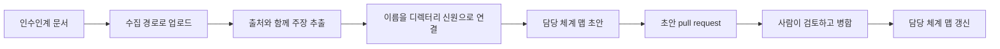

# 에이전트 담당 체계(Agent ownership)

FDAI가 운영 업무를 넘겨받아도 그 업무에는 여전히 책임지는 사람이 필요합니다. 담당 체계는 15개
에이전트 각각을 실명 담당자에게 연결해, 에스컬레이션이나 검토나 질문이 항상 그 영역을 아는
사람에게 도달하도록 합니다. 인수인계는 그 사람들이 가진 지식을 기록으로 남겨 지금 그 업무를
수행하는 에이전트에게 붙이는 절차입니다.

이 페이지에서는 여러분이 다루게 될 두 축 모델, 담당 체계 맵이 보장하는 것, 인수인계 문서가
조용한 수정이 아니라 검토된 변경이 되는 과정을 설명합니다.

> **권한 경계:** 에이전트의 담당자가 된다고 해서 FDAI 권한이 생기지는 않습니다. 실행기 신원을
> 부여하지 않고, 승인 가능한 범위도 넓히지 않습니다. 접근 권한과 담당 체계는 서로 다른 축으로
> 검증되고 승인되고 감사됩니다.

## 하나가 아니라 두 개의 축

에이전트를 담당하면 그 에이전트를 실행할 수 있다고 오해하기 쉽습니다. 그렇지 않습니다. FDAI는
서로 독립된 두 질문을 분리해서 다룹니다.

| 질문 | 축 | 값 |
|------|----|-----|
| 이 사람은 FDAI에서 무엇을 할 수 있나요? | 접근 권한(RBAC) | Reader, Contributor, Approver, Owner, Break-Glass |
| 이 에이전트 영역은 누가 답하나요? | 담당 체계 | 최종 책임자, 알림 대상 |

대부분의 사람은 두 모델 모두에 속합니다. 비용 승인을 담당하는 Approver가 비용 전문 에이전트인
Njord의 책임 담당자일 수도 있습니다. 그래도 두 축은 따로 확인되므로, 승인 그룹에서 누군가를
제외해도 에이전트가 조용히 무담당 상태가 되지 않고, 담당자로 지정한다고 해서 승인 권한이 조용히
생기지도 않습니다.

## 담당 체계 맵이 보장하는 것

맵은 런타임 설정이 아니라 Git에 있는 검토 대상 파일입니다. 모든 에이전트와 그 뒤의 사람을
기록합니다.

- **모든 에이전트가 맵에 있습니다.** 15개 에이전트가 전부 등장합니다. 어떤 에이전트에 책임
  담당자가 없으면 맵이 로드되지 않습니다. 단, 상시 담당자 없이 운영한다고 명시하고 그 이유를
  적어 둔 경우는 예외입니다.
- **한 에이전트에 담당자가 여러 명일 수 있습니다.** 각 에이전트는 한 사람이 아니라 목록에
  연결되며, 항목은 개인 또는 디렉터리 그룹을 가리킬 수 있습니다. 다섯 명을 나열하지 않고 "이건
  플랫폼 팀이 담당한다"라고 표현하는 방법입니다.
- **FDAI 자체에도 담당자가 필요합니다.** FDAI 유지관리자가 최소 한 명 있어야 하고, 없으면
  기동이 실패합니다. 두 명을 권장하며 한 명이면 경고가 발생합니다. 갈 곳 없는 모든
  에스컬레이션에 대해 한 사람이 단일 실패 지점이 되기 때문입니다.
- **유지관리자가 마지막 종착지입니다.** 담당자와 연락이 닿지 않는 에이전트는 응답 없이 방치되지
  않고 유지관리자로 에스컬레이션됩니다.

각 항목은 책임 구분을 가집니다. **최종 책임자**는 그 영역에 대해 답할 사람이고, **알림 대상**은
책임을 지지 않고 정보만 받는 항목입니다. 새 스키마는 순서가 있는 역할을 추가해 누가 1차 담당,
누가 백업, 누가 에스컬레이션 대상인지 기록할 수 있게 합니다.

## 담당자 계정이 오래됐을 때

사람은 팀을 옮기고 계정은 삭제됩니다. FDAI는 그것을 인시던트 도중에 발견하는 대신 미리
감시합니다.

주기적인 점검이 맵과 여러분의 디렉터리를 대조합니다. 더 이상 살아 있는 신원으로 연결되지 않는
항목은 오래된 담당자로 보고됩니다. 이는 중단이 아니라 경고입니다. 컨트롤 플레인은 계속
동작하고, 담당 체계 화면에 해당 항목이 나타나며, 감사 기록은 매 점검마다가 아니라 상태가 바뀜
때 남습니다.

이 구분은 당직 중일 때 중요합니다. 오래된 담당자는 그 에이전트의 에스컬레이션 경로가 끊겼으니
곧 손봐야 한다는 뜻이지, FDAI가 멈췄다는 뜻이 아닙니다.

## 인수인계 문서가 변경이 되기까지

인수인계는 이미 가지고 있는 문서에서 시작합니다. 당직표, RACI 차트, 조직도, 런북, 떠나면서
남긴 메모 같은 것입니다. FDAI는 그 문서를 읽고 맵 변경을 제안한 다음 멈춥니다.



1. **업로드.** 콘솔의 지식 인수인계 양식이나 수집 경로로 문서를 제출합니다. 다른 업로드와 같은
   안전 검사를 거칩니다.
2. **추출.** 결정론적 추출기가 줄 단위로 에이전트 영역 용어, 책임 표현, 사람을 찾습니다. 만들어진
   모든 주장은 근거가 된 줄을 인용합니다.
3. **연결.** 문서에 나온 사람을 여러분의 디렉터리에서 조회합니다. FDAI는 신원을 추측하지
   않습니다. 연결되지 않은 이름은 미해결로 표시해 사람이 정리하도록 남깁니다.
4. **초안.** 결과는 경고가 붙은 담당 체계 맵 초안입니다. 어떤 에이전트가 무담당으로 남았고 어떤
   사람이 연결되지 않았는지도 함께 담깁니다.
5. **제안.** 거버넌스 경로가 켜져 있으면 초안이 담당 체계 맵에 대한 초안 pull request로
   게시됩니다. 같은 문서를 다시 올려도 두 번째 요청이 열리지는 않습니다.
6. **병합.** 사람이 그 pull request를 검토하고 병합합니다. 그 전까지 맵은 아무것도 바뀌지
   않습니다.

초안은 확신도가 아무리 높아도 자동으로 적용되지 않습니다. 그게 핵심입니다. 문서는 누가 무엇을
담당했는지에 대한 근거일 뿐이고, 근거가 스스로 에스컬레이션 경로를 다시 쓰지는 못합니다.

업로드 후 초안을 확인하려면 수집 경로에서 가져옵니다.

```http
GET /ingestion/uploads/{upload_id}/handover-draft
```

## 콘솔에서 작업하는 위치

담당 체계는 콘솔의 **에이전트 오버사이트**에 있으며, 현재 맵, 사람 의존 관계, 지식 인수인계,
승인 경로, 매핑 검토 화면을 제공합니다.

콘솔은 읽고 제안하는 표면입니다. 담당 체계 projection을 보여 주고 인수인계 제안을 제출할 수
있지만, 담당 체계 맵을 직접 쓰지는 못합니다. 실제 변경은 모두 검토된 pull request를 거칩니다.

## 사람을 에이전트에 배정하기

맵 자체 외에도 Owner는 **배정 케이스**를 만들 수 있습니다. 한 사람과 요청된 접근 역할, 맡게 될
에이전트 역할, 뒤따르는 지식 목표를 하나로 묶은 통제된 기록입니다. 케이스는 초안, 검토, 담당
체계 변경, 활성화 단계를 거치며 각 단계에서 누가 요청하고 누가 검토했는지 기록합니다.

실제 사용 감각을 좌우하는 두 가지 규칙이 있습니다.

- **다른 사람이 검토합니다.** 케이스를 제출한 Owner는 그 케이스를 승인하는 Owner가 될 수
  없습니다.
- **케이스는 조율할 뿐 권한을 주지 않습니다.** 접근 권한과 담당 체계는 여전히 별개의 효과로
  적용되고 감사되므로, 하나의 양식으로 둘 다 요청해도 두 권한이 합쳐지지 않습니다.

> **현재 상태:** 디렉터리 검색, 배정 케이스 기록, 검토 흐름, 통합된 담당 체계 화면은 지금
> 사용할 수 있습니다. 디렉터리 그룹 멤버십을 바꾸는 경로는 관찰 모드로 동작합니다. 변경을
> 계획하고 검증하며 무엇을 했을지 기록하지만, 멤버십 변경을 대신 적용하지는 않습니다. 제안
> 표면으로 사용하고 그룹 변경은 평소 쓰는 신원 관리 절차로 마무리하세요.

## 사람을 지치게 하지 않고 지식 모으기

누군가 에이전트에 배정되면 FDAI는 아는 것의 빈틈을 채워 달라고 요청할 수 있습니다. 이 요청은
의도적으로 아껴서 보냅니다. 계속 방해받는 운영자는 결국 답을 하지 않기 때문입니다.

- 세션당 최대 한 번, 한 주에 먼저 거는 세션은 최대 두 번입니다.
- 한 세션은 몇 개의 질문 또는 몇 분 중 먼저 도달하는 쪽에서 끝납니다.
- 인시던트나 승인 대기를 처리하는 중에는 요청이 오지 않습니다.
- 답하거나, 문서를 대신 첨부하거나, 하루 미루거나, 거절할 수 있습니다.

미루기와 거절은 온전히 본인이 정합니다. 다른 사람을 대신해 지식 목표를 수락하려면 독립된
Owner가 필요합니다. 케이스에 두 번째 검토자가 필요한 것과 같은 이유입니다.

> 현지화된 요청 문구와 교체된 담당 범위의 자동 회수는 아직 구현되지 않았습니다. 누군가 영역을
> 넘기고 나면 뒷정리 제거는 직접 수행할 것을 전제로 계획하세요.

## 좋은 담당 체계의 모습

- **무담당 에이전트가 없고**, 상시 담당자 없이 운영하는 에이전트에는 기록된 이유가 있습니다.
- **모든 에이전트에 백업이 있어서** 한 사람의 휴가로 에스컬레이션 경로가 끊기지 않습니다.
- **오래된 담당자가 없으며**, 감사 시점이 아니라 상시로 점검됩니다.
- **FDAI 유지관리자가 최소 두 명이어서** 마지막 에스컬레이션 대상이 한 사람이 되지 않습니다.
- **인수인계 문서가 실제 사람으로 연결되고**, 미해결 이름은 초안에 남기지 않고 정리됩니다.

## 다음 단계

| 학습 대상 | 문서 |
|-----------|------|
| 15개 에이전트가 각각 책임지는 영역 | [에이전트 조직](agents-and-self-healing-ko.md) |
| 승인 권한이 부여되고 확인되는 방식 | [승인과 알림 채널](approvals-and-channels-ko.md) |
| 담당자나 에이전트가 실제로 한 일을 확인하는 방법 | [감사 로그 읽기](../guides/read-audit-log-ko.md) |
| 에이전트 담당 체계 계약과 맵 스키마 전체 | [에이전트 운영 담당 체계](../../roadmap/interfaces/agent-stewardship-and-handover-ko.md) |
| 런타임, 복구, 검증 세부 사항 | [에이전트 담당 체계 수명주기](../../roadmap/interfaces/agent-stewardship-operations-ko.md) |
