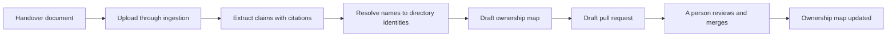

# Agent ownership

When FDAI takes over an operational task, that task still needs an accountable person. Ownership
maps each of the 15 agents to named people, so an escalation, a review, or a question always
reaches someone who understands the domain. Handover is how the knowledge those people carry gets
written down and attached to the agent that now does the work.

This page explains the two-axis model you work in, what the ownership map guarantees, and how a
handover document becomes a reviewed change instead of a silent edit.

> **Authority boundary:** Being an agent's owner grants no FDAI permission. It never grants the
> executor identity, and it never widens what you can approve. Access and ownership are validated,
> approved, and audited as separate axes.

## Two axes, not one

New operators often assume that owning an agent means being allowed to run it. It doesn't. FDAI
keeps two independent questions apart.

| Question | Axis | Values |
|----------|------|--------|
| What may this person do in FDAI? | Access (RBAC) | Reader, Contributor, Approver, Owner, Break-Glass |
| Who answers for this agent's domain? | Ownership | Accountable (final owner), Notified |

Most people sit in both models. An Approver who handles cost approvals may also be the accountable
owner for Njord, the cost specialist. The two are still resolved separately, so removing someone
from an approval group doesn't quietly leave an agent unowned, and naming someone as an owner
doesn't quietly grant them approval rights.

## What the ownership map guarantees

The map is a reviewed file in Git, not a runtime setting. It lists every agent and the people
behind it.

- **Every agent is mapped.** All 15 agents appear in the map. The map won't load if an agent has no
  accountable owner, unless that agent is explicitly recorded as running without a standing domain
  owner and the reason is written down.
- **An agent can have several owners.** Each agent maps to a list rather than to one person, and an
  entry can name an individual or a directory group. That's how you express "the platform team owns
  this" without listing five people.
- **FDAI itself needs an owner.** At least one FDAI maintainer is required, and startup fails
  without one. Two is the recommendation, and a single maintainer raises a warning, because one
  person is a single point of failure for every escalation that has nowhere else to go.
- **The maintainer is the last stop.** An agent whose owners can't be reached escalates to the
  maintainer rather than going unanswered.

Each entry carries a responsibility. An **Accountable** owner is answerable for the domain, and a
**Notified** entry is kept informed without being on the hook. A newer schema adds ordered duties,
so you can record who is primary, who is backup, and who is the escalation target.

## When an owner goes stale

People change teams and accounts get deleted. FDAI watches for that instead of discovering it
during an incident.

A scheduled check compares the map against your directory. An entry that no longer resolves to a
live identity is reported as a stale owner. This is a warning, not a shutdown: the control plane
keeps running, the stale entry appears in the ownership view, and an audit record is written when
the state changes rather than on every check.

That distinction matters when you're on call. A stale owner means the escalation path for that
agent is broken and needs attention soon. It doesn't mean FDAI stopped working.

## How a handover document becomes a change

Handover starts with a document someone already has: an on-call roster, a RACI chart, an org chart,
a runbook, or a memo written on the way out. FDAI reads it, proposes a map change, and stops.



1. **Upload.** You submit the document through the console's knowledge-handover form, or through the
   ingestion path directly. It passes the same safety inspection as any other upload.
2. **Extract.** A deterministic extractor scans line by line for agent domain terms, responsibility
   markers, and people. Every claim it makes cites the line it came from.
3. **Resolve.** Named people are looked up in your directory. FDAI never guesses an identity. A name
   it can't resolve is flagged as unresolved and left for a person to settle.
4. **Draft.** The result is a draft ownership map with its warnings attached, including which agents
   ended up unmapped and which people couldn't be resolved.
5. **Propose.** When the governance path is enabled, the draft is published as a draft pull request
   against the ownership map. Uploading the same document again doesn't open a second one.
6. **Merge.** A person reviews that pull request and merges it. Nothing about the map changes until
   they do.

The draft is never applied automatically, at any confidence level. That is the point: a document is
evidence about who owned what, and evidence doesn't get to rewrite an escalation path on its own.

To read a draft after upload, fetch it from the ingestion path:

```http
GET /ingestion/uploads/{upload_id}/handover-draft
```

## Where you do this in the console

Ownership lives under **Agent oversight** in the console, with views for the current map, human
dependencies, knowledge handover, approval routes, and mapping reviews.

The console is a reading and proposing surface. It shows you the ownership projection and lets you
submit a handover proposal, and it can't write the ownership map itself. Every real change goes
through the reviewed pull request.

## Assigning a person to agents

Beyond the map itself, an Owner can assemble an **assignment case**: one governed record that ties a
person to a requested access role, the agent duties they would take on, and the knowledge goals that
follow. A case moves through draft, review, ownership change, and activation, recording who
requested it and who reviewed it at each step.

Two rules shape how this feels in practice:

- **Someone else reviews it.** The Owner who submits a case can't be the Owner who approves it.
- **The case coordinates, it doesn't authorize.** Access and ownership are still applied and audited
  as separate effects, so one form can request both without merging the two authorities.

> **Current status:** Directory search, assignment-case records, the review flow, and the joined
> ownership view are available today. The path that changes directory group membership runs in
> observation mode: it plans and verifies the change and records what it would do, but doesn't apply
> the membership change for you. Treat it as a proposal surface and finish the group change through
> your normal identity process.

## Collecting knowledge without burning people out

Once someone is mapped to an agent, FDAI can ask them to fill gaps in what it knows. That invitation
is deliberately rationed, because an operator who gets interrupted constantly stops answering.

- At most one invitation per session, and at most two proactive sessions in a week.
- A session is capped at a few questions or a few minutes, whichever comes first.
- No invitation arrives while you're handling an incident or a pending approval.
- You can answer, attach a document instead, snooze for a day, or decline.

Snoozing and declining are yours alone to decide. Accepting a knowledge goal on someone's behalf
needs an independent Owner, for the same reason a case needs a second reviewer.

> Localized invitation text and automatic removal of replaced coverage aren't implemented yet. Plan
> on doing that follow-up removal yourself when someone hands a domain off.

## What good ownership looks like

- **No agent is unowned**, and any agent recorded as running without a standing owner has a written
  reason.
- **Every agent has a backup**, so one vacation doesn't break an escalation path.
- **No stale owners**, checked continuously rather than at audit time.
- **At least two FDAI maintainers**, so the final escalation target is never one person.
- **Handover documents resolve to real people**, with unresolved names settled rather than left in
  the draft.

## Next steps

| To learn about | Read |
|----------------|------|
| What each of the 15 agents is accountable for | [The agent organization](agents-and-self-healing.md) |
| How approval authority is granted and checked | [Approvals and channels](approvals-and-channels.md) |
| How to inspect what an owner or an agent actually did | [Read the audit log](../guides/read-audit-log.md) |
| The full agent ownership contract and map schema | [Agent operational ownership](../../roadmap/interfaces/agent-stewardship-and-handover.md) |
| The runtime, recovery, and verification detail | [Agent ownership lifecycle](../../roadmap/interfaces/agent-stewardship-operations.md) |
