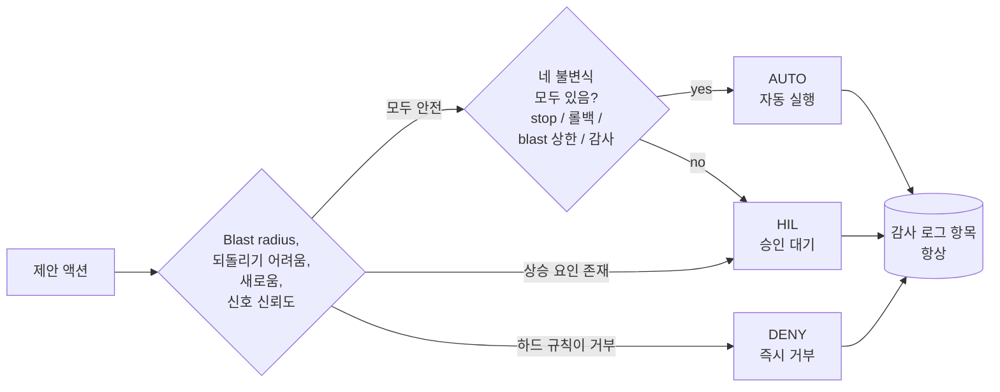

# 리스크 티어(Risk tiers)

AIOpsPilot이 내리는 모든 결정이 자동 실행되어야 하는 건 아닙니다. **리스크 티어**
는 제어 평면이 액션을 사람 없이 배포할지, 사람의 HIL(human-in-the-loop) 승인을
기다릴지, 아니면 아예 거부할지 결정하는 방식입니다.

## 세 판정

모든 제안 액션은 이벤트, 대상 리소스, 환경, 액션이 명시한 blast-radius 로부터
도출된 **리스크 분류**를 갖습니다. 분류는 다음 셋 중 정확히 하나로 매핑됩니다:

- **AUTO** - 직접 실행해도 안전할 만큼 낮은 리스크. 감사 로그는 여전히 누가, 무엇을,
  언제, 왜 를 기록합니다.
- **HIL** - 운영자가 승인해야 합니다. AIOpsPilot은 실행을 정지하고 알림 채널(Teams
  카드, PR 리뷰, 이메일, 배포에서 구성한 것 무엇이든)로 요청을 올립니다.
- **DENY** - 하드 규칙이 액션을 무조건 거부합니다. 극단적 경우 Break-Glass 역할이
  DENY를 우회할 수 있지만, 그런 사용은 눈에 띄게 감사됩니다.

## 무엇이 결정을 HIL 쪽으로 미는가

다음 중 하나라도 있으면 사다리를 올라갑니다:

- **Blast radius** - 프로덕션, 다중 리전, 공유 테넌시 대상은 격리된 개발 리소스보다
  더 자주 승인을 요구합니다.
- **되돌리기 어려움(Reversibility)** - 깨끗한 롤백 경로가 없는 액션(일부 데이터
  마이그레이션, 리소스 삭제 등)은 기본적으로 HIL로 앉습니다.
- **새로움(Novelty)** - trust router가 T2로 escalation 한 것은 리스크 게이트가
  더 엄격하게 받습니다.
- **신호 소스의 신뢰도** - 합성된 이상 신호는 hardened policy 위반보다 가볍게
  잡힙니다.

## AUTO가 요구하는 네 가지

모든 AUTO 액션은 이 네 가지를 모두 함께 보냅니다. 하나라도 빠지면 자동으로 HIL로
downgrade 됩니다:

1. **Stop-condition** - 세상이 나쁘게 반응하면 변경을 정지시키는 측정 가능한 상태.
2. **롤백 경로** - 사전 계산되어 있고, 테스트되어 있으며, 감사 항목에서 참조 가능.
3. **Blast-radius 제한** - 범위 · 배치 크기 · 속도에 대한 명시적 상한.
4. **감사 로그 항목** - append-only, immutable, 완전.

넷 중 하나라도 없으면 액션은 정의상 불완전하며 HIL로 라우팅됩니다. 이건 override
가 아니라 필수 검사입니다.

## 사람의 override는 최상위 제어

모든 게 그린이어도 올바른 역할을 가진 운영자는 AUTO 액션을 일시정지, downgrade,
거부할 수 있습니다. Override 자체도 감사됩니다. 자세한 메커닉은 로드맵의 *Human
Override* 절 참조.

## 다음 단계

| 학습 대상 | 문서 |
|-----------|------|
| 라우터가 어떤 티어를 고르는지 | [deterministic-first-ko.md](deterministic-first-ko.md) |
| 새 액션이 관찰 전용에서 자동 실행으로 이행하는 방식 | [shadow-then-enforce-ko.md](shadow-then-enforce-ko.md) |
| HIL의 일상 운영자 관점 | [../guides/approve-change-ko.md](../guides/approve-change-ko.md) |
| 전체 리스크 분류 규정 | [../../roadmap/risk-classification-ko.md](../../roadmap/risk-classification-ko.md) |
