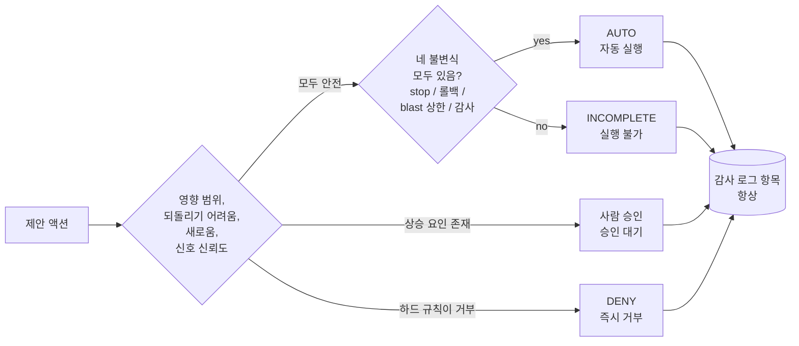

# 리스크 티어(Risk tiers)

FDAI가 내리는 모든 결정이 자동 실행되어야 하는 것은 아닙니다. **리스크 티어**는
컨트롤 플레인이 액션을 사람 없이 실행할지, 사람 승인(`hil` 결정)을 기다릴지, 아니면
거부할지 결정하는 방식입니다.

## 세 가지 결정

제안된 모든 액션은 이벤트, 대상 리소스, 환경, 그리고 액션이 명시한 영향 범위(정본
`blast_radius` 필드)로부터 도출된 **리스크 분류**를 가집니다. 이 분류는 다음 세 가지 중
정확히 하나에 매핑됩니다:

- **AUTO** - 직접 실행해도 안전할 만큼 낮은 리스크. 감사 로그는 여전히 누가, 무엇을,
  언제, 왜를 기록합니다.
- **사람 승인(`hil`)** - 운영자가 승인해야 합니다. FDAI는 실행을 멈추고 Teams,
  재인증이 구성된 Slack, 수정 pull request 검토처럼 신원을 확인할 수 있는 승인 채널로
  요청을 보냅니다.
- **DENY** - 하드 규칙이 요청 주체와 관계없이 액션을 거부합니다. BreakGlass는 `deny`를
  `hil`이나 `auto`로 바꾸지 않습니다. 정책이 허용한 긴급 승인에 일시적으로 참여할
  자격만 부여합니다.

`shadow_only`는 네 번째 결정이 아니라 실행 모드입니다. 결정을 계산하고 기록하지만
대상을 변경할 수 없습니다. `abstain` 기계값도 사람 승인과 다릅니다. 판단 티어가 결정을
뒷받침하지 못했으므로 실행 없이 사람 검토를 위해 보류한다는 뜻입니다.

## 최종 판정 계산 방식

먼저 리스크 분류 테이블을 평가합니다. 규칙은 `deny`, 사람 승인(`hil`), `auto`, 그리고
기본 사람 승인 catch-all의 엄격한 순서로 평가되며, 처음 일치한 규칙이 기준 결정이 됩니다.

FDAI는 이 기준 결정을 신뢰 티어, `ActionType`, 선언된 영향 범위와 실시간 영향 범위,
호출자 역할, 환경, 컨트롤 플레인 상태의 자율성 상한과 비교합니다. **가장 엄격한 결과를
선택합니다.** 상한은 자동 실행을 사람 승인, 관찰 전용 모드, 거부로 낮출 수 있지만 기준
결정보다 자율성을 높일 수 없습니다.

예시: 되돌릴 수 있고 단일 리소스에 한정된 변경이 auto 규칙과 일치해도 인벤토리
그래프가 오래되었다면 안전성 검토가 거부합니다. Owner 역할이나 더 허용적인
`ActionType` 상한도 이를 `hil` 또는 `auto`로 다시 높일 수 없습니다.

## 무엇이 결정을 사람 승인 쪽으로 미는가

다음 조건은 사람 승인이 필요할 가능성을 높이거나 자율성 상한을 낮춥니다:

- **영향 범위** - 프로덕션, 다중 리전, 공유 테넌시 대상은 격리된 개발 리소스보다
  더 자주 승인을 요구합니다.
- **되돌리기 어려움(Reversibility)** - 되돌리기 어려운 데이터 변경이나 리소스 삭제는
  기본적으로 사람 승인이 필요합니다.
- **새로움(Novelty)** - trust-router가 T2로 에스컬레이션한 결과에는 더 엄격한 상한이
  적용됩니다. 업스트림에서 T2 결과는 품질 검토를 통과해도 관찰 전용
  (`shadow_only`)입니다.
- **신호 소스의 신뢰도** - 합성된 이상 신호는 검증된 정책 위반보다 낮은 신뢰도로
  처리됩니다.

## 자동 실행에 필요한 네 가지

실행 가능한 모든 액션은 다음 네 가지를 모두 갖춰야 합니다:

1. **Stop-condition** - 환경이 예상과 다르게 반응하면 변경을 멈추는 측정 가능한 상태.
2. **롤백 경로** - 사전 계산되어 있고, 테스트되어 있으며, 감사 항목에서 참조 가능.
3. **영향 범위 제한** - 범위, 배치 크기, 속도에 대한 명시적 상한.
4. **감사 로그 항목** - append-only, immutable, 완전.

하나라도 없으면 액션은 불완전하며 실행할 수 없습니다. 사람 승인으로 누락된 안전 계약을
보완할 수 없습니다. `ActionType`을 수정하고 검증한 뒤 파이프라인에 다시 진입해야 합니다.

## 안전하게 닫히는(fail-closed) 사례

업스트림 기본값은 불확실할수록 자율성을 낮춥니다:

| 상황 | 결과 | 이유 |
|------|------|------|
| 정책 verifier가 액션을 거부 | DENY | 이 경로에서 사람 승인은 결정론적 정책 결과를 면제할 수 없음 |
| 인벤토리 그래프가 오래됨 | DENY | 영향 범위가 오래된(obsolete) 관계로부터 계산될 수 있음 |
| 구독 전체 범위의 변경 | DENY | 자율 변경은 구독 전체에 걸쳐 실행할 수 없음 |
| 되돌릴 수 없는 액션 | 사람 승인(`hil`), 정족수 2명 | 서로 다른 승인자 두 명이 필요하며 자기 승인은 허용되지 않음 |
| 환경이 누락되거나 인식되지 않음 | 프로덕션으로 처리 | 누락된 메타데이터가 리스크를 낮출 수 없음 |
| 월별 비용 영향이 알려지지 않음 | 사람 승인 | 알 수 없는 비용은 구성된 auto 임계값 이상으로 처리 |
| 어떤 규칙과도 일치하지 않음 | 사람 승인 | 기본 규칙이 사람 검토를 선택 |

## 승인 대기 중에 일어나는 일

사람 승인 경로는 대기 중인 액션을 저장하고 이벤트 루프에 제어를 반환합니다. 신원을 확인할 수 있는
채널에는 권한이 아니라 불투명한 승인 참조가 전달됩니다. API는 액션을 재개하기 전에
승인자를 다시 인증하고 action hash, idempotency key, 역할, 정족수, TTL, 자기 승인 금지
규칙을 검사합니다.

승인하면 동일한 대기 액션을 한 번만 재개합니다. 거부와 시간 초과는 감사 로그에 기록되는
no-op입니다. 중복되거나 충돌하는 응답은 액션을 다시 실행할 수 없습니다. 이메일, SMS,
호출 시스템은 승인 대기 사실을 알릴 수 있지만 A1 승인 결정을 제출할 수는 없습니다.

## 저하 및 긴급 상태

컨트롤 플레인 상태도 자율성을 높이지 않는 상한입니다. 필수 의존성이 저하되면 관련 액션을
`shadow_only` 또는 deny로 제한합니다. 운영자 kill-switch도 안전한 범위에서 판정과 감사를
유지하면서 변경 실행을 막습니다. 의존성이 복구되어도 액션을 자동 승격하지 않고 정상적인
리스크 평가를 다시 수행합니다.

## 운영자 제어도 경계 안에서 동작

권한 있는 운영자는 대기 중인 액션을 거부하거나 kill-switch를 활성화할 수 있습니다.
규칙 override는 이와 다른 catalog-as-code 제어입니다. 제한된 범위에서 승인된 규칙을
좁히거나, 강등하거나, 비활성화합니다. 자율성을 높이거나 원래 발견된 문제를 지우거나
거부 결정을 우회할 수 없습니다. 모든 제어 액션은 감사 로그에 기록됩니다.

## 과거 결정을 설명하는 증거

감사 레코드는 일치한 리스크 규칙, 판정 당시 feature vector, 리스크 카탈로그 버전,
필요한 정족수, 모든 자율성 상한, 가장 엄격했던 축, 최종 실행 경로를 보존합니다. 이
`resolved_ceiling` 증거를 사용하면 현재 구성을 다시 계산하지 않고도 "왜 사람 승인이
필요했나?"와 "무엇이 자동 실행을 막았나?"에 답할 수 있습니다.

## 다음 단계

| 학습 대상 | 문서 |
|-----------|------|
| 라우터가 어떤 티어를 고르는지 | [deterministic-first-ko.md](deterministic-first-ko.md) |
| 새 액션이 관찰 전용에서 자동 실행으로 이행하는 방식 | [shadow-then-enforce-ko.md](shadow-then-enforce-ko.md) |
| 사람 승인의 일상 운영자 관점 | [../guides/approve-change-ko.md](../guides/approve-change-ko.md) |
| 전체 리스크 분류 규정 | [../../roadmap/decisioning/risk-classification-ko.md](../../roadmap/decisioning/risk-classification-ko.md) |
| 자율성 상한과 승인 재개 계약 | [../../roadmap/decisioning/execution-model-ko.md](../../roadmap/decisioning/execution-model-ko.md) |
