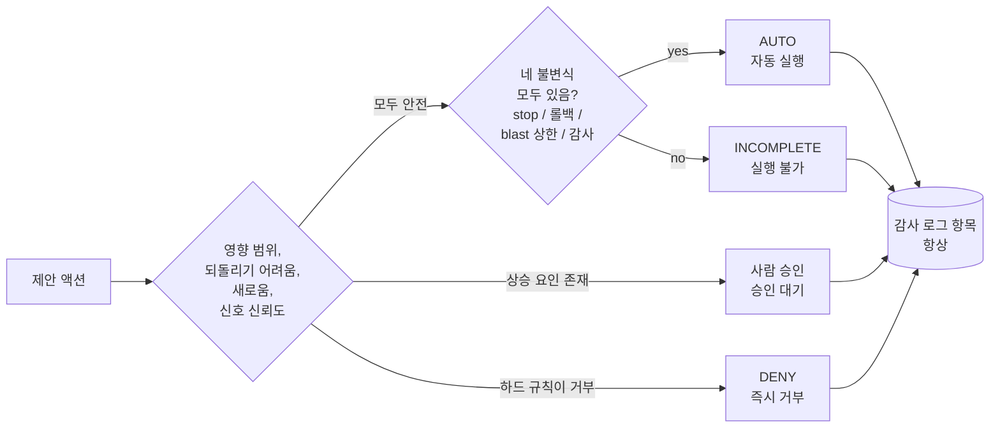

# 리스크 티어(Risk tiers)

FDAI가 내리는 모든 결정이 자동 실행되어야 하는 것은 아닙니다. **리스크 티어**는
컨트롤 플레인이 액션을 사람 없이 실행할지, 사람 승인(`hil` 결정)을 기다릴지, 아니면
거부할지 결정하는 방식입니다.

## 세 가지 결정

제안된 모든 액션은 이벤트, 대상 리소스, 환경, 그리고 액션이 명시한 영향 범위(정본
`blast_radius` 필드)로부터 도출된 **리스크 분류**를 가집니다. 이 분류는 다음 세 가지 중
정확히 하나에 매핑됩니다:

```mermaid
flowchart LR
  A[제안 액션]
  A --> C{영향 범위,<br/>되돌리기 어려움,<br/>새로움,<br/>신호 신뢰도}
  C -->|모두 안전| I{네 불변식<br/>모두 있음?<br/>stop / 롤백 /<br/>blast 상한 / 감사}
  C -->|상승 요인 존재| H
  C -->|하드 규칙이 거부| D
  I -->|yes| AU[AUTO<br/>자동 실행]
  I -->|no| X[INCOMPLETE<br/>실행 불가]
  H[사람 승인<br/>승인 대기]
  D[DENY<br/>즉시 거부]
  AU --> AUD[(감사 로그 항목<br/>항상)]
  H --> AUD
  D --> AUD
  X --> AUD
```

- **AUTO**: 직접 실행해도 안전할 만큼 낮은 위험입니다. 감사 로그는 여전히 누가, 무엇을,
  언제, 왜를 기록합니다.
- **사람 승인(`hil`)**: 운영자가 승인해야 합니다. FDAI는 실행을 멈추고 Teams, 재인증이
  구성된 Slack, 수정 pull request 검토처럼 신원을 확인할 수 있는 채널로 요청을 보냅니다.
- **DENY**: 하드 룰이 요청 주체와 관계없이 작업을 거부합니다. BreakGlass는 `deny`를
  `hil`이나 `auto`로 바꾸지 않습니다. 정책이 허용한 긴급 승인에 참여할 자격만 임시로
  줍니다.

`shadow_only`는 네 번째 결정이 아니라 실행 모드입니다. 결정을 계산하고 기록하지만
대상을 바꿀 수는 없습니다. `abstain`은 또 다릅니다. 판단 티어가 어떤 결정도 뒷받침하지
못해서, 실행 없이 검토를 위해 보류한다는 뜻입니다.

## 최종 판정 계산 방식

먼저 위험 분류 테이블을 평가합니다. 룰은 `deny`, 사람 승인(`hil`), `auto`, 그리고 마지막
사람 승인 catch-all 순서로 엄격하게 평가되며, 처음 일치한 룰이 기준 결정이 됩니다.

FDAI는 이 기준 결정을 신뢰 티어, `ActionType`, 선언된 영향 범위와 실시간 영향 범위,
호출자 역할, 환경, 컨트롤 플레인 상태에서 오는 자율성 상한과 비교합니다. **가장 엄격한
결과를 선택합니다.** 상한은 자동 실행을 사람 승인, 관찰 전용 모드, 거부로 낮출 수
있지만 기준 결정보다 자율성을 높일 수는 없습니다.

예시: 되돌릴 수 있고 단일 리소스에 한정된 변경이 auto 규칙과 일치해도 인벤토리
그래프가 오래되었다면 안전성 검토가 거부합니다. Owner 역할이나 더 허용적인
`ActionType` 상한도 이를 `hil` 또는 `auto`로 다시 높일 수 없습니다.

## 무엇이 결정을 사람 승인 쪽으로 미는가

다음 조건은 사람 승인이 필요할 가능성을 높이거나 자율성 상한을 낮춥니다.

- **영향 범위**: 프로덕션, 다중 리전, 공유 테넌시 대상은 격리된 개발 리소스보다 훨씬
  자주 승인을 요구합니다.
- **되돌리기 어려움**: 깔끔하게 되돌릴 경로가 없는 데이터 마이그레이션이나 리소스
  삭제는 기본적으로 사람 승인을 요청합니다.
- **새로움**: 트러스트 라우터가 T2로 올린 결과에는 더 엄격한 상한이 적용됩니다. T2
  결과는 품질 검토를 통과해도 관찰 전용(`shadow_only`)입니다.
- **신호를 얼마나 신뢰하는지**: 합성된 이상 신호는 검증된 정책 위반보다 낮게
  평가됩니다.

## 자동 실행에 필요한 네 가지

실행 가능한 모든 작업은 다음 네 가지를 모두 갖춰야 합니다.

1. **중단 조건**: 환경이 예상과 다르게 반응하면 변경을 멈추는 측정 가능한 상태
2. **롤백 경로**: 미리 계산되고 테스트되었으며 감사 항목에서 참조 가능
3. **영향 범위 제한**: 범위, 배치 크기, 속도에 대한 명시적인 상한
4. **감사 로그 항목**: 추가 전용이고 변경할 수 없으며 빠짐이 없음

하나라도 없으면 작업은 불완전하며 실행할 수 없습니다. 사람 승인으로 누락된 안전 계약을
메울 수는 없습니다. `ActionType`을 고치고 검증한 뒤에야 파이프라인에 다시 들어갈 수
있습니다.

## 더 안전한 쪽을 고르는 사례

상위 프로젝트 기본값은 불확실할수록 자율성을 낮춥니다.

| 상황 | 결과 | 이유 |
|------|------|------|
| 정책 검증기가 작업을 거부 | DENY | 이 경로에서는 사람 승인이 결정론적 정책 결과를 면제할 수 없음 |
| 인벤토리 그래프가 오래됨 | DENY | 영향 범위가 철 지난 관계로 계산될 수 있음 |
| 구독 전체 범위의 변경 | DENY | 자동 변경은 구독 전체에 걸쳐 실행할 수 없음 |
| 되돌릴 수 없는 작업 | 사람 승인, 정족수 2명 | 서로 다른 승인자 두 명이 필요하며 자기 승인은 불가 |
| 환경이 누락되거나 인식되지 않음 | 프로덕션으로 처리 | 누락된 메타데이터가 위험을 낮출 수 없음 |
| 월별 비용 영향이 알려지지 않음 | 사람 승인 | 알 수 없는 비용은 설정된 자동 임계값 이상으로 처리 |
| 어떤 룰과도 일치하지 않음 | 사람 승인 | 기본 룰이 더 안전한 사람 검토를 선택 |

## 승인 대기 중에 일어나는 일

사람 승인 결정은 대기 중인 작업을 저장하고 이벤트 루프에 제어를 돌려줍니다. 신원을
확인할 수 있는 채널에는 권한이 아니라 불투명한 승인 참조가 전달됩니다. 승인자가
응답하면 API는 작업을 재개하기 전에 승인자를 다시 인증하고 action hash, idempotency
key, 역할, 정족수, TTL, 자기 승인 금지 규칙을 검사합니다.

승인하면 동일한 대기 작업을 딱 한 번만 재개합니다. 거부와 시간 초과는 모두 감사 로그에
남는 미실행입니다. 중복되거나 충돌하는 응답은 작업을 다시 실행할 수 없습니다. 이메일,
SMS, 호출 시스템은 승인 대기 사실을 알릴 수 있지만 승인 결정을 제출할 수는 없습니다.

## 저하 및 긴급 상태

컨트롤 플레인 상태도 자율성을 낮추기만 하는 상한입니다. 필수 의존성이 나빠지면 관련
작업을 `shadow_only` 또는 거부로 제한합니다. 운영자 kill-switch도 안전한 범위에서
판단과 감사를 유지하면서 변경을 막습니다. 의존성이 복구되어도 작업을 조용히
승격하지 않고, 정상적인 위험 평가를 다시 수행합니다.

## 운영자 제어도 경계 안에서 동작

권한 있는 운영자는 대기 중인 작업을 거부하거나 kill-switch를 켜면 됩니다. 룰
오버라이드는 카탈로그에 코드로 존재하는 별도의 제어입니다. 제한된 범위에서 승인된 룰
하나를 좀히거나, 강등하거나, 끕니다. 자율성을 높이거나 원래 발견된 문제를 지우거나
거부 결정을 우회할 수는 없습니다. 모든 제어 동작은 감사 로그에 남습니다.

## 과거 결정을 설명하는 근거

감사 레코드는 일치한 위험 룰, 판정 당시의 feature vector, 위험 카탈로그 버전, 필요한
정족수, 모든 자율성 상한, 가장 엄격했던 축, 최종 실행 경로를 보관합니다. 이
`resolved_ceiling` 근거를 쓰면 현재 설정을 다시 계산하지 않고도 "왜 사람 승인이
필요했나?"와 "무엇이 자동 실행을 막았나?"에 답할 수 있습니다.

## 다음 단계

| 학습 대상 | 문서 |
|-----------|------|
| 라우터가 어떤 티어를 고르는지 | [deterministic-first-ko.md](deterministic-first-ko.md) |
| 새 작업이 관찰에서 자동 실행으로 넘어가는 방식 | [shadow-then-enforce-ko.md](shadow-then-enforce-ko.md) |
| 사람 승인의 일상 운영자 관점 | [../guides/approve-change-ko.md](../guides/approve-change-ko.md) |
| 전체 리스크 분류 규정 | [../../roadmap/decisioning/risk-classification-ko.md](../../roadmap/decisioning/risk-classification-ko.md) |
| 자율성 상한과 승인 재개 계약 | [../../roadmap/decisioning/execution-model-ko.md](../../roadmap/decisioning/execution-model-ko.md) |
