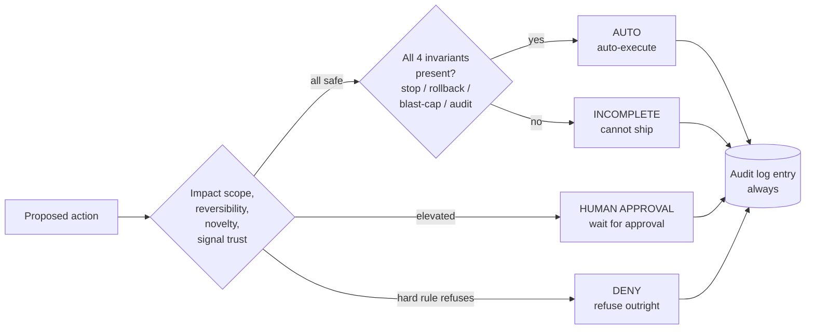

# Risk tiers

Not every decision FDAI makes should run automatically. **Risk tiers** are
how the control plane decides whether an action runs without a human, waits
for human approval (the `hil` decision), or is refused outright.

## Three decisions

Every proposed action carries a **risk classification** derived from the
event, the target resource, the environment, and the action's stated
impact scope (the canonical `blast_radius` field). The classification maps to
exactly one of:

- **AUTO** - safe enough to execute directly. The audit-log entry still
  records who, what, when, why.
- **human approval (`hil`)** - an operator has to approve. FDAI pauses execution and
  raises a request through an identity-verified approval channel such as Teams,
  configured Slack with re-authentication, or a fix pull request review.
- **DENY** - a hard rule refuses the action outright, regardless of who asks.
  BreakGlass does not convert `deny` to `hil` or `auto`. It grants temporary
  eligibility to participate in an emergency approval where policy permits.

`shadow_only` is an execution mode rather than a fourth decision. It computes
and records the decision but cannot mutate the target. The `abstain` machine
value is also distinct: it means the deciding tier could not support a decision,
so the case is held for review without execution.

## How the final decision is calculated

The risk-classification table is evaluated first. Rules run in strict order:
`deny`, then human approval (`hil`), then `auto`, followed by a default human
approval catch-all. The first match is the baseline decision.

FDAI then compares that baseline with autonomy ceilings from the trust tier,
the `ActionType`, declared and live impact scope, caller role, environment, and
control-plane health. The **strictest result wins**. A ceiling may lower
autonomy from automatic execution to human approval, observation-only mode, or
denial; it can never raise the baseline.

Example: a reversible resource-scoped change matches an auto rule, but its
inventory graph is stale. The risk table denies the action. Neither an Owner
role nor a permissive `ActionType` ceiling can raise it back to `hil` or `auto`.

## What tips a decision toward human approval

Any of these push a decision up the ladder:

- **Impact scope** - production, multi-region, or shared-tenancy targets
  demand approval more often than isolated dev resources.
- **Reversibility** - actions with no clean rollback path (e.g. some data
  migrations, resource deletions) tend to require human approval by default.
- **Novelty** - anything the trust router had to escalate to T2 keeps a
  stricter ceiling. Upstream T2 output remains observation-only
  (`shadow_only`) even after it clears the quality check.
- **Signal source trust** - a synthesised anomaly signal weighs less than a
  hardened policy violation.

## What automatic execution requires

Every action that can execute ships with all four of these:

1. **Stop-condition** - a measurable state that halts the change if the
   world reacts badly.
2. **Rollback path** - pre-computed, tested, and referenced from the audit
   entry.
3. **Impact-scope limit** - an explicit cap on scope, batch size, or rate.
4. **Audit-log entry** - append-only, immutable, and complete.

If any of the four is missing, the action is incomplete and cannot ship. Human
approval cannot repair a missing safety contract. The `ActionType` must be fixed
and validated before the action can re-enter the pipeline.

## Fail-closed examples

The upstream defaults make uncertainty reduce autonomy:

| Situation | Result | Why |
|-----------|--------|-----|
| Policy verifier rejects the action | DENY | A human approval cannot waive the deterministic policy result in this path |
| Inventory graph is stale | DENY | Impact scope may be calculated from obsolete relationships |
| Subscription-wide impact scope | DENY | No autonomous mutation may span the subscription |
| Irreversible action | human approval (`hil`), quorum 2 | Two distinct approvers are required; no self-approval |
| Unknown or unrecognized environment | Treat as production | Missing metadata cannot lower risk |
| Unknown monthly cost impact | human approval | Unknown cost is treated as above the configured auto threshold |
| No rule matches | human approval | The default catch-all fails toward human review |

## What happens while approval is pending

human approval parks the pending action and returns control to the event loop. An
identity-verified channel receives an opaque approval reference rather than
authority embedded in the message. The API re-authenticates the approver and
checks the action hash, idempotency key, role, quorum, TTL, and no-self-approval
rule before resuming.

Approval resumes the same pending action once. Rejection and timeout are
audited no-ops. Duplicate or conflicting responses cannot replay the action.
Email, SMS, and paging systems may alert an operator that a request is waiting,
but they cannot submit the A1 approval decision.

## Degraded and emergency states

Control-plane health is another never-raising ceiling. If a required dependency
is degraded, FDAI caps affected actions at `shadow_only` or deny. An operator
kill-switch also prevents mutation while keeping judgment and audit available
where safe. Recovery from the dependency failure does not silently promote an
action; normal risk evaluation runs again.

## Operator controls stay bounded

An authorized operator can reject a pending action or activate a kill-switch.
A rule override is a different, catalog-as-code control: it narrows, downgrades,
or disables one accepted rule for a bounded scope. It cannot widen autonomy,
erase the underlying detected issue, or bypass a denial. Every control action
is audited.

## Evidence behind a past decision

The audit record preserves the matched risk rule, feature-vector snapshot,
risk-catalog version, required quorum, every autonomy ceiling, the strictest
winning axis, and the final execution path. That `resolved_ceiling` evidence
answers both "why did this require human approval?" and "what prevented automatic
execution?" without recomputing against today's configuration.

## Next steps

| To learn about | Read |
|----------------|------|
| How the router picks the tier | [deterministic-first.md](deterministic-first.md) |
| How a new action goes from watch to auto-execute | [shadow-then-enforce.md](shadow-then-enforce.md) |
| The operator view of human approval | [../guides/approve-change.md](../guides/approve-change.md) |
| The full risk-classification rulebook | [../../roadmap/decisioning/risk-classification.md](../../roadmap/decisioning/risk-classification.md) |
| The autonomy ceiling and approval-resume contracts | [../../roadmap/decisioning/execution-model.md](../../roadmap/decisioning/execution-model.md) |
