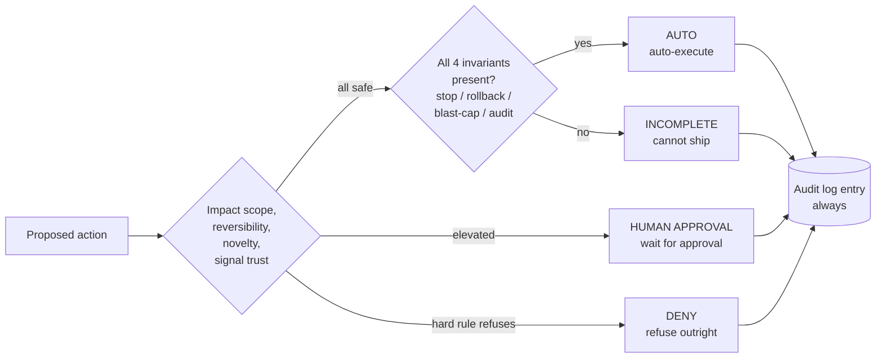

# Risk tiers

Not every decision FDAI makes should run automatically. **Risk tiers** are how
the control plane decides whether an action runs without a person, waits for
human approval (the `hil` decision), or is refused outright.

## Three decisions

Every proposed action carries a **risk classification**. FDAI derives it from the
event, the target resource, the environment, and the action's stated impact scope
(the `blast_radius` field in the contract). That classification maps to exactly
one of three outcomes:

```mermaid
flowchart LR
  A[Proposed action]
  A --> C{Impact scope,<br/>reversibility,<br/>novelty,<br/>signal trust}
  C -->|all safe| I{All 4 invariants<br/>present?<br/>stop / rollback /<br/>blast-cap / audit}
  C -->|elevated| H
  C -->|hard rule refuses| D
  I -->|yes| AU[AUTO<br/>auto-execute]
  I -->|no| X[INCOMPLETE<br/>cannot ship]
  H[HUMAN APPROVAL<br/>wait for approval]
  D[DENY<br/>refuse outright]
  AU --> AUD[(Audit log entry<br/>always)]
  H --> AUD
  D --> AUD
  X --> AUD
```

- **AUTO**: safe enough to run directly. The audit-log entry still records who,
  what, when, and why.
- **Human approval (`hil`)**: an operator has to approve it. FDAI pauses
  execution and raises a request through an identity-verified channel such as
  Teams, a configured Slack workspace with re-authentication, or a review on a
  fix pull request.
- **DENY**: a hard rule refuses the action no matter who asks. BreakGlass does
  not turn `deny` into `hil` or `auto`. It only lets someone take part in an
  emergency approval where policy allows it.

`shadow_only` is an execution mode, not a fourth decision. FDAI still computes
and records the decision, but the action cannot touch the target. The `abstain`
value is different again: the deciding tier could not support any decision, so
the case is held for review and nothing runs.

## How the final decision is calculated

FDAI evaluates the risk-classification table first. The rules run in a strict
order: `deny`, then human approval (`hil`), then `auto`, and finally a catch-all
that asks for human approval. The first match becomes the baseline decision.

FDAI then compares that baseline against the autonomy ceilings that come from the
trust tier, the `ActionType`, the declared and live impact scope, the caller's
role, the environment, and control-plane health. **The strictest result wins.** A
ceiling can lower autonomy from automatic execution to human approval,
observation-only mode, or denial. It can never raise the baseline.

Example: a reversible, resource-scoped change matches an auto rule, but its
inventory graph is stale. The risk table denies the action, and neither an Owner
role nor a permissive `ActionType` ceiling can pull it back up to `hil` or
`auto`.

## What tips a decision toward human approval

Any of these push a decision up the ladder:

- **Impact scope**: production, multi-region, or shared-tenancy targets need
  approval far more often than an isolated dev resource.
- **Reversibility**: an action with no clean rollback path, such as some data
  migrations or resource deletions, asks for human approval by default.
- **Novelty**: anything the trust router had to escalate to T2 keeps a stricter
  ceiling. T2 output stays observation-only (`shadow_only`) even after it clears
  the quality check.
- **How much you trust the signal**: a synthesized anomaly signal counts for less
  than a hardened policy violation.

## What automatic execution requires

Every action that can execute ships with all four of these:

1. **Stop condition**: a measurable state that halts the change if the world
   reacts badly.
2. **Rollback path**: computed in advance, tested, and referenced from the audit
   entry.
3. **Impact scope limit**: an explicit cap on scope, batch size, or rate.
4. **Audit-log entry**: append-only, immutable, and complete.

If any of the four is missing, the action is incomplete and cannot ship. Human
approval cannot patch a missing safety contract. You have to fix and validate the
`ActionType` before the action can re-enter the pipeline.

## Choosing the safer default

The upstream defaults make uncertainty reduce autonomy:

| Situation | Result | Why |
|-----------|--------|-----|
| The policy verifier rejects the action | DENY | On this path, human approval cannot waive a deterministic policy result |
| The inventory graph is stale | DENY | The impact scope might be computed from outdated relationships |
| Subscription-wide impact scope | DENY | No automatic change may span a whole subscription |
| Irreversible action | Human approval, quorum 2 | Two different approvers are required, and self-approval is not allowed |
| Unknown or unrecognized environment | Treated as production | Missing metadata cannot lower risk |
| Unknown monthly cost impact | Human approval | An unknown cost counts as above the configured auto threshold |
| No rule matches | Human approval | The catch-all chooses the safer path of human review |

## What happens while approval is pending

A human-approval decision parks the pending action and hands control back to the
event loop. The identity-verified channel receives an opaque approval reference,
not authority embedded in the message. When the approver responds, the API
re-authenticates them and checks the action hash, the idempotency key, the role,
the quorum, the time to live, and the no-self-approval rule before it resumes.

An approval resumes the same pending action exactly once. A rejection and a
timeout are both audited no-ops. A duplicate or conflicting response cannot
replay the action. Email, SMS, and paging systems can tell an operator that a
request is waiting, but they cannot submit the approval decision.

## Degraded and emergency states

Control-plane health is another ceiling that only ever lowers autonomy. If a
required dependency is degraded, FDAI caps the affected actions at `shadow_only`
or deny. An operator kill-switch also stops changes while keeping judgment and
audit available where that is safe. When the dependency recovers, nothing is
promoted silently. The normal risk evaluation simply runs again.

## Operator controls stay bounded

An authorized operator can reject a pending action or activate a kill-switch. A
rule override is a different control that lives in the catalog as code: it
narrows, downgrades, or disables one accepted rule for a bounded scope. It cannot
widen autonomy, erase the underlying detected issue, or get around a denial.
Every control action is audited.

## Evidence behind a past decision

The audit record keeps the matched risk rule, a snapshot of the feature vector,
the risk-catalog version, the required quorum, every autonomy ceiling, the
strictest axis that won, and the final execution path. That `resolved_ceiling`
evidence answers both "why did this need human approval?" and "what stopped it
from running automatically?" without recomputing anything against today's
configuration.

## Next steps

| To learn about | Read |
|----------------|------|
| How the router picks the tier | [deterministic-first.md](deterministic-first.md) |
| How a new action moves from watching to running on its own | [shadow-then-enforce.md](shadow-then-enforce.md) |
| The operator view of human approval | [../guides/approve-change.md](../guides/approve-change.md) |
| The full risk-classification rulebook | [../../roadmap/decisioning/risk-classification.md](../../roadmap/decisioning/risk-classification.md) |
| The autonomy ceiling and approval-resume contracts | [../../roadmap/decisioning/execution-model.md](../../roadmap/decisioning/execution-model.md) |
