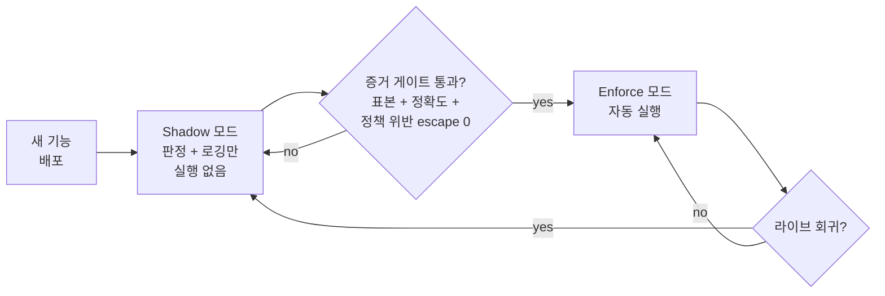

# 먼저 관찰하고, 검증 후 변경 적용

FDAI의 새 자율 액션은 한꺼번에 켜지지 않습니다. 모든 규칙, 탐지기,
수정은 먼저 **shadow 모드**로 배포됩니다. 프로덕션에서 내렸을 결정을
동일하게 계산하지만, 그 결정을 기록만 할 뿐 적용하지 않습니다. 기준선 대비 측정된
비교를 통과해야만 실제로 실행할 자격을 얻습니다.

## Shadow 모드가 기록하는 것

새 기능이 shadow인 동안 모든 이벤트는 자율성이 켜진 것처럼 흐릅니다:

- 전체 trust-routing + 안전성 검토 결정이 계산됩니다.
- 실행되었을 제안 액션을 저장합니다.
- 운영자의 실제 조치를 감사 로그에서 수집합니다.
- 두 결과의 차이가 **shadow 정확도 신호**입니다.

프로덕션 동작은 변하지 않습니다. 승인은 여전히 사람이 처리하고 수정은 기존
방식으로 전달됩니다. 새 기능은 관찰만 하며 실행을 제어하지 않습니다.

## Shadow에서 적용 모드로 승격하기 위한 조건

기능은 Phase 0에서 기록한 기준선 대비 사전 등록된 기준을 shadow 증거가 충족할 때만
승격됩니다. 증거 패킷에는 고정된 시나리오 세트와 측정 기간을 명시하므로 검토자가
비교 결과를 재현할 수 있습니다.

- **최소 증거**: 구성된 shadow 기간과 표본 크기를 충족합니다.
- **결과 품질**: 동일한 시나리오 세트에서 일치율, false positive, false negative
  비율이 액션별 임계값을 충족합니다.
- **정책 위반 escape 0**: 결정론적 정책 거부를 우회했을 shadow 액션이 없어야 합니다.
  이 보호 지표의 허용값은 정확히 0입니다.
- **안전 준비 상태**: Preconditions, stop-conditions, 영향 범위 상한,
  idempotency, 롤백 리허설, 감사 완전성이 모두 통과합니다.
- **운영 보호 지표**: 변경 실패율과 롤백 비율이 기준선보다 악화되지 않습니다.

승격은 *명시적*입니다. 자체 게이트를 가진 별도 PR로 검토하며 기능의 첫 커밋과 묶지
않습니다.

## 정확히 무엇을 승격하는가

서로 관련된 제어도 독립적으로 전환합니다:

| 제어 | Shadow 상태 | Enforce 상태 |
|------|-------------|---------------|
| 규칙 effect | `audit` 또는 `do-not-enforce` | 제한된 범위에 `deny` 또는 `remediate` 적용 |
| Assignment | 선택한 리소스에서 규칙 세트를 관찰 | 검토된 effect와 매개 변수를 해당 범위에 적용 |
| `ActionType` | `default_mode: shadow`, 변경 실행 없음 | 리스크 상한과 promotion gate 안에서만 enforce 활성화 |

규칙을 승격해도 이를 참조하는 모든 assignment나 액션이 자동으로 승격되지는 않습니다.
독립적으로 변경되는 각 제어는 자체 증거, 검토, 범위, 롤백 참조를 유지합니다.

## 승격 승인 주체

승격은 검토된 카탈로그 PR로 전달하는 governance 변경입니다. 요청에는 증거 패킷, 대상
범위, 액션 버전, 롤백 계획이 포함됩니다. 요청자는 자신의 승격 요청을 승인할 수 없습니다.
필요한 역할과 정족수는 governance 액션과 리스크 판정에서 가져오며, 승격 승인은 실행
결과와 별도로 기록됩니다.

## 무엇이 강등을 트리거하는가

승격 후에도 같은 보호 신호를 계속 사용합니다. enforce된 기능이 승격 기준을 놓치거나,
정책 위반 escape를 기록하거나, 필수 의존성을 잃으면 영향을 받는 assignment 또는 액션을
shadow로 강등하고 온콜 팀에 알립니다. 회귀를 수정한 뒤에는 새로운 증거 수집과 승격
사이클을 시작합니다.

범위가 제한된 override는 전체 기능의 자동 강등이 아닙니다. 제한된 범위에서만 실행을
억제하거나 좁히고 shadow 탐지는 계속합니다. 반복되거나 장기화된 override는 규칙 수정
또는 은퇴 후보의 증거가 되며, 후보는 일반 카탈로그 quality-gate를 통과해야 합니다.

## 강등과 롤백은 다르다

강등은 기능을 판단 및 기록 전용으로 되돌려 이후의 변경 실행을 막습니다. 이미 실행된
변경을 되돌리지는 않습니다. 이전 상태 복원은 액션 인스턴스의 `rollback_contract`가
담당하며 자체 감사 참조와 복구 검증을 남깁니다.

예시: right-sizing 액션의 롤백 비율이 보호 기준을 벗어남 -> assignment를 shadow로
강등 -> 새로운 right-size 변경을 중지 -> 이미 적용된 변경은 해당 액션의 scripted 또는
PR 기반 롤백 경로로 복원.

## 왜 이게 운영자에게 중요한가

시스템을 사용하는 누구에게나 해당하는 두 가지 결과:

- **새 자율 기능은 증거 없이 적용되지 않습니다.** 액션이 자동 실행을 시작하기 전에
  구성된 기간 동안 shadow에서 동일한 판정을 관찰하고 측정 가능한 기준을 통과합니다.
- **이후 실행 중지는 표준 제어입니다.** 강등은 승격과 같은 카탈로그 및 assignment
  파이프라인을 사용하므로 회귀에 정해진 대응을 적용할 수 있습니다.
- **실행된 상태에는 별도 복구 경로가 있습니다.** 강등과 롤백이 서로 다른 관측 가능한
  작업이므로 자동화 중지 여부와 이전 상태 복원 여부를 각각 확인할 수 있습니다.

## 다음 단계

| 학습 대상 | 문서 |
|-----------|------|
| 관찰 후 변경 적용을 처리하는 티어 | [deterministic-first-ko.md](deterministic-first-ko.md) |
| 생성된 액션의 auto vs 사람 승인 의미 | [risk-tiers-ko.md](risk-tiers-ko.md) |
| 모든 액션이 요구하는 안전 불변식 | [../../../.github/instructions/coding-conventions.instructions.md](../../../.github/instructions/coding-conventions.instructions.md) |
| 기능을 승격하는 Phase exit 게이트 | [../../roadmap/README-ko.md](../../roadmap/README-ko.md) |
| 규칙 effect, assignment, 범위 제한 override | [../../roadmap/rules-and-detection/rule-governance-ko.md](../../roadmap/rules-and-detection/rule-governance-ko.md) |
| 기준선과 승격 보호 지표 | [../../roadmap/architecture/goals-and-metrics-ko.md](../../roadmap/architecture/goals-and-metrics-ko.md) |
