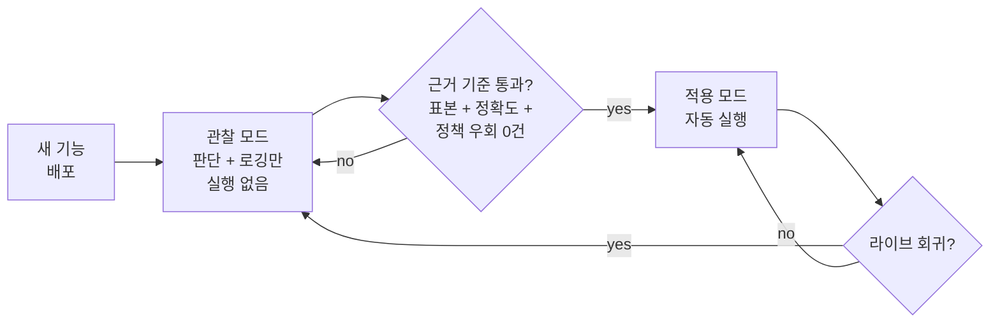

# 먼저 관찰하고, 검증 후 변경 적용

FDAI의 새 자율 작업은 한꺼번에 켜지지 않습니다. 모든 룰, 탐지기, 수정은 먼저 **관찰
모드**로 배포됩니다. 프로덕션에서 내렸을 결정을 똑같이 계산하지만, 그 결정을
기록만 할 뿐 적용하지 않습니다. 기준선과 비교한 측정 결과를 통과해야 실제로 실행할
자격을 얻습니다.

## 관찰 모드가 기록하는 것

새 기능이 관찰 중일 때도 모든 이벤트는 자율성이 이미 켜진 것처럼 흐릅니다.

```mermaid
flowchart LR
  NEW[새 기능<br/>배포]
  NEW --> SH[관찰 모드<br/>판단 + 로깅만<br/>실행 없음]
  SH --> M{근거 기준 통과?<br/>표본 + 정확도 +<br/>정책 우회 0건}
  M -->|yes| EN[적용 모드<br/>자동 실행]
  M -->|no| SH
  EN --> R{라이브 회귀?}
  R -->|yes| SH
  R -->|no| EN
```

- 전체 트러스트 라우팅과 안전성 검토 결정을 계산합니다.
- 실행됐을 제안 작업을 저장합니다.
- 사람이 실제로 선택한 조치를 감사 로그에서 수집합니다.
- 두 결과의 차이가 **관찰 정확도 신호**입니다.

프로덕션 동작은 바뀌지 않습니다. 승인은 여전히 사람이 처리하고 수정은 기존 방식으로
전달됩니다. 새 기능은 지켜볼 뿐 조종하지 않습니다.

## 승격에 필요한 조건

FDAI는 단계 0 기준선에 대해 미리 등록해 둔 기준을 관찰 근거가 넘었을 때만 기능을
승격합니다. 근거 패킷에는 고정된 시나리오 세트와 측정 기간을 적으므로 검토자가 비교
결과를 재현할 수 있습니다.

- **최소 근거**: 설정된 관찰 기간과 표본 크기를 충족합니다.
- **결과 품질**: 같은 시나리오 세트에서 일치율, 오탐지, 미탐지 비율이 작업별 임계값을
  충족합니다.
- **정책 우회 0건**: 결정론적 정책 거부를 빠져나갔을 관찰 작업이 하나도 없어야 합니다.
  이 보호 지표의 허용값은 정확히 0입니다.
- **안전 준비 상태**: 사전 조건, 중단 조건, 영향 범위 상한, 멱등성, 롤백 리허설,
  감사 완전성이 모두 통과합니다.
- **운영 보호 지표**: 변경 실패율과 롤백 비율이 기준선보다 나빠지지 않습니다.

승격은 항상 명시적입니다. 자체 검토 기준을 가진 별도 pull 요청으로 처리하며 기능의 첫
커밋과 묶지 않습니다.

## 정확히 무엇을 승격하는가

서로 관련된 제어도 따로 움직입니다.

| 제어 | 관찰 상태 | 적용 상태 |
|------|-----------|-----------|
| 룰 효과 | `audit` 또는 `do-not-enforce` | 제한된 범위에 `deny` 또는 `remediate` 적용 |
| 배정 | 선택한 리소스에서 룰 세트를 관찰 | 검토된 효과와 매개 변수를 해당 범위에 적용 |
| `ActionType` | `default_mode: shadow`이며 아무것도 바꾸지 않음 | 위험 상한과 승격 기준 안에서만 적용을 허용 |

룰을 승격해도 그것을 참조하는 모든 배정나 작업이 자동으로 승격되지는 않습니다.
각 제어는 자체 근거, 검토, 범위, 롤백 참조를 따로 가집니다.

## 승격 승인 주체

승격은 검토된 카탈로그 pull 요청으로 전달하는 거버넌스 변경입니다. 요청에는 근거 패킷,
대상 범위, 작업 버전, 롤백 계획이 들어갑니다. 요청자는 자신의 승격 요청을 승인할 수
없습니다. 필요한 역할과 정족수는 거버넌스 작업과 위험 판정에서 가져오며, 승인은 실행
결과와 별도로 기록됩니다.

## 무엇이 강등을 불러오는가

승격 후에도 같은 보호 신호를 계속 사용합니다. 적용된 기능이 승격 기준을 놓치거나, 정책
우회를 기록하거나, 필수 의존성을 잃으면 해당 배정나 작업을 관찰 모드로 되돌리고
온콜 팀에 알립니다. 회귀를 고친 뒤에는 새로운 근거 수집과 승격 사이클을 시작합니다.

범위가 제한된 오버라이드는 전체 기능의 자동 강등이 아닙니다. 제한된 범위에서만 실행을
억제하거나 좁히고 탐지는 계속 관찰합니다. 반복되거나 오래가는 오버라이드는 룰 수정이나
은퇴 후보의 근거가 되며, 그 변경도 일반 카탈로그 quality-gate를 통과해야 합니다.

## 강등과 롤백은 다릅니다

강등은 기능을 판단과 기록 전용으로 되돌려 이후의 변경을 막습니다. 이미 실행된 변경을
되돌리지는 않습니다. 이전 상태 복원은 작업 인스턴스의 `rollback_contract`가 담당하며
자체 감사 참조와 복구 검증을 남깁니다.

예시: 사이즈 최적화 작업의 롤백 비율이 보호 기준을 벼남 -> 배정을 관찰 모드로
되돌림 -> 새로운 사이즈 변경을 중지 -> 이미 적용된 변경은 해당 작업의 스크립트 또는
pull 요청 기반 롤백 경로로 복원.

## 왜 이게 운영자에게 중요한가

시스템을 사용하는 누구에게나 해당하는 세 가지 결과가 있습니다.

- **새 자율 기능은 근거 없이 적용되지 않습니다.** 작업이 스스로 실행되기 전에 설정된
  기간 동안 같은 판단을 관찰하고 측정 가능한 기준을 통과합니다.
- **이후 실행 중지는 표준 제어입니다.** 강등은 승격과 같은 카탈로그 및 배정
  파이프라인을 쓰므로, 회귀에 정해진 대응을 적용할 수 있습니다.
- **실행된 상태에는 별도 복구 경로가 있습니다.** 강등과 롤백은 서로 다른 관측 가능한
  작업이므로 자동화 중지 여부와 이전 상태 복원 여부를 각각 확인할 수 있습니다.

## 다음 단계

| 학습 대상 | 문서 |
|-----------|------|
| 관찰 후 변경 적용을 처리하는 티어 | [deterministic-first-ko.md](deterministic-first-ko.md) |
| 생성된 작업의 자동 실행과 사람 승인 의미 | [risk-tiers-ko.md](risk-tiers-ko.md) |
| 모든 액션이 요구하는 안전 불변식 | [../../../.github/instructions/coding-conventions.instructions.md](../../../.github/instructions/coding-conventions.instructions.md) |
| 기능을 승격하는 단계 exit 게이트 | [../../roadmap/README-ko.md](../../roadmap/README-ko.md) |
| 규칙 효과, 배정, 범위 제한 재정의 | [../../roadmap/rules-and-detection/rule-governance-ko.md](../../roadmap/rules-and-detection/rule-governance-ko.md) |
| 기준선과 승격 보호 지표 | [../../roadmap/architecture/goals-and-metrics-ko.md](../../roadmap/architecture/goals-and-metrics-ko.md) |
