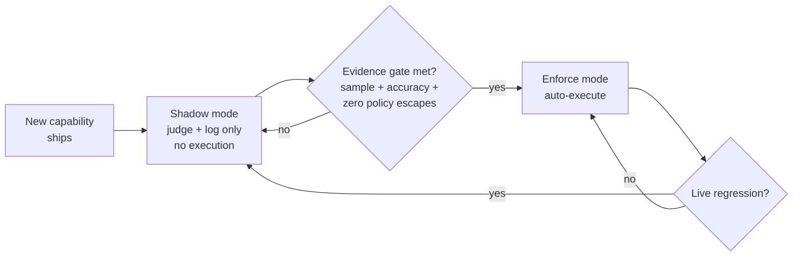

# Observe, then enable changes

New autonomous actions in FDAI never turn on all at once. Each rule,
detector, and remediation ships in **shadow mode** first - it makes the same
decision it *would* make in production, but the decision is recorded, not
applied. Only after a measured comparison against the baseline does the
action earn the right to execute for real.

## What shadow mode records

While a new capability is in shadow, every event flows through it as if
autonomy were on:

- The full trust-routing + risk-gate decision is computed.
- The proposed action (what would have executed) is stored.
- The *actual* human resolution (what operators eventually did) is captured
  from the audit log.
- The delta between the two is the **shadow accuracy signal**.

Nothing about production behaviour changes. Approvals still go to humans,
remediations still ship the way they always did. The new capability is
watching, not steering.

## What promotion from shadow to enforce takes

A capability is promoted only when its shadow evidence beats a pre-registered
bar against the baseline recorded in Phase 0. The evidence packet names the
frozen scenario set and measurement window, so a reviewer can reproduce the
comparison.

- **Minimum evidence**: The configured shadow duration and sample size are met.
- **Outcome quality**: Agreement, false-positive, and false-negative rates meet
  their action-specific thresholds against the same scenario set.
- **Zero policy-violation escapes**: No shadow action would have bypassed a
  deterministic policy denial. This guard metric is exactly zero.
- **Safety readiness**: Preconditions, stop-conditions, blast-radius caps,
  idempotency, rollback rehearsal, and audit completeness all pass.
- **Operational guard metrics**: Change-failure and rollback rates do not
  regress against the baseline.

Promotion is *explicit*. It is a separate PR, reviewed with its own gate,
never bundled with the capability's first commit.

## What exactly is promoted

Related controls move independently:

| Control | Shadow state | Enforced state |
|---------|--------------|----------------|
| Rule effect | `audit` or `do-not-enforce` | `deny` or `remediate` for a bound scope |
| Assignment | Observes a rule set on selected resources | Applies the reviewed effect and parameters to that scope |
| `ActionType` | `default_mode: shadow` and no mutation | Enforce is enabled only within its risk ceilings and promotion gate |

Promoting a rule does not automatically promote every assignment or action that
references it. Each independently changing control keeps its own evidence,
review, scope, and rollback reference.

## Who approves promotion

Promotion is a governance change delivered as a reviewed catalog PR. The
request includes the evidence packet, target scope, action version, and rollback
plan. The requester cannot approve their own promotion. Required role and
quorum come from the governance action and risk decision, and the approval is
recorded separately from execution outcomes.

## What triggers a demotion

The same guard signals continue after promotion. If a live enforced capability
misses its promotion bar, records a policy-violation escape, or loses a required
dependency, the affected assignment or action demotes to shadow and the on-call
team receives an alert. Fixing the regression starts a new evidence and
promotion cycle.

A scoped override is not automatic global demotion. It suppresses or narrows
execution only for its bounded scope while shadow detection continues. Repeated
or long-lived overrides become evidence for a rule revision or retirement
candidate, which still passes the normal catalog quality gate.

## Demotion is not rollback

Demotion prevents future mutations by returning the capability to judge-and-log
behavior. It does not undo a change that already ran. Restoring prior state is
the responsibility of the action instance's `rollback_contract`, with its own
audit reference and recovery verification.

Example: a right-sizing action regresses its rollback-rate guard -> the
assignment demotes to shadow -> no new right-size mutations start -> any
already-applied change is restored through that action's scripted or PR-based
rollback path.

## Why this matters to operators

Two consequences for anyone consuming the system:

- **New autonomy does not arrive without evidence.** By the time an action starts
  auto-executing, it has already been observed doing the same thing in
  shadow for the configured window and passed a measurable bar.
- **Stopping future execution is a standard control.** Demotion uses the same
  catalog and assignment pipeline as promotion, so a regression has a defined
  response rather than an improvised emergency change.
- **Executed state still has an explicit recovery path.** Demotion and rollback
  are separate, observable operations, so operators can see whether automation
  stopped and whether prior state was restored.

## Next steps

| To learn about | Read |
|----------------|------|
| The tiers shadow-then-enforce runs on | [deterministic-first.md](deterministic-first.md) |
| What auto vs HIL means for the actions produced | [risk-tiers.md](risk-tiers.md) |
| Safety invariants required for every action | [../../../.github/instructions/coding-conventions.instructions.md](../../../.github/instructions/coding-conventions.instructions.md) |
| The phase exit gates that promote capabilities | [../../roadmap/README.md](../../roadmap/README.md) |
| Rule effects, assignments, and scoped overrides | [../../roadmap/rules-and-detection/rule-governance.md](../../roadmap/rules-and-detection/rule-governance.md) |
| Baselines and promotion guard metrics | [../../roadmap/architecture/goals-and-metrics.md](../../roadmap/architecture/goals-and-metrics.md) |
