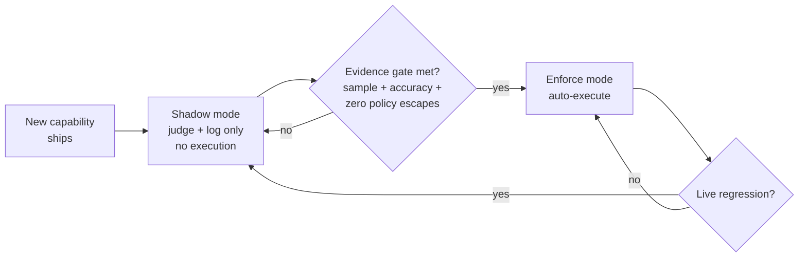

# Observe, then enable changes

New autonomous actions in FDAI never turn on all at once. Every rule, detector,
and fix ships in **observation mode** first. It makes the same decision it would
make in production, but the decision is only recorded, never applied. An action
earns the right to run for real only after a measured comparison against the
baseline.

## What observation mode records

While a new capability is observing, every event flows through it as if autonomy
were already on:

```mermaid
flowchart LR
  NEW[New capability<br/>ships]
  NEW --> SH[Shadow mode<br/>judge + log only<br/>no execution]
  SH --> M{Evidence gate met?<br/>sample + accuracy +<br/>zero policy escapes}
  M -->|yes| EN[Enforce mode<br/>auto-execute]
  M -->|no| SH
  EN --> R{Live regression?}
  R -->|yes| SH
  R -->|no| EN
```

- FDAI computes the full trust-routing and safety-check decision.
- It stores the proposed action, meaning what would have executed.
- It captures the resolution people actually chose, taken from the audit log.
- The difference between those two is the **observation accuracy signal**.

Nothing about production behavior changes. Approvals still go to people, and
fixes still ship the way they always did. The new capability is watching, not
steering.

## What promotion takes

FDAI promotes a capability only when its observation evidence beats a bar that
was registered in advance against the Phase 0 baseline. The evidence packet names
the frozen scenario set and the measurement window, so a reviewer can reproduce
the comparison.

- **Minimum evidence**: the configured observation duration and sample size are
  met.
- **Outcome quality**: agreement, false-positive, and false-negative rates meet
  the action's thresholds against the same scenario set.
- **Zero policy escapes**: no observed action would have slipped past a
  deterministic policy denial. This guard metric has to be exactly zero.
- **Safety readiness**: preconditions, stop conditions, impact scope caps,
  idempotency, rollback rehearsal, and audit completeness all pass.
- **Operational guard metrics**: change-failure and rollback rates do not get
  worse than the baseline.

Promotion is always explicit. It is a separate pull request with its own review
gate, and it is never bundled with the capability's first commit.

## What exactly is promoted

Related controls move independently:

| Control | Observation state | Enforced state |
|---------|-------------------|----------------|
| Rule effect | `audit` or `do-not-enforce` | `deny` or `remediate` for a bound scope |
| Assignment | Observes a rule set on selected resources | Applies the reviewed effect and parameters to that scope |
| `ActionType` | `default_mode: shadow`, and it changes nothing | Enforcement is enabled only inside its risk ceilings and promotion gate |

Promoting a rule does not automatically promote every assignment or action that
references it. Each control keeps its own evidence, review, scope, and rollback
reference.

## Who approves promotion

Promotion is a governance change delivered as a reviewed catalog pull request.
The request includes the evidence packet, the target scope, the action version,
and the rollback plan. The requester cannot approve their own promotion. The
required role and quorum come from the governance action and the risk decision,
and the approval is recorded separately from execution outcomes.

## What triggers a demotion

The same guard signals keep running after promotion. If a live enforced
capability misses its promotion bar, records a policy escape, or loses a required
dependency, the affected assignment or action drops back to observation mode and
the on-call team is alerted. Fixing the regression starts a new evidence and
promotion cycle.

A scoped override is not an automatic global demotion. It suppresses or narrows
execution only inside its bounded scope while detection keeps observing.
Overrides that repeat or last a long time become evidence for revising or
retiring the rule, and that change still goes through the normal catalog quality
gate.

## Demotion is not rollback

Demotion prevents future changes by putting the capability back into
judge-and-log behavior. It does not undo a change that already ran. Restoring the
previous state is the job of the action instance's `rollback_contract`, which has
its own audit reference and recovery verification.

Example: a right-sizing action fails its rollback-rate guard -> the assignment
drops back to observation mode -> no new right-sizing changes start -> anything
already applied is restored through that action's scripted or pull-request
rollback path.

## Why this matters to operators

Three consequences for anyone using the system:

- **New autonomy never arrives without evidence.** By the time an action starts
  running on its own, it has already been observed doing the same thing for the
  configured window and has passed a measurable bar.
- **Stopping future execution is a standard control.** Demotion uses the same
  catalog and assignment pipeline as promotion, so a regression has a defined
  response instead of an improvised emergency change.
- **Executed state still has an explicit recovery path.** Demotion and rollback
  are separate, observable operations, so you can see whether automation stopped
  and whether the previous state was restored.

## Next steps

| To learn about | Read |
|----------------|------|
| The tiers this observe-then-enforce flow runs on | [deterministic-first.md](deterministic-first.md) |
| What auto and human approval mean for the resulting actions | [risk-tiers.md](risk-tiers.md) |
| Safety invariants required for every action | [../../../.github/instructions/coding-conventions.instructions.md](../../../.github/instructions/coding-conventions.instructions.md) |
| The phase exit gates that promote capabilities | [../../roadmap/README.md](../../roadmap/README.md) |
| Rule effects, assignments, and scoped overrides | [../../roadmap/rules-and-detection/rule-governance.md](../../roadmap/rules-and-detection/rule-governance.md) |
| Baselines and promotion guard metrics | [../../roadmap/architecture/goals-and-metrics.md](../../roadmap/architecture/goals-and-metrics.md) |
