# 덱 참고 자료: 온톨로지 컨텍스트, RAG, OWL/RDF

제안서 또는 아키텍처 장표에서 FDAI 에이전트가 온톨로지 데이터를 사용하는 방식, 일반적인 검색 증강 생성(RAG)과의 차이, 현재 구현에 OWL, RDF 또는 전용 그래프 데이터베이스가 필요하지 않은 이유를 설명할 때 이 자료를 사용하세요.

> **장표용 핵심 문장:** RAG는 관련 가능성이 있는 콘텐츠를 검색합니다. FDAI 온톨로지 컨텍스트는 하나의 결정에 필요한 형식화된 관계와 안전 관련 사실을 결정론적으로 구성합니다.
>
> **범위:** 이 자료는 현재 FDAI 구현과 문서화된 저장소 결정을 설명합니다. RDF, OWL 또는 그래프 데이터베이스를 영구적으로 배제한다는 결정은 아닙니다.

## 한눈에 보는 비교

RAG와 온톨로지 컨텍스트는 서로 다른 검색 문제를 해결합니다. 함께 사용할 수 있지만 같은 방식으로 설명하면 안 됩니다.

| 질문 | 일반적인 RAG | FDAI 온톨로지 컨텍스트 |
|------|--------------|-------------------------|
| 검색 단위 | 문서 조각, passage 또는 임베딩 | 형식화된 객체, 선언된 링크, 범위가 제한된 그래프 이웃 |
| 선택 방식 | 의미 유사도, 키워드 일치, 재정렬 | 안정적인 객체 ID, 허용된 링크 타입, 깊이 제한, 결정 기준 시각 |
| 반환 컨텍스트 | 순위가 지정된 자연어 발췌문 | 변경 불가능한 구조화 스냅샷과 근거 참조 |
| 의미 | 검색된 텍스트에서 해석 | `ObjectType`, `LinkType`, `ActionType` 계약으로 선언 |
| 재현성 | 인덱스, 조회, 순위, 모델에 따라 달라질 수 있음 | 같은 기준 시각, 카탈로그 버전, 객체 집합, 최신성 입력에서 안정적 |
| 데이터 누락 | 더 적거나 약한 passage를 반환하는 경우가 많음 | 충돌 또는 오래된 출처를 기록하고 자율성 상한을 낮춤 |
| 적합한 용도 | 설명, 문서 탐색, 과거 사례 회수, 근거 기반 추론 | 영향, 담당 체계, 목표, 제약, 권한, 실행 안전성 |

**장표용 짧은 대비:** RAG는 "이 질문에 답하는 데 어떤 콘텐츠가 도움이 될 수 있는가?"를 묻습니다. FDAI 온톨로지 컨텍스트는 "이 결정에 어떤 검증된 관계와 제약이 적용되는가?"를 묻습니다.

## FDAI가 온톨로지 데이터를 참조하는 방식

FDAI는 전체 런타임 그래프를 모든 에이전트에 전달하거나 필터 없이 모델 프롬프트에 넣지 않습니다. 결정 경로는 대상 리소스를 확인하고 허용 목록에 있는 이웃 관계를 순회한 뒤, 결과를 범위가 제한된 운영 컨텍스트로 접습니다.


구체화된 결정 컨텍스트에는 다음과 같은 안정적인 참조와 안전 상태가 포함됩니다.

```text
target_resource_id
service_ids
workload_ids
objective_ids
constraint_ids
ownership_ids
dependency_ids
stale_sources
conflicts
autonomy_ceiling
```

현재 결정 경로는 다음 단계를 따릅니다.

1. **대상 확인:** 이벤트가 안정적인 리소스 ID와 결정 기준 시각을 제공합니다.
2. **범위가 제한된 이웃 순회:** Materializer가 최대 깊이를 지키면서 서비스, 워크로드, 목표, 의존성, 담당 체계 링크의 허용 목록을 따릅니다.
3. **그래프를 스냅샷으로 구성:** 관련 ID, 카탈로그 버전, 최신성, 충돌, 최종 자율성 상한을 기록합니다.
4. **안전 결과 적용:** 컨텍스트가 누락되거나 오래됐거나 충돌하면 자동 결정을 사람 승인 또는 보류로 전환할 수 있습니다. 온톨로지 컨텍스트는 기존 정책 및 작업 상한보다 높은 권한을 부여할 수 없습니다.
5. **재현 근거 보존:** 결정에는 통제되지 않은 전체 그래프 대신 스냅샷 ID와 근거 참조가 포함됩니다.

다른 읽기 경로는 목적에 맞는 변환 결과를 사용합니다. 보고서는 범위가 제한된 프로세스 그래프를 순회하고 역할 기반 필드 필터링을 적용할 수 있습니다. 콘솔의 `GET /ontology/graph` 화면은 배포 인스턴스 속성이 아니라 카탈로그 선언과 집계된 운영 모델 상태를 제공합니다.

## 온톨로지와 함께 사용하는 RAG

FDAI는 승인된 문서, 과거 사례, 코드 참조 또는 근거 기반 추론에 검색을 사용하면서 온톨로지를 형식화된 의미 및 안전 계층으로 유지할 수 있습니다.



- **온톨로지의 역할:** 리소스, 서비스, 목표, 담당자, 제약, 작업의 의미와 허용되는 관계를 정의합니다.
- **RAG의 역할:** 가설을 설명하거나 지지하거나 반박할 수 있는 비정형 근거를 찾습니다.
- **안전 경계:** 검색된 텍스트는 실행 권한을 만들지 않습니다. 제안된 작업은 형식화된 작업, 정책, 위험, 역할, 적용 모드 전환, 잠금, 롤백, 감사 검사를 계속 통과해야 합니다.

두 방식은 상호 보완적입니다. RAG는 근거 회수 범위를 넓히고, 온톨로지 컨텍스트는 유효한 결정 공간을 좁힙니다.

## 현재 구현에서 OWL 또는 RDF를 사용하지 않는 이유

RDF는 그래프 표현 표준이고, OWL은 형식 온톨로지 언어와 추론 의미를 추가합니다. 둘 다 그래프 데이터베이스와 같은 개념은 아닙니다. 현재 FDAI는 버전이 있는 YAML 및 JSON 스키마 선언, 형식화된 Python 계약, 명시적 검증, PostgreSQL 인스턴스 테이블로 필요한 의미를 표현합니다.

문서화된 구현 선택은 다음 제약을 기준으로 합니다.

| 고려 사항 | 현재 FDAI 선택 |
|-----------|----------------|
| 필요한 의미 | 명시적인 객체 타입, 링크 엔드포인트, 카디널리티, 출처, 수명주기, 작업 안전 계약 |
| 런타임 질의 형태 | 범위가 제한된 교집합과 짧은 허용 목록 순회 |
| 영속성 | B-tree, GIN, JSONB, 선택적 pgvector 인덱스를 제공하는 기존 PostgreSQL 서비스 |
| 결정 동작 | 추론된 사실이 암묵적 실행 권한을 만드는 방식이 아니라 명시적 검증과 실패 시 차단 안전 검사 |
| 운영 | 별도 triple 저장소 또는 그래프 서비스를 추가하지 않고 하나의 백업, 복구, 트랜잭션, observability 표면 사용 |
| 재평가 조건 | 측정된 multi-hop causal 워크로드가 같은 시나리오 집합에서 관계형 지연 시간 예산을 초과 |

OWL 또는 RDF는 enterprise 지식 모델을 가져오거나 linked 데이터를 교환하거나 더 풍부한 off-path 의미 분석을 수행할 때 통합 경계에서 유용할 수 있습니다. 이러한 어댑터도 검증된 FDAI 계약으로 변환 결과하고 같은 권한 경계를 유지해야 합니다.

**정확한 발표자 표현:** "현재 범위가 제한된 결정 질의에는 표준 기반 reasoner 또는 전용 그래프 저장소가 필요하지 않았습니다. 측정된 워크로드가 필요성을 입증하면 FDAI는 이 구현 선택을 다시 평가할 수 있습니다."

다음 표현은 피하세요.

- "FDAI는 지식 그래프를 사용하지 않습니다." 형식화된 운영 그래프를 사용하지만 현재 전용 그래프 데이터베이스가 필요하지 않습니다.
- "OWL 또는 RDF는 안전한 운영을 지원할 수 없습니다." 지식을 표현할 수 있지만 FDAI의 실행 권한은 명시적인 작업 및 정책 게이트에서 발생합니다.
- "모델이 전체 그래프를 읽습니다." 주요 결정 경로는 범위가 제한된 구체화 스냅샷을 받습니다.
- "온톨로지가 RAG를 대체합니다." 두 방식은 목적이 다르며 함께 사용할 수 있습니다.

## 권장 장표 구성

### 한 장 버전

**제목:** 관련 텍스트에서 통제된 컨텍스트로

**왼쪽:** `RAG -> ranked excerpts` 비교를 보여줍니다.

**오른쪽:** `typed graph -> bounded snapshot -> safety decision`을 보여줍니다.

**하단 문장:** "RAG는 회수 범위를 넓힙니다. 온톨로지 컨텍스트는 의미, 영향, 권한을 제한합니다."

### 두 장 버전

1. **에이전트가 데이터를 참조하는 방식:** 구체화 흐름을 사용하고 복잡한 그래프 대신 스냅샷 필드를 보여줍니다.
2. **이 구현을 선택한 이유:** YAML 및 타입이 지정된 계약과 PostgreSQL을 OWL/RDF 및 전용 그래프 저장소와 비교합니다. 측정 기반 재평가 조건으로 마무리합니다.

### 준비할 근거

- 하나의 합성 resource-service-objective 관계.
- 자동 처리를 유지하는 최신 컨텍스트 하나.
- 결정을 사람 승인 또는 보류로 낮추는 누락되거나 오래된 관계 하나.
- 결정과 함께 기록된 카탈로그 버전 및 스냅샷 ID.

## 관련 문서

| 확인할 내용 | 문서 |
|-------------|------|
| 온톨로지 선언, 런타임 인스턴스, 작업 흐름 | [온톨로지 기반 자동화](../concepts/ontology-driven-automation-ko.md) |
| 공유 운영 의미와 컨텍스트 스냅샷 | [운영 온톨로지](../../roadmap/architecture/operating-ontology-ko.md) |
| PostgreSQL 및 그래프 데이터베이스 결정 | [규칙 조회 온톨로지 저장소](../../roadmap/architecture/rule-lookup-ontology-storage-ko.md) |
| 작업 권한과 런타임 상한 | [실행 모델](../../roadmap/decisioning/execution-model-ko.md) |
