# Deck Reference: Ontology Context, RAG, and OWL/RDF

Use this reference when a proposal or architecture slide must explain how FDAI agents use ontology data, how that approach differs from retrieval-augmented generation (RAG), and why the current implementation doesn't require OWL, RDF, or a dedicated graph database.

> **Slide-ready takeaway:** RAG retrieves potentially relevant content. FDAI ontology context deterministically assembles the typed relationships and safety facts needed for one decision.
>
> **Scope:** This reference describes the current FDAI implementation and its documented storage decision. It doesn't record a permanent rejection of RDF, OWL, or graph databases.

## Comparison at a glance

RAG and ontology context solve different retrieval problems. They can complement each other, but they shouldn't be presented as interchangeable.

| Question | Typical RAG | FDAI ontology context |
|----------|-------------|-----------------------|
| Retrieval unit | Document chunk, passage, or embedding | Typed object, declared link, and bounded graph neighborhood |
| Selection method | Semantic similarity, keyword match, reranking | Stable object identity, allowed link types, depth limit, and decision cutoff |
| Returned context | Ranked natural-language excerpts | Immutable structured snapshot and evidence references |
| Meaning | Interpreted from retrieved text | Declared by `ObjectType`, `LinkType`, and `ActionType` contracts |
| Reproducibility | Can vary with index, query, ranking, and model | Stable for the same cutoff, catalog versions, object set, and freshness inputs |
| Missing data | Often produces fewer or weaker passages | Records conflicts or stale sources and lowers the autonomy ceiling |
| Best fit | Explanation, document discovery, prior-case recall, and grounded reasoning | Impact, ownership, objectives, constraints, authority, and execution safety |

**Short contrast for a slide:** RAG asks, "Which content might help answer this question?" FDAI ontology context asks, "Which validated relationships and constraints govern this decision?"

## How FDAI references ontology data

FDAI doesn't send the complete runtime graph to every agent or place it unfiltered in a model prompt. The decision path resolves a target resource, traverses an allowlisted neighborhood, and folds the result into a bounded operational context.


The materialized decision context contains stable references and safety state such as:

```text
target_resource_id
service_ids
workload_ids
objective_ids
constraint_ids
ownership_ids
dependency_ids
stale_sources
conflicts
autonomy_ceiling
```

The current decision path follows these steps:

1. **Resolve the target:** An event provides the stable resource identity and decision cutoff.
2. **Traverse a bounded neighborhood:** The materializer follows an allowlist of service, workload, objective, dependency, and ownership links with a maximum depth.
3. **Fold the graph into a snapshot:** FDAI records relevant identities, catalog versions, freshness, conflicts, and the resulting autonomy ceiling.
4. **Apply the safety consequence:** Missing, stale, or conflicting context can move an automatic decision to human approval or hold. Ontology context cannot grant authority beyond existing policy and action ceilings.
5. **Preserve replay evidence:** The decision carries a snapshot identity and evidence references instead of an uncontrolled graph dump.

Other read paths use projections suited to their purpose. Reports can traverse a bounded process graph and apply role-based field filtering. The console's `GET /ontology/graph` view exposes catalog declarations and aggregate operating-model status, not deployment instance properties.

## How RAG fits beside the ontology

FDAI can use retrieval for approved documents, prior cases, code references, or grounded reasoning while retaining the ontology as the typed meaning and safety layer.



- **Ontology contribution:** Defines what the resource, service, objective, owner, constraint, and action mean and how they may relate.
- **RAG contribution:** Finds relevant unstructured evidence that may explain, support, or challenge a hypothesis.
- **Safety boundary:** Retrieved text doesn't create execution authority. A proposed action still passes typed action, policy, risk, role, promotion, lock, rollback, and audit checks.

This makes the relationship complementary: RAG broadens evidence recall, while ontology context narrows the valid decision space.

## Why the current implementation doesn't use OWL or RDF

RDF is a graph representation standard, and OWL adds a formal ontology language and reasoning semantics. Neither is the same thing as a graph database. FDAI currently expresses its required semantics through versioned YAML and JSON Schema declarations, typed Python contracts, explicit validation, and PostgreSQL instance tables.

The documented implementation choice is based on the following constraints:

| Consideration | Current FDAI choice |
|---------------|---------------------|
| Required semantics | Explicit object types, link endpoints, cardinality, provenance, lifecycle, and action safety contracts |
| Runtime query shape | Bounded intersections and short allowlisted traversals |
| Persistence | Existing PostgreSQL service with B-tree, GIN, JSONB, and optional pgvector indexes |
| Decision behavior | Explicit validation and fail-closed safety checks rather than implicit execution authority from inferred facts |
| Operations | One backup, recovery, transaction, and observability surface instead of an additional triple store or graph service |
| Re-evaluation trigger | Measured multi-hop causal workloads exceed relational latency budgets on the same scenario set |

OWL or RDF could still be useful at an integration boundary, for example when importing an enterprise knowledge model, exchanging linked data, or running richer offline semantic analysis. Such an adapter would still need to project validated FDAI contracts and preserve the same authority boundaries.

**Accurate presenter wording:** "FDAI didn't need a standards-based reasoner or a dedicated graph store for its current bounded decision queries. The architecture can revisit that implementation choice when measured workloads justify it."

Avoid saying:

- "FDAI doesn't use a knowledge graph." It does use a typed operating graph; it doesn't currently require a dedicated graph database.
- "OWL or RDF cannot support safe operations." They can represent knowledge, but FDAI's execution authority comes from explicit action and policy gates.
- "The model reads the whole graph." The primary decision path receives a bounded materialized snapshot.
- "The ontology replaces RAG." They serve different purposes and can be used together.

## Suggested slide construction

### One-slide version

**Title:** From relevant text to governed context

**Left:** Show the comparison `RAG -> ranked excerpts`.

**Right:** Show `typed graph -> bounded snapshot -> safety decision`.

**Bottom line:** "RAG expands recall. Ontology context constrains meaning, impact, and authority."

### Two-slide version

1. **How agents reference data:** Use the materialization flow and show the snapshot fields instead of a dense graph.
2. **Why this implementation:** Compare YAML and typed contracts plus PostgreSQL with OWL/RDF and a dedicated graph store. End with the measured re-evaluation trigger.

### Evidence to bring

- One synthetic resource-to-service-to-objective relationship.
- One fresh context that preserves automatic handling.
- One missing or stale relationship that lowers the decision to human approval or hold.
- The catalog version and snapshot identity recorded with the decision.

## Related docs

| To verify | Read |
|-----------|------|
| Ontology declarations, runtime instances, and action flow | [Ontology-driven automation](../concepts/ontology-driven-automation.md) |
| Shared operating meaning and context snapshots | [Operating ontology](../../roadmap/architecture/operating-ontology.md) |
| PostgreSQL and graph-database decision | [Rule lookup ontology storage](../../roadmap/architecture/rule-lookup-ontology-storage.md) |
| Action authority and runtime ceilings | [Execution model](../../roadmap/decisioning/execution-model.md) |
