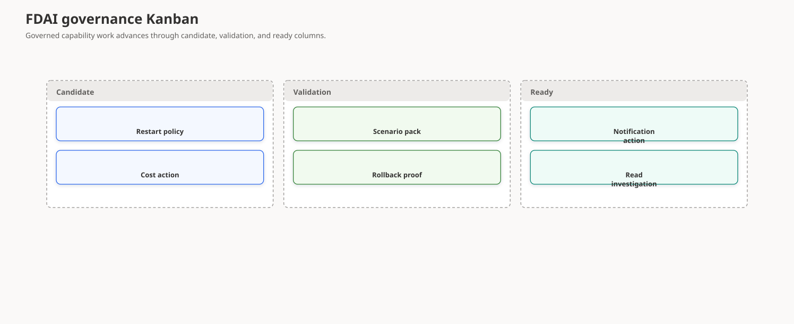

# Diagram Gallery

FDAI compiles one bilingual YAML contract into accessible SVG, PNG, manifest,
and interactive viewer assets. Use this gallery to choose a diagram family
before authoring a new architecture or operations view.

## Design at a glance

The compiler supports the Mermaid 11 diagram families through validated FDAI
kinds. Structural diagrams use deterministic graph layouts. Timeline,
coordinate, radial, grid, and weighted-flow diagrams use dedicated data fields
and layout strategies rather than decorative aliases.

| Family | FDAI kinds |
|--------|------------|
| Architecture and flow | `context`, `container`, `component`, `deployment`, `network`, `architecture`, `c4-*`, `data-flow`, `flowchart`, `graph`, `conceptual-flow` |
| Interaction and process | `sequence`, `railroad`, `swimlane`, `user-journey`, `kanban`, `block`, `cynefin` |
| State and semantic structure | `state`, `decision-tree`, `requirement`, `domain`, `entity-relationship`, `class-diagram`, `mindmap`, `ishikawa`, `tree-view` |
| Time | `timeline`, `gantt`, `git-graph`, `event-modeling` |
| Charts | `pie`, `radar`, `quadrant`, `xy-chart`, `wardley`, `venn`, `sankey`, `packet` |

## Conceptual architecture

Use a conceptual flow for numbered stages, semantic color, nested explanatory
surfaces, feedback loops, and durable stores.

<fdai-architecture-diagram manifest="../diagrams/generated/fdai-conceptual-control-loop.manifest.json" locale="en" style="display:block">
  
</fdai-architecture-diagram>

## Timeline and Gantt

Use Gantt for scaled task durations, dependencies, status, and progress across
parallel workstreams.

<fdai-architecture-diagram manifest="../diagrams/generated/fdai-delivery-roadmap.manifest.json" locale="en" style="display:block">
  
</fdai-architecture-diagram>

## Radial charts

Pie communicates composition. Radar compares several normalized dimensions.

<fdai-architecture-diagram manifest="../diagrams/generated/fdai-decision-mix.manifest.json" locale="en" style="display:block">
  
</fdai-architecture-diagram>

<fdai-architecture-diagram manifest="../diagrams/generated/fdai-assurance-radar.manifest.json" locale="en" style="display:block">
  
</fdai-architecture-diagram>

## Coordinate and grid views

Quadrant places capabilities on normalized axes. Kanban groups work into
stable process columns.

<fdai-architecture-diagram manifest="../diagrams/generated/fdai-capability-quadrant.manifest.json" locale="en" style="display:block">
  
</fdai-architecture-diagram>

<fdai-architecture-diagram manifest="../diagrams/generated/fdai-governance-kanban.manifest.json" locale="en" style="display:block">
  
</fdai-architecture-diagram>

## Weighted evidence flow

Sankey-style weighted connectors show relative contribution while preserving
the underlying event, read, approval, mutation, and audit semantics.

<fdai-architecture-diagram manifest="../diagrams/generated/fdai-evidence-sankey.manifest.json" locale="en" style="display:block">
  
</fdai-architecture-diagram>

## Related docs

| To learn about | Read |
|----------------|------|
| FDAI authority and deployment boundaries | [FDAI Architecture](architecture.md) |
| Diagram compiler authoring contract | [Architecture Diagram Compiler](../../tools/architecture-diagrams/README.md) |
