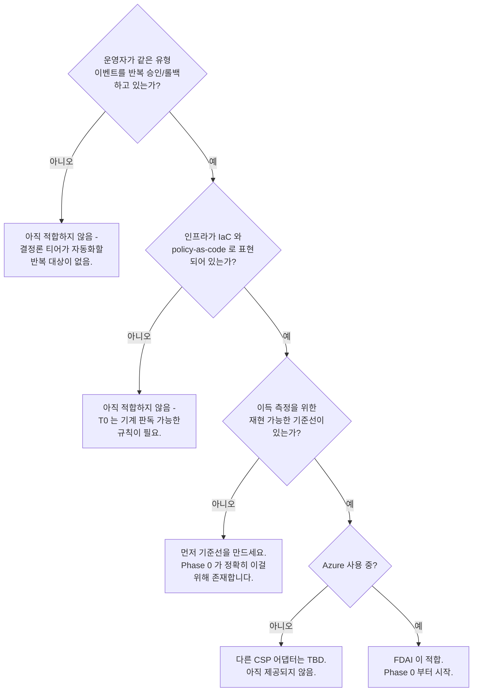

# FDAI 시작하기

FDAI(Forward Deployed AI)는 자율 클라우드 운영 컨트롤 플레인입니다. 운영 이벤트 중
반복 가능한 다수를 규칙·정책·타입 있는 액션으로 결정론적으로 해소하고, 결정론 게이트를
통과한 애매한 소수만 LLM 추론으로 넘깁니다. 모든 자율 액션은 리스크 분류를 거치며, 안전
임계값을 넘는 것은 반드시 HIL(human-in-the-loop) 승인 대기로 넘어갑니다.

FDAI는 **여러분의 클라우드 안에 사는, 전문화된 에이전트들의 조직**이라고 생각하면
됩니다. 에이전트들은 리소스 변경을 감지하고, 버전 있는 규칙 카탈로그에 비추어 각 변경을
판단하고, 안전한 다수를 실행하고, 위험한 소수만 여러분에게 올립니다. 여러분은 이 전체
시스템을 **승인 또는 거절** 수준에서 운영합니다. 잡무가 아니라 결정을 요청받습니다.
짐작으로 SRE 업무를 대신 돌리는 일은 없습니다. 모든 액션은 자체 stop-condition,
롤백 경로, blast-radius 제한, 감사 기록을 지닌 타입 있는 **온톨로지** 엔트리의
인스턴스입니다.

레퍼런스 구현 대상은 Azure입니다. 다른 CSP를 추가할 수 있도록 클라우드 중립 seam을
유지하지만, 지금 시점에 비-Azure 어댑터는 없습니다.

## 무엇을 얻을 수 있나

FDAI는 하나의 이벤트 기반 코어 위에 세 개의 버티컬을 얹습니다. 각 버티컬은 고유
규칙과 액션을 로드하지만, 동일한 컨트롤 루프·관측성·감사 로그·리스크 게이트를
공유합니다.

### Change Safety

제안된 모든 변경에 대해 규칙 카탈로그 기반 정책 게이트를 적용합니다. 각 후보는
policy-as-code에 대해 dry-run되고 blast-radius가 한정되며, 자동 병합되거나 HIL로
라우팅됩니다.

예시: IaC PR이 public-egress NSG 규칙을 도입 -> risk gate가 고위험으로 판정 ->
Teams에 HIL 승인 카드 -> 승인자가 approve 클릭 -> executor가 remediation PR을 병합하고
감사 엔트리를 기록.

### Resilience

예약된 DR 훈련, DB DR 훈련, blast-radius가 한정된 카오스 실험. 주기·범위·증거는
분리됩니다. 스케줄러가 주기, risk gate가 범위, 감사 로그가 증거를 담당합니다.

예시: 야간 잡이 critical DB에서 PITR 갭을 발견 -> agent가 훈련 시간대 안에서
페어링된 복원 훈련을 스케줄링 -> RPO/RTO 목표에 대해 복원 성공 -> 감사 엔트리로
기록.

### Cost Governance

지출 이상 탐지, 사이즈 최적화 권고, 저위험 하위집합(유휴 디스크 정리, 미사용 public IP
해제, orphan NIC 제거) 자동 실행.

예시: 비용 이상 탐지기가 캐시 티어 과잉 프로비저닝에서 트리거 -> T0 규칙 매칭 -> 2주
shadow로 정확도 증명 -> enforce로 승격 -> 롤백 경로를 갖춘 사이즈 최적화 remediation
PR이 나갑니다.

## 어떻게 동작하나

세 티어, 하나의 루프. trust router는 이벤트를 결정할 수 있는 가장 낮은 티어를 선택하고,
risk gate는 결과 액션이 자동 실행되는지 승인 대기로 넘어가는지 판단합니다.

1. **T0 (결정론, 목표 커버리지 ~70-80%)**: policy-as-code 결정. 모델 호출 없음, 애매함
   없음.
2. **T1 (경량, ~15-20%)**: 감사 로그 이력 위의 패턴 매칭·임베딩 유사도·소형 모델
   분류기. 저렴하고 빠르며 감사 가능.
3. **T2 (심층 추론, ~5-10%)**: mixed-model 교차 검증·결정론 verifier·grounding 검사를
   거친 frontier 모델. LLM이 제안하고, 실행 자격은 verifier가 부여합니다. 모델 자체가
   아닙니다.

```text
event -> event-ingest -> trust-router -> T0 | T1 | (T2 -> quality-gate)
      -> risk-gate    -> auto | HIL | abstain -> executor -> delivery -> audit
```

커버리지 백분율은 측정된 베이스라인 위에서만 주장 가능한 설계 목표입니다
([goals-and-metrics-ko](../roadmap/goals-and-metrics-ko.md)).

이 루프 위에 두 가지가 얹혀 시스템을 운영 가능하게 만듭니다:

- **타입 있는 액션 온톨로지.** FDAI가 할 수 있는 모든 변경 - 드리프트된 설정 교정,
  서비스 재시작, DR 훈련 실행 - 은 catalog-as-code 온톨로지의 `ActionType` 엔트리
  입니다. 규칙이 발동하거나 운영자가 요청하면, 그 타입이 타입의 안전 계약을 물려받는
  구체적 액션으로 *인스턴스화*됩니다.
  [concepts/ontology-driven-automation-ko.md](concepts/ontology-driven-automation-ko.md) 참고.
- **에이전트들의 조직.** 이름 있는 에이전트 집합이 루프를 소유합니다. 일부는 감지하고,
  하나는 판단하고, 하나는 실행하고, 하나는 여러분의 승인을 담당하고, 하나는 감사를
  기록합니다. 무언가 깨지면 협력해 해결하고 위험한 소수만 여러분에게 알립니다.
  [concepts/agents-and-self-healing-ko.md](concepts/agents-and-self-healing-ko.md) 참고.

## 여러분의 스택 전반에서 동작

FDAI는 이벤트 기반이고 중립적 추상화 뒤에 있어, 이미 운영 중인 것들에 꽂힙니다:

- **Azure 리소스** - 구현된 대상. 컴퓨트·스토리지·데이터베이스·네트워킹·아이덴티티·
  Kubernetes가 제공되는 규칙 카탈로그와 액션 온톨로지로 커버됩니다.
- **이벤트 버스** - Kafka 호환 스트림(Kafka 엔드포인트의 Event Hubs)이 리소스 변경
  신호·activity-log 이벤트·탐지기 finding을 루프로 실어 나릅니다.
- **policy-as-code** - 규칙은 CSP 중립 스키마로 정규화되어 OPA/Rego로 평가되므로,
  결정론 티어가 기계 판독 가능한 정책 위에서 돌아갑니다.
- **전달 채널** - 액션은 remediation PR(GitOps)로 나가고, HIL 승인은 Teams 또는
  Slack Adaptive Card로 도착합니다. 감사와 롤백은 git에서 공짜로 옵니다.
- **운영자 콘솔** - 읽기 전용 콘솔과 대화형 narrator로, executor의 특권 아이덴티티를
  절대 쥐지 않으면서 질문하고 승인·거절할 수 있습니다.

## FDAI가 적합한 경우

모두 참일 때 잘 맞습니다:



- 운영자가 반복적으로 승인·롤백하는 클라우드 설정 이벤트(드리프트, 비용 회귀, 정책
  위반)에 실제 시간을 쓰고 있다.
- 인프라가 IaC와 policy-as-code로 표현되어 있다(또는 그 방향으로 가고 있다).
- 자율성 이득을 측정할 베이스라인이 있거나 만들 수 있다. FDAI는 측정된 짝 없이
  배수를 주장하지 않습니다.
- 컴플라이언스가 저위험 변경의 자동 실행을 허용한다. 단, 모든 액션에 stop-condition,
  롤백 경로, blast-radius 제한, 감사 로그가 있어야 합니다.

## 아직 적합하지 않은 경우

- **IaC도 policy-as-code도 없는 환경**: 결정론 티어가 실행할 대상이 없습니다.
- **일회성·비반복 인시던트**: FDAI의 이득은 반복 가능한 다수를 자동화하는 데
  있고, 나머지 신규 소수는 인간이 계속 루프 안에 남습니다.
- **비-Azure CSP**: 추상화는 중립적으로 설계되어 있지만, Azure 어댑터만 제공됩니다.

## 여러분의 환경과 함께 성장

- **Day 1**: T0 규칙이 shadow 모드로 이벤트에서 돌아갑니다. 모든 finding은 감사 엔트리를
  남겨 "무엇을 했을지"를 보여줍니다.
- **Week 1**: shadow 지표로 어떤 액션이 promotion gate를 통과하는지 확인. T1이 해결된
  인시던트 패턴을 재사용하기 시작하고, T2는 소수 비중을 유지.
- **Month 1**: 승격된 액션은 롤백 경로와 함께 자율 실행됩니다. discovery loop가 여러분의
  운영 신호(HIL 승인, shadow 드리프트, 오버라이드)에서 카탈로그 갱신을 제안하기
  시작합니다.

## 다음 단계

| 학습 대상 | 문서 |
|-----------|------|
| FDAI가 자동화하는 SRE 기능 | [concepts/sre-foundations-ko.md](concepts/sre-foundations-ko.md) |
| 왜 결정론 우선인가 | [concepts/deterministic-first-ko.md](concepts/deterministic-first-ko.md) |
| 세 신뢰 티어의 상세 | [concepts/risk-tiers-ko.md](concepts/risk-tiers-ko.md) |
| 액션 온톨로지가 자동화를 이끄는 방식 | [concepts/ontology-driven-automation-ko.md](concepts/ontology-driven-automation-ko.md) |
| 에이전트들이 협력하고 자가 치유하는 방식 | [concepts/agents-and-self-healing-ko.md](concepts/agents-and-self-healing-ko.md) |
| Shadow 모드 롤아웃과 승격 | [concepts/shadow-then-enforce-ko.md](concepts/shadow-then-enforce-ko.md) |
| 운영자 관점의 변경 승인 | [guides/approve-change-ko.md](guides/approve-change-ko.md) |
| 감사 로그 읽기 | [guides/read-audit-log-ko.md](guides/read-audit-log-ko.md) |
| 특정 스코프에서 규칙 좁히기 | [guides/override-a-rule-ko.md](guides/override-a-rule-ko.md) |
| 전체 엔지니어링 로드맵 | [../roadmap/README-ko.md](../roadmap/README-ko.md) |
