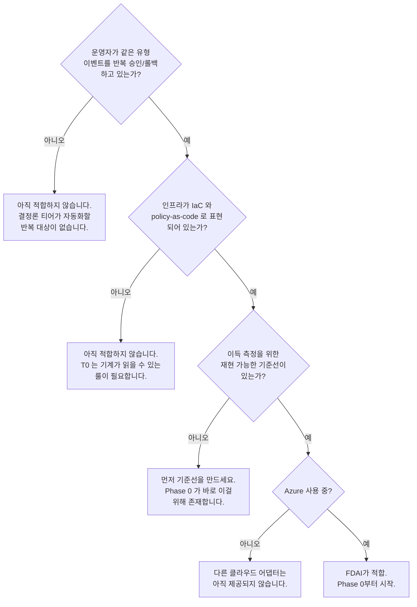

# FDAI 시작하기

FDAI(Forward Deployed AI)는 자율 클라우드 운영 컨트롤 플레인입니다. 반복되는 운영 이벤트의
대다수를 룰, 정책, 타입이 정의된 작업으로 정리하고, 결정론적 경로에서 판단하지 못한
모호한 사례에만 언어 모델을 씁니다. 모든 자율 작업은 위험도 분류를 거치며, 안전 임계값을
넘는 작업은 사람 승인을 기다립니다.

<div class="get-started-principles" role="list" aria-label="FDAI 운영 원칙">
  <div class="get-started-principle" role="listitem"><span class="principle-index">01</span><strong>추론보다 규칙 우선</strong><span>알려진 결정은 결정론적이고 검토 가능하며 빠르게 유지합니다.</span></div>
  <div class="get-started-principle" role="listitem"><span class="principle-index">02</span><strong>변경 적용 전 관찰 우선</strong><span>새 액션은 리소스를 변경하기 전에 동작을 증명합니다.</span></div>
  <div class="get-started-principle" role="listitem"><span class="principle-index">03</span><strong>안전성 검토 기반 자율성</strong><span>고위험이거나 불확실한 결과는 사람 검토를 위해 대기합니다.</span></div>
  <div class="get-started-principle" role="listitem"><span class="principle-index">04</span><strong>권한 분리</strong><span>판단, 승인, 실행, 감사는 서로 다른 주체가 담당합니다.</span></div>
  <div class="get-started-principle" role="listitem"><span class="principle-index">05</span><strong>모든 경로의 증거</strong><span>자동 실행, 거부, 시간 초과, 롤백, no-op 결과를 감사 추적에 남깁니다.</span></div>
</div>

FDAI는 **여러분의 클라우드 안에 사는, 전문화된 에이전트들의 조직**이라고 생각하면
됩니다. 에이전트들은 리소스 변경을 감지하고, 버전 있는 규칙 카탈로그에 비추어 각 변경을
판단하고, 안전한 다수를 실행하고, 위험한 소수만 여러분에게 올립니다. 여러분은 이 전체
시스템을 **승인 또는 거절** 수준에서 운영합니다. 잡무가 아니라 결정을 요청받습니다.
즉흥으로 움직이는 일은 없습니다. 모든 작업은 자체 중단 조건, 롤백 경로, 영향 범위
제한, 감사 기록을 지닌 타입 있는 **온톨로지** 엔트리의 인스턴스입니다.

레퍼런스 구현 대상은 Azure입니다. 다른 클라우드를 추가할 수 있도록 중립적인 연결 지점을
유지하지만, 지금 시점에 Azure 외 어댑터는 없습니다.

## 무엇을 얻을 수 있나

FDAI는 하나의 이벤트 기반 코어 위에 세 개의 버티컬을 얹습니다. 각 버티컬은 고유한
룰과 작업을 로드하면서 컨트롤 루프, 관측, 감사 로그, 안전성 검토를 공유합니다.

### Change Safety

제안된 모든 변경은 룰 카탈로그 정책 검사를 거칩니다. FDAI는 후보를 policy-as-code(기계가
읽을 수 있는 정책)에 대해 dry-run하고, 영향 범위를 제한한 뒤, 자동으로 병합하거나 사람
승인으로 보냅니다.

예시: IaC pull request가 public-egress NSG 룰을 도입 -> 안전성 검토가 고위험으로 판정 ->
Teams에 승인 카드가 도착 -> 승인자가 승인을 선택 -> 실행기가 수정 pull request를 병합하고
감사 엔트리를 기록.

### Resilience

예약된 DR 훈련, DB DR 훈련, 영향 범위가 한정된 카오스 실험입니다. 주기, 범위, 근거는
따로 관리됩니다. 스케줄러가 주기를, 안전성 검토가 범위를, 감사 로그가 근거를 담당합니다.

예시: 야간 작업이 핵심 DB에서 시점 복원(PITR) 공백을 발견 -> 에이전트가 훈련 시간대 안에서
짝 지어진 복원 훈련을 예약 -> RPO/RTO 목표를 충족하며 복원 성공 -> 감사 엔트리로 기록.

### Cost Governance

지출 이상 탐지, 사이즈 최적화 권고, 그리고 유휴 디스크 정리, 미사용 public IP 해제, orphan
NIC 제거 같은 저위험 작업의 자동 실행입니다.

예시: 비용 이상 탐지기가 캐시 티어 과잉 프로비저닝을 포착 -> T0 룰이 매칭 -> 2주간 관찰
모드로 정확도를 증명 -> 적용 모드로 승격 -> 롤백 경로를 갖춘 사이즈 최적화 수정 pull
request가 나갑니다.

## 여러분의 스택 전반에서 동작

FDAI는 이벤트 기반이고 중립적 추상화 뒤에 있어, 이미 운영 중인 환경에 연결할 수
있습니다:

- **Azure 리소스**: 구현된 대상입니다. 컴퓨트, 스토리지, 데이터베이스, 네트워킹,
  아이덴티티, Kubernetes를 제공되는 룰 카탈로그와 작업 온톨로지로 다룹니다.
- **이벤트 버스**: Kafka 호환 스트림(Kafka 엔드포인트의 Event Hubs)이 리소스 변경
  신호, Activity Log 이벤트, 발견된 문제를 컨트롤 루프로 전달합니다.
- **policy-as-code**: 룰은 클라우드 공급자 중립 스키마로 정규화되어 OPA와 Rego로
  평가됩니다. 따라서 결정론 티어는 기계가 읽을 수 있는 정책 위에서 동작합니다.
- **전달 채널**: 작업은 수정 pull request로 전달되고, 승인 요청은 Teams 또는 Slack
  Adaptive Card로 도착합니다. Git은 변경 기록과 롤백 참조를 보관합니다.
- **운영자 콘솔**: 읽기 전용 콘솔과 대화형 내레이터를 사용해 실행기의 특권 자격 증명
  없이 질문하고 결정을 검토할 수 있습니다.

## 어떻게 동작하나

세 티어, 하나의 루프입니다. 트러스트 라우터가 이벤트를 판단할 수 있는 가장 낮은 티어를
고르고, 안전성 검토가 그 결과 작업을 바로 실행할지 승인 대기로 보낼지 정합니다.

1. **T0, 결정론(목표 커버리지 70-80%)**: 정답이 정해진 policy-as-code 판단입니다. 모델
   호출도, 모호함도 없습니다.
2. **T1, 경량(목표 15-20%)**: 감사 로그 이력 위의 패턴 매칭, 임베딩 유사도, 소형 분류
   모델입니다. 저렴하고 빠르며 감사할 수 있습니다.
3. **T2, 심층 추론(목표 5-10%)**: 서로 다른 모델 간 교차 검증, 결정론적 검증기, 근거
   확인을 거치는 프런티어 모델입니다. 모델이 작업을 제안하고, 실행 가능 여부는 검증기가
   정합니다.

```text
event -> event-ingest -> trust-router -> T0 | T1 | (T2 -> quality-gate)
      -> risk-gate    -> auto | HIL | abstain -> executor -> delivery -> audit
```

위 파이프라인에서 `risk-gate`가 안전성 검토이며, 결과는 `auto`(바로 실행),
`HIL`(사람 승인 필요), `abstain`(검토 보류) 세 가지입니다.

백분율은 목표치입니다. 측정된 베이스라인이 나오기 전에는 FDAI가 이 수치를 주장하지
않습니다
([goals-and-metrics-ko](../roadmap/architecture/goals-and-metrics-ko.md)).

이 루프 위에 두 가지가 얹혀 시스템을 운영 가능하게 만듭니다.

- **타입이 정의된 작업 온톨로지.** 드리프트된 설정 교정, 서비스 재시작, DR 훈련 실행처럼
  FDAI가 할 수 있는 모든 변경은 코드로 관리되는 카탈로그의 `ActionType` 엔트리입니다.
  룰이 발동하거나 여러분이 요청하면, 그 타입이 안전 계약을 물려받은 구체적인 작업으로
  만들어집니다.
  [concepts/ontology-driven-automation-ko.md](concepts/ontology-driven-automation-ko.md)를
  참조하세요.
- **에이전트들의 조직.** 이름이 정해진 에이전트 집합이 루프를 소유합니다. 일부는
  관찰하고, 하나는 판단하고, 하나는 실행하고, 하나는 여러분의 승인을 담당하고, 하나는
  감사를 기록합니다. 무언가 깨지면 함께 해결하고 위험한 소수만 여러분에게 알립니다.
  [concepts/agents-and-self-healing-ko.md](concepts/agents-and-self-healing-ko.md)를
  참조하세요.

## FDAI가 적합한 경우

다음이 모두 참이면 잘 맞습니다.


```mermaid
flowchart TB
  Q1{운영자가 같은 유형<br/>이벤트를 반복 승인/롤백<br/>하고 있는가?}
  Q1 -->|아니오| N1[아직 적합하지 않습니다.<br/>결정론 티어가 자동화할<br/>반복 대상이 없습니다.]
  Q1 -->|예| Q2{인프라가 IaC 와<br/>policy-as-code 로 표현<br/>되어 있는가?}
  Q2 -->|아니오| N2[아직 적합하지 않습니다.<br/>T0 는 기계가 읽을 수 있는<br/>룰이 필요합니다.]
  Q2 -->|예| Q3{이득 측정을 위한<br/>재현 가능한 기준선이<br/>있는가?}
  Q3 -->|아니오| N3[먼저 기준선을 만드세요.<br/>Phase 0 가 바로 이걸<br/>위해 존재합니다.]
  Q3 -->|예| Q4{Azure 사용 중?}
  Q4 -->|아니오| N4[다른 클라우드 어댑터는<br/>아직 제공되지 않습니다.]
  Q4 -->|예| OK[FDAI가 적합.<br/>Phase 0부터 시작.]
```

- 운영자가 드리프트, 비용 회귀, 정책 위반처럼 반복되는 클라우드 설정 이벤트를 승인하거나
  롤백하는 데 실제 시간을 쓰고 있습니다.
- 인프라가 IaC와 policy-as-code로 표현되어 있거나, 그 방향으로 가고 있습니다.
- 자율성 이득을 측정할 기준선이 있거나 만들 수 있습니다. FDAI는 짝이 되는 측정 없이
  배수를 주장하지 않습니다.
- 컴플라이언스가 저위험 변경의 자동 실행을 허용합니다. 단, 모든 작업에 중단 조건,
  롤백 경로, 영향 범위 제한, 감사 로그 기록이 있어야 합니다.

## 아직 적합하지 않은 경우

- **IaC도 policy-as-code도 없는 환경**: 결정론 티어가 실행할 대상이 없습니다.
- **일회성이고 반복되지 않는 인시던트**: FDAI의 이점은 반복되는 다수를 정리하는 데서
  나옵니다. 새롭고 드문 사례는 사람이 계속 담당합니다.
- **Azure 외 클라우드**: 추상화는 중립적으로 설계되어 있지만, Azure 어댑터만
  제공됩니다.

## 첫 번째 안전한 롤아웃

하나의 제한된 운영 범위와 하나의 작업 제품군으로 시작하는 것이 좋습니다. 첫 번째
롤아웃의 목표는 첫날부터 자동화를 최대화하는 것이 아니라 근거를 만드는 것입니다.

<!-- fdai:steps -->

1. **경계를 선택합니다.** 리소스 그룹 크기의 범위를 고르고, 소유자를 지정하고,
  범위 안에 들어갈 이벤트와 작업을 정리합니다.
2. **준비 검사를 실행합니다.** 컨트롤 루프를 시작하기 전에
  [배포 사전 검사](../roadmap/deployment/deployment-preflight-ko.md)를 완료하고
  아이덴티티, 정책, 연결, 롤백 차단 요소를 해소합니다.
3. **기준선을 기록합니다.** 이벤트 볼륨, 결정 지연, 운영자 개입, 롤백 빈도를
  [목표와 메트릭 계약](../roadmap/architecture/goals-and-metrics-ko.md)에 따라
  측정합니다.
4. **관찰 모드에서 지켜봅니다.** FDAI가 아무것도 바꾸지 않고 판단과 감사만 하도록
  둡니다. 오탐, 승인 결정, 검증기 실패, 실행했을 법한 작업을 검토합니다.
5. **한 번에 하나씩 승격합니다.** 고정된 시나리오, 롤백 리허설, 정책 검사가 승격
  기준을 충족한 작업만 적용 모드로 바꿉니다. 나머지는 모두 관찰 모드로 둡니다.

예시: 비프로덕션 리소스 그룹 하나를 온보딩 -> 드리프트 작업 하나를 2주 동안 관찰 ->
감사 근거 검토 -> 롤백 리허설 -> 나머지 카탈로그는 관찰 모드로 둔 채 해당 작업만 승격.

## 적용 전에 확인할 근거

다음 신호로 작업의 준비 상태를 판단하세요. 배포에 성공했다는 사실만으로는 충분하지
않습니다.

| 근거 | 확인할 수 있는 내용 | 지원하는 결정 |
|------|---------------------|---------------|
| 룰 커버리지와 판단 보류 비율 | 결정론 룰이 추측 없이 의도한 사례를 다루는지 | 관찰 모드 유지 또는 시나리오 확장 |
| 정책, 스키마, what-if 결과 | 제안된 모든 변경이 결정론적 검증기를 통과하는지 | 차단 또는 승격 준비 계속 |
| 승인, 거절, 오버라이드 | 운영자 판단이 자동 결정과 여전히 다른 지점 | 임계값, 범위, 룰 조정 |
| 롤백 리허설 | 선언된 복구 경로가 예상 시간 안에 이전 상태를 복원하는지 | 적용 허용 또는 차단 |
| 감사 완전성 | 이벤트부터 결과까지 모든 경로를 재구성할 수 있는지 | 근거 기록 수락 또는 릴리스 보류 |

## 여러분의 환경과 함께 성장

- **Day 1**: T0 룰이 관찰 모드로 이벤트를 처리합니다. 발견된 모든 문제가 감사 엔트리를
  남기므로 FDAI가 무엇을 했을지 확인할 수 있습니다.
- **Week 1**: 관찰 지표로 어떤 작업이 승격 기준을 통과하는지 확인합니다. T1이 해결된
  인시던트 패턴을 재사용하기 시작하고, T2는 낮은 비중을 유지합니다.
- **Month 1**: 승격된 작업이 롤백 경로와 함께 스스로 실행됩니다. 발견 루프가 승인,
  관찰 모드 편차, 오버라이드 같은 여러분의 운영 신호에서 카탈로그 갱신을 제안하기
  시작합니다.

## 시작하기

- **운영 모델 이해**:
  [사이트 신뢰성 엔지니어링](sre/README-ko.md)을 읽은 다음
  [FDAI SRE 기초](concepts/sre-foundations-ko.md)와
  [결정론 우선 의사 결정](concepts/deterministic-first-ko.md)을 살펴보세요.
- **환경 준비**:
  [배포 사전 검사](../roadmap/deployment/deployment-preflight-ko.md)를 수행한 다음
  [배포와 온보딩](../roadmap/deployment/deploy-and-onboard-ko.md)을 진행하세요.
- **사람 검토 경로 운영**:
  [변경 승인](guides/approve-change-ko.md)과
  [감사 로그 읽기](guides/read-audit-log-ko.md)를 따라 해보세요.
- **도입 계획**:
  [구현 계획](../roadmap/fork-and-sequencing/implementation-plan-ko.md)을 사용해 범위,
  소유권, 관찰 근거, 승격 순서를 정하세요.

## 다음 단계

<!-- fdai:cards -->

- [사이트 신뢰성 엔지니어링](sre/README-ko.md) - FDAI 전반의 관찰, 대응, 복구, 학습.
- [인시던트 관리](sre/incident-management-ko.md) - 신호부터 종료까지 인시던트 생애주기 따라가기.
- [근본 원인 분석](sre/root-cause-analysis-ko.md) - 티어별 근거 기반 원인 가설 이해하기.
- [결정론 우선](concepts/deterministic-first-ko.md) - 왜 알려진 결정은 결정론적으로 남는가.
- [리스크 티어](concepts/risk-tiers-ko.md) - 세 신뢰 티어의 상세.
- [온톨로지 기반 자동화](concepts/ontology-driven-automation-ko.md) - 액션 온톨로지가 자동화를 이끄는 방식.
- [에이전트와 자가 치유](concepts/agents-and-self-healing-ko.md) - 에이전트들이 협력하고 자가 치유하는 방식.
- [관찰 후 적용](concepts/shadow-then-enforce-ko.md) - 관찰 모드 롤아웃과 승격.
- [변경 승인](guides/approve-change-ko.md) - 운영자 관점의 변경 승인.
- [감사 로그 읽기](guides/read-audit-log-ko.md) - 감사 로그 읽기.
- [규칙 오버라이드](guides/override-a-rule-ko.md) - 특정 스코프에서 규칙 좁히기.
- [엔지니어링 로드맵](../roadmap/README-ko.md) - 전체 엔지니어링 참고 자료.
