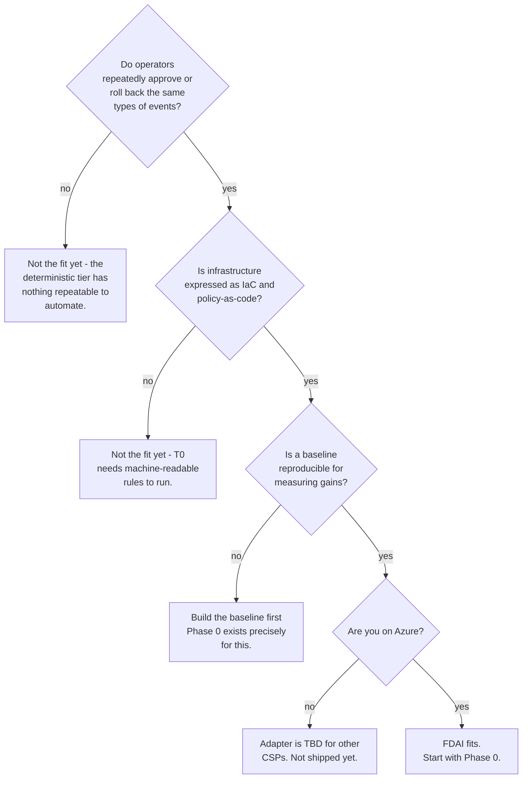

# Get Started with FDAI

FDAI (Forward Deployed AI) is an autonomous cloud operations control plane. It
resolves the repeatable majority of operational events deterministically with
rules, policies, and typed actions, and reserves LLM inference for the ambiguous
residual that survives the deterministic gate. Every autonomous action is
risk-classified, and anything above the safe threshold pauses for
human-in-the-loop (HIL) approval.

<div class="get-started-principles" role="list" aria-label="FDAI operating principles">
  <div class="get-started-principle" role="listitem"><span class="principle-index">01</span><strong>Rules before reasoning</strong><span>Known decisions stay deterministic, reviewable, and fast.</span></div>
  <div class="get-started-principle" role="listitem"><span class="principle-index">02</span><strong>Shadow before enforce</strong><span>New actions prove their behavior before they can mutate anything.</span></div>
  <div class="get-started-principle" role="listitem"><span class="principle-index">03</span><strong>Risk-gated autonomy</strong><span>High-risk and uncertain outcomes pause for human review.</span></div>
  <div class="get-started-principle" role="listitem"><span class="principle-index">04</span><strong>Separated authority</strong><span>Judgment, approval, execution, and audit use distinct principals.</span></div>
  <div class="get-started-principle" role="listitem"><span class="principle-index">05</span><strong>Evidence on every path</strong><span>Auto, deny, timeout, rollback, and no-op outcomes enter the audit trail.</span></div>
</div>

Think of FDAI as an **organization of specialized agents that lives inside your
cloud**. The agents sense resource changes, judge each one against a versioned
catalog of rules, execute the safe majority, and escalate the risky few to you.
You operate the whole system at the level of **approve or reject** - you are
asked for decisions, not toil. Nothing runs the SRE handbook for you by
guesswork: every action is an instance of a typed **ontology** entry that carries
its own stop-condition, rollback path, blast-radius limit, and audit record.

The reference implementation targets Azure. The design keeps a cloud-neutral seam
so other CSPs are additive rather than requiring a core rewrite, but no non-Azure
adapter ships today.

## What can you achieve?

FDAI ships three verticals under one event-driven core. Each loads its own
rules and actions but shares the control loop, observability, audit log, and
risk gate.

### Change Safety

Rule-catalog-driven policy gates on every proposed change. Each candidate is
dry-run against policy-as-code, blast-radius scoped, and either auto-merged or
routed to HIL.

Example: an IaC PR proposes a public-egress NSG rule -> risk gate flags
high-risk -> HIL approval card in Teams -> approver clicks approve -> executor
merges the remediation PR + writes the audit entry.

### Resilience

Scheduled DR drills, database DR exercises, and blast-radius-bounded chaos
experiments. Cadence, scope, and proof stay separated: scheduler owns cadence,
risk gate owns scope, audit log owns proof.

Example: a nightly job finds a PITR gap on a critical database -> agent schedules
a paired restore drill in the exercise window -> restore succeeds against target
RPO/RTO -> audit entry recorded.

### Cost Governance

Anomaly detection on spend, right-sizing recommendations, and auto-execution of
the low-risk subset (idle disk cleanup, unused public IP release, orphan NIC
removal).

Example: cost-anomaly detector fires on cache-tier over-provisioning -> T0 rule
matches -> two-week shadow proves accuracy -> promotion to enforce -> right-size
remediation PR ships with a rollback path.

## Works across your stack

FDAI is event-driven and sits behind neutral abstractions, so it plugs into
what you already run:

- **Azure resources**: The implemented target. Compute, storage, databases,
  networking, identity, and Kubernetes are covered by the shipped rule catalog
  and action ontology.
- **Event bus**: A Kafka-compatible stream (Event Hubs on the Kafka endpoint)
  carries resource-change signals, activity-log events, and detector findings
  into the loop.
- **Policy-as-code**: Rules normalize to a cloud-provider-neutral schema and
  evaluate through OPA/Rego, so the deterministic tier runs on machine-readable
  policy.
- **Delivery channels**: Actions ship as remediation pull requests (PRs that
  apply a fix), and HIL approvals reach you as Teams or Slack Adaptive Cards.
  Git provides the change record and rollback reference.
- **Operator console**: A read-only console and conversational narrator let you
  ask questions and review decisions without holding the executor's privileged
  identity.

## How it works

Three tiers, one loop. The trust router picks the lowest tier that can decide
the event; the risk gate decides whether the resulting action auto-executes or
waits for approval.

1. **T0 (deterministic, ~70-80% target coverage)**: policy-as-code decisions
   with a known correct outcome. No model call, no ambiguity.
2. **T1 (lightweight, ~15-20%)**: pattern matching, embedding similarity, and
   small-model classifiers over the audit log's history. Cheap, fast, and
   auditable.
3. **T2 (deep reasoning, ~5-10%)**: frontier models with mixed-model
   cross-check, deterministic verifier, and grounding checks. LLMs generate;
   execution eligibility is granted by verifier, not by the model.

```text
event -> event-ingest -> trust-router -> T0 | T1 | (T2 -> quality-gate)
      -> risk-gate    -> auto | HIL | abstain -> executor -> delivery -> audit
```

Coverage percentages are targets that require a measured baseline before they
can be claimed
([goals-and-metrics](../roadmap/architecture/goals-and-metrics.md)).

Two things ride on top of that loop and make it operable:

- **A typed action ontology.** Every change FDAI can make - remediate a
  drifted config, restart a service, run a DR drill - is an `ActionType`
  entry in a catalog-as-code ontology. When a rule fires or an operator asks,
  the type is *instantiated* into a concrete action that inherits the type's
  safety contract. See
  [concepts/ontology-driven-automation.md](concepts/ontology-driven-automation.md).
- **An organization of agents.** A fixed set of named agents owns the loop:
  some sense, one judges, one executes, one carries your approval, one records
  the audit. When something breaks, they collaborate to resolve it and only
  page you for the high-risk few. See
  [concepts/agents-and-self-healing.md](concepts/agents-and-self-healing.md).

## When FDAI fits

FDAI is a good fit when all of these are true:



- Operators already spend real time approving or rolling back repeatable
  cloud-configuration events (drift, cost regressions, policy violations).
- Your infrastructure is expressed as IaC and policy-as-code, or you are
  moving that way.
- You have, or can construct, a baseline to measure autonomy gains against.
  FDAI never claims a multiplier without a paired measurement.
- Your compliance regime tolerates auto-executed low-risk changes provided
  every action has a stop-condition, rollback path, blast-radius limit, and
  audit-log entry.

## When FDAI doesn't fit (yet)

- **No IaC or no policy-as-code**: the deterministic tier has nothing to run.
- **One-off, non-repeatable incidents**: FDAI's edge comes from
  resolving the repeatable majority; the residual novel minority stays with
  humans.
- **Non-Azure CSPs**: abstractions are neutral by design, but the Azure
  adapter is the only one shipped.

## Your first safe rollout

Start with one bounded operational scope and one action family. The goal of the
first rollout is to produce evidence, not to maximize automation on day one.

1. **Choose the boundary.** Select a resource-group-equivalent scope, name its
  owner, and identify the events and actions that belong inside it.
2. **Run readiness checks.** Complete the
  [deployment preflight](../roadmap/deployment/deployment-preflight.md) and
  resolve identity, policy, connectivity, and rollback blockers before the
  control loop starts.
3. **Capture the baseline.** Measure event volume, decision latency, operator
  touches, and rollback frequency using the
  [goals and metrics contract](../roadmap/architecture/goals-and-metrics.md).
4. **Observe in shadow mode.** Let FDAI judge and audit without mutating. Review
  false positives, HIL decisions, verifier failures, and would-be actions.
5. **Promote one action independently.** Turn on enforcement only for an action
  whose frozen scenarios, rollback rehearsal, and policy checks meet its
  promotion gate. Leave every other action in shadow.

Example: onboard one non-production resource group -> observe one drift action
for two weeks -> review its audit evidence -> rehearse rollback -> promote only
that action while the remaining catalog stays in shadow.

## Evidence before enforcement

Use these signals to decide whether an action is ready. A successful deployment
is not enough by itself.

| Evidence | What it tells you | Decision it supports |
|----------|-------------------|----------------------|
| Rule coverage and abstention rate | Whether deterministic rules cover the intended cases without guessing | Keep in shadow or expand the scenario set |
| Policy, schema, and what-if results | Whether every proposed mutation passes the deterministic verifier | Block or continue toward promotion |
| HIL approvals, rejections, and overrides | Where operator judgment still disagrees with the automated verdict | Revise thresholds, scope, or the rule |
| Rollback rehearsal | Whether the declared recovery path restores the prior state within the expected window | Permit or block enforcement |
| Audit completeness | Whether every terminal path can be reconstructed from event to outcome | Accept the evidence record or hold release |

## Grows with your environment

- **Day 1**: T0 rules run in shadow mode on your events. Every finding writes
  an audit entry so you can see what it would have done.
- **Week 1**: shadow metrics show which actions clear their promotion gate.
  T1 starts reusing patterns from resolved incidents; T2 stays a small share.
- **Month 1**: promoted actions run autonomously with rollback paths. The
  discovery loop begins proposing catalog updates from your own operating
  signals (HIL approvals, shadow drift, overrides).

## Get started

- **Understand the operating model**: Read
  [SRE foundations](concepts/sre-foundations.md), then
  [deterministic-first decisioning](concepts/deterministic-first.md).
- **Prepare an environment**: Follow
  [deployment preflight](../roadmap/deployment/deployment-preflight.md), then
  [deploy and onboard](../roadmap/deployment/deploy-and-onboard.md).
- **Operate the human review path**: Walk through
  [approving a change](guides/approve-change.md) and
  [reading the audit log](guides/read-audit-log.md).
- **Plan adoption**: Use the
  [implementation plan](../roadmap/fork-and-sequencing/implementation-plan.md)
  to sequence scope, ownership, shadow evidence, and promotion.

## Next steps

<!-- fdai:cards -->

- [SRE foundations](concepts/sre-foundations.md) - The SRE functions FDAI automates.
- [Deterministic-first](concepts/deterministic-first.md) - Why known decisions stay deterministic.
- [Risk tiers](concepts/risk-tiers.md) - The three trust tiers in depth.
- [Ontology-driven automation](concepts/ontology-driven-automation.md) - How the action ontology drives automation.
- [Agents and self-healing](concepts/agents-and-self-healing.md) - How agents collaborate and self-heal.
- [Shadow then enforce](concepts/shadow-then-enforce.md) - Shadow-mode rollout and promotion.
- [Approve a change](guides/approve-change.md) - Approving a change on the operator side.
- [Read the audit log](guides/read-audit-log.md) - Reading the audit log.
- [Override a rule](guides/override-a-rule.md) - Narrowing a rule for one scope.
- [Engineering roadmap](../roadmap/README.md) - The full engineering reference.
