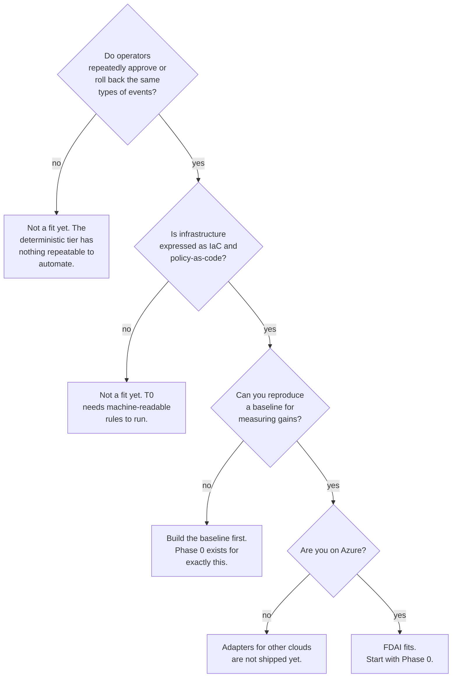

# Get Started with FDAI

FDAI (Forward Deployed AI) is an autonomous cloud operations control plane. It
settles the repeatable majority of operational events with rules, policies, and
typed actions, and calls a language model only for the ambiguous cases that the
deterministic path could not decide. Every autonomous action gets a risk
classification, and anything above the safe threshold waits for human approval.

<div class="get-started-principles" role="list" aria-label="FDAI operating principles">
  <div class="get-started-principle" role="listitem"><span class="principle-index">01</span><strong>Rules before reasoning</strong><span>Known decisions stay deterministic, reviewable, and fast.</span></div>
  <div class="get-started-principle" role="listitem"><span class="principle-index">02</span><strong>Observe, then enable changes</strong><span>New actions prove their behavior before they can mutate anything.</span></div>
  <div class="get-started-principle" role="listitem"><span class="principle-index">03</span><strong>Safety-gated autonomy</strong><span>High-risk and uncertain outcomes pause for human review.</span></div>
  <div class="get-started-principle" role="listitem"><span class="principle-index">04</span><strong>Separated authority</strong><span>Judgment, approval, execution, and audit use distinct principals.</span></div>
  <div class="get-started-principle" role="listitem"><span class="principle-index">05</span><strong>Evidence on every path</strong><span>Auto, deny, timeout, rollback, and no-op outcomes enter the audit trail.</span></div>
</div>

Think of FDAI as an **organization of specialized agents that lives inside your
cloud**. The agents watch resource changes, judge each one against a versioned
catalog of rules, run the safe majority, and bring the risky few to you. You
operate at the level of **approve or reject**, so you make decisions instead of
doing the toil. Nothing is improvised: every action is an instance of a typed
**ontology** entry that carries its own stop condition, rollback path, impact
scope limit, and audit record.

The reference implementation targets Azure. The design keeps a cloud-neutral
seam, so adding another cloud provider is additive work rather than a core
rewrite. No non-Azure adapter ships today.

## What can you achieve?

FDAI ships three verticals on one event-driven core. Each vertical loads its own
rules and actions and shares the control loop, observability, audit log, and
safety check.

### Change Safety

Every proposed change passes rule-catalog policy checks. FDAI dry-runs the
candidate against policy-as-code (policies expressed as machine-readable rules),
limits its impact scope, and then either merges it automatically or sends it for
human approval.

Example: an IaC pull request proposes a public-egress NSG rule -> the safety
check marks it high risk -> an approval card arrives in Teams -> the approver
selects approve -> the executor merges the fix pull request and writes the audit
entry.

### Resilience

Scheduled DR drills, database DR exercises, and chaos experiments with a bounded
impact scope. Cadence, scope, and proof stay separate: the scheduler owns
cadence, the safety check owns scope, and the audit log owns proof.

Example: a nightly job finds a point-in-time-restore gap on a critical database
-> an agent schedules a paired restore drill inside the exercise window -> the
restore meets the target RPO and RTO -> the audit entry is recorded.

### Cost Governance

Spend anomaly detection, right-sizing recommendations, and automatic execution of
the low-risk subset such as idle disk cleanup, unused public IP release, and
orphan NIC removal.

Example: the cost anomaly detector fires on an over-provisioned cache tier -> a
T0 rule matches -> two weeks of observation mode prove the rule is accurate -> the
action is promoted to enforcement mode -> the right-sizing fix pull request ships
with a rollback path.

## Works across your stack

FDAI is event-driven and sits behind neutral abstractions, so it plugs into what
you already run:

- **Azure resources**: the implemented target. Compute, storage, databases,
  networking, identity, and Kubernetes are covered by the shipped rule catalog
  and action ontology.
- **Event bus**: a Kafka-compatible stream (Event Hubs on its Kafka endpoint)
  carries resource-change signals, activity-log events, and detected issues into
  the loop.
- **Policy-as-code**: rules normalize to a cloud-provider-neutral schema and
  evaluate through OPA and Rego, so the deterministic tier runs on
  machine-readable policy.
- **Delivery channels**: actions ship as fix pull requests, and approval requests
  reach you as Teams or Slack Adaptive Cards. Git keeps the change record and the
  rollback reference.
- **Operator console**: a read-only console and a conversational narrator let you
  ask questions and review decisions without holding the executor's privileged
  identity.

## How it works

Three tiers, one loop. The trust router picks the lowest tier that can decide the
event. The safety check then decides whether the resulting action runs on its own
or waits for approval.

1. **T0, deterministic (target coverage 70-80%)**: policy-as-code decisions with
   a known correct answer. No model call and no ambiguity.
2. **T1, lightweight (target 15-20%)**: pattern matching, embedding similarity,
   and small classifier models over the audit log's history. Cheap, fast, and
   auditable.
3. **T2, deep reasoning (target 5-10%)**: frontier models with a cross-check
   between different models, a deterministic verifier, and an evidence check. The
   model proposes an action, and the verifier decides whether it may run.

```text
event -> event-ingest -> trust-router -> T0 | T1 | (T2 -> quality-gate)
      -> risk-gate    -> auto | HIL | abstain -> executor -> delivery -> audit
```

In that pipeline, `risk-gate` is the safety check and its three outcomes are
`auto` (run it), `HIL` (human approval required), and `abstain` (hold for
review).

Those percentages are targets. FDAI does not claim them until a measured baseline
exists
([goals-and-metrics](../roadmap/architecture/goals-and-metrics.md)).

Two things sit on top of that loop and make it operable:

- **A typed action ontology.** Every change FDAI can make, such as fixing a
  drifted config, restarting a service, or running a DR drill, is an `ActionType`
  entry in a catalog kept as code. When a rule fires or you ask for something, the
  type is turned into a concrete action that inherits the type's safety contract.
  Read
  [concepts/ontology-driven-automation.md](concepts/ontology-driven-automation.md).
- **An organization of agents.** A fixed set of named agents owns the loop. Some
  observe, one judges, one executes, one carries your approval, and one records
  the audit trail. When something breaks, they work together to resolve it and
  page you only for the high-risk few. Read
  [concepts/agents-and-self-healing.md](concepts/agents-and-self-healing.md).

## When FDAI fits

FDAI is a good fit when all of these are true:


```mermaid
flowchart TB
  Q1{Do operators<br/>repeatedly approve or<br/>roll back the same<br/>types of events?}
  Q1 -->|no| N1[Not a fit yet. The<br/>deterministic tier has<br/>nothing repeatable to<br/>automate.]
  Q1 -->|yes| Q2{Is infrastructure<br/>expressed as IaC and<br/>policy-as-code?}
  Q2 -->|no| N2[Not a fit yet. T0<br/>needs machine-readable<br/>rules to run.]
  Q2 -->|yes| Q3{Can you reproduce<br/>a baseline for<br/>measuring gains?}
  Q3 -->|no| N3[Build the baseline first.<br/>Phase 0 exists for<br/>exactly this.]
  Q3 -->|yes| Q4{Are you on Azure?}
  Q4 -->|no| N4[Adapters for other clouds<br/>are not shipped yet.]
  Q4 -->|yes| OK[FDAI fits.<br/>Start with Phase 0.]
```

- Your operators already spend real time approving or rolling back repeatable
  cloud-configuration events such as drift, cost regressions, and policy
  violations.
- Your infrastructure is expressed as IaC and policy-as-code, or you are moving
  that way.
- You have a baseline, or can build one, to measure autonomy gains against. FDAI
  never claims a multiplier without a paired measurement.
- Your compliance regime accepts automatically executed low-risk changes as long
  as every action carries a stop condition, a rollback path, an impact scope
  limit, and an audit-log entry.

## When FDAI does not fit yet

- **No IaC or no policy-as-code**: the deterministic tier has nothing to run.
- **One-off, non-repeatable incidents**: FDAI's advantage comes from settling the
  repeatable majority. The novel minority stays with people.
- **Non-Azure clouds**: the abstractions are neutral by design, but the Azure
  adapter is the only one that ships.

## Your first safe rollout

Start with one bounded operational scope and one action family. The goal of the
first rollout is to produce evidence, not to automate as much as possible on day
one.

<!-- fdai:steps -->

1. **Choose the boundary.** Pick a resource-group-sized scope, name its owner,
  and list the events and actions that belong inside it.
2. **Run readiness checks.** Complete the
  [deployment preflight](../roadmap/deployment/deployment-preflight.md) and clear
  identity, policy, connectivity, and rollback blockers before the control loop
  starts.
3. **Capture the baseline.** Measure event volume, decision latency, operator
  touches, and rollback frequency using the
  [goals and metrics contract](../roadmap/architecture/goals-and-metrics.md).
4. **Watch it in observation mode.** Let FDAI judge and audit without changing
  anything. Review false positives, approval decisions, verifier failures, and the
  actions it would have taken.
5. **Promote one action at a time.** Turn on enforcement only for an action whose
  frozen scenarios, rollback rehearsal, and policy checks meet its promotion gate.
  Leave every other action in observation mode.

Example: onboard one non-production resource group -> watch one drift action for
two weeks -> review its audit evidence -> rehearse the rollback -> promote only
that action while the rest of the catalog keeps observing.

## Evidence before enforcement

Use these signals to decide whether an action is ready. A successful deployment
is not enough on its own.

| Evidence | What it tells you | Decision it supports |
|----------|-------------------|----------------------|
| Rule coverage and how often FDAI holds for review | Whether deterministic rules cover the intended cases without guessing | Keep observing, or widen the scenario set |
| Policy, schema, and what-if results | Whether every proposed change passes the deterministic verifier | Block, or continue toward promotion |
| Approvals, rejections, and overrides | Where operator judgment still disagrees with the automated decision | Adjust thresholds, scope, or the rule |
| Rollback rehearsal | Whether the declared recovery path restores the previous state inside the expected window | Allow or block enforcement |
| Audit completeness | Whether every outcome can be reconstructed from event to result | Accept the evidence record, or hold the release |

## Grows with your environment

- **Day 1**: T0 rules run in observation mode on your events. Every detected
  issue writes an audit entry, so you can see what FDAI would have done.
- **Week 1**: observation metrics show which actions clear their promotion gate.
  T1 starts reusing patterns from resolved incidents, and T2 stays a small share.
- **Month 1**: promoted actions run on their own with rollback paths. The
  discovery loop starts proposing catalog updates from your own operating signals
  such as approvals, observation-mode drift, and overrides.

## Get started

- **Understand the operating model**: Read
  [Site Reliability Engineering](sre/README.md), then
  [FDAI SRE foundations](concepts/sre-foundations.md) and
  [deterministic-first decisioning](concepts/deterministic-first.md).
- **Prepare an environment**: Follow
  [deployment preflight](../roadmap/deployment/deployment-preflight.md), then
  [deploy and onboard](../roadmap/deployment/deploy-and-onboard.md).
- **Operate the human review path**: Walk through
  [approving a change](guides/approve-change.md) and
  [reading the audit log](guides/read-audit-log.md).
- **Plan adoption**: Use the
  [implementation plan](../roadmap/fork-and-sequencing/implementation-plan.md)
  to sequence scope, ownership, shadow evidence, and promotion.

## Next steps

<!-- fdai:cards -->

- [Site Reliability Engineering](sre/README.md) - Observe, respond, recover, and learn across FDAI.
- [Incident management](sre/incident-management.md) - Follow the incident lifecycle from signal to closure.
- [Root-cause analysis](sre/root-cause-analysis.md) - Understand tiered, grounded cause hypotheses.
- [Deterministic-first](concepts/deterministic-first.md) - Why known decisions stay deterministic.
- [Risk tiers](concepts/risk-tiers.md) - The three trust tiers in depth.
- [Ontology-driven automation](concepts/ontology-driven-automation.md) - How the action ontology drives automation.
- [Agents and self-healing](concepts/agents-and-self-healing.md) - How agents collaborate and self-heal.
- [Shadow then enforce](concepts/shadow-then-enforce.md) - Observation mode rollout and promotion.
- [Approve a change](guides/approve-change.md) - Approving a change on the operator side.
- [Read the audit log](guides/read-audit-log.md) - Reading the audit log.
- [Override a rule](guides/override-a-rule.md) - Narrowing a rule for one scope.
- [Engineering roadmap](../roadmap/README.md) - The full engineering reference.
