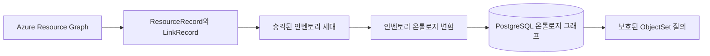
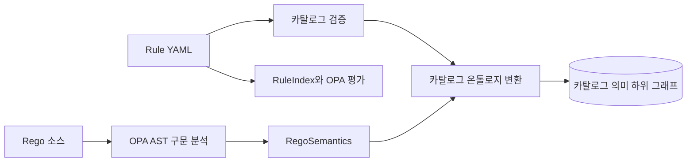
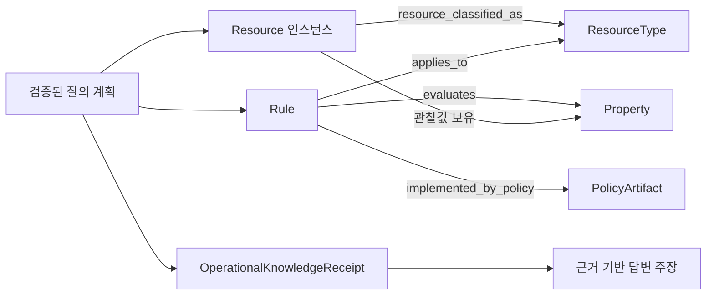
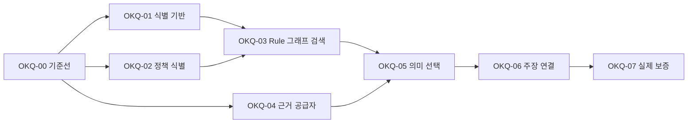

# 운영 지식 질의 보강 계획

이 분석은 FDAI가 Azure 리소스 상태, 온톨로지 관계, Rule과 Rego의 의미, 운영자의 자연어
질문을 하나의 근거 기반 질의 경로로 연결하는 방법을 설명합니다. 이미 구현된 기반과 통합
미비점을 구분하고, 실행 가능한 시나리오로 완료를 입증할 수 있는 단계별 계획을 정의합니다.

> **범위:** 이 문서는 구현 계획 기록이며 새로운 온톨로지 권한을 정의하지 않습니다. 선언과
> 정책은 계속 Git이 관리하고, Azure 상태는 공급자 관찰이 관리하며, PostgreSQL은 다시 만들 수
> 있는 의미 읽기 모델로 유지합니다.
>
> **안전 경계:** 검색, 그래프 탐색, 의미 계획 수립, 서술은 계속 읽기 전용입니다. Rule 검색
> 결과는 Rego 판정이 아니며, 온톨로지 답변은 승인 또는 실행 권한을 부여하지 않습니다.

## 핵심 평가

FDAI에는 필요한 기본 요소가 대부분 있지만, 현재는 하나의 운영 지식 경로가 아니라 서로
인접한 파이프라인으로 구성되어 있습니다.

- **Azure 인벤토리는 안전하게 변환됩니다:** 완전하게 승격된 인벤토리 세대가 형식이 지정된
  `Resource` 객체와 검증된 `contains`, `attached_to`, `depends_on`, `routes_to`, `peered_with`
  링크로 변환됩니다. 불완전하거나 검증되지 않은 관계는 명시적인 이유와 함께 제외됩니다.
- **Rule과 Rego 의미가 변환됩니다:** 카탈로그 시작 시 `Rule`, `PolicyArtifact`, `ResourceType`,
  `SignalType`, `Property`, `ActionType` 객체와 이들을 연결하는 형식이 지정된 링크를 만듭니다.
- **자연어에는 검증된 실행 커널이 있습니다:** 의미 턴은 정확한 release를 참조하는 질의 DAG를
  만들고, 범위가 제한된 ObjectSet과 함수 노드를 실행하며, 근거가 연결된 처리 결과를 반환할 수
  있습니다.
- **핵심 미비점은 연결입니다:** 공급자가 관찰한 `Resource`는 정규화된 형식을 속성으로
  보유하지만, 카탈로그가 관리하는 `ResourceType`과 형식이 지정된 관계를 갖지 않습니다. 따라서
  그래프가 `Resource -> ResourceType <- Rule -> PolicyArtifact` 경로를 직접 구성할 수 없습니다.
- **운영 기능 구성은 계약보다 좁습니다:** 현재 의미 런타임 구성은 현재 ObjectSet 읽기, 집합
  연산, 변환, 집계, 네트워크 경로, Pod 원격 분석 함수만 등록합니다. 과거 토폴로지, 메트릭 계열,
  인과 근거 결합, 담당 체계, Rule 검색은 이 런타임에 등록되지 않았습니다.
- **문서 상태가 실제 구현과 어긋났습니다:** Rule 의미 검색 설계는 `catalog.search_rules`가 운영에
  연결되었다고 설명하지만, 현재 소스 트리에는 해당 식별자의 선언이나 런타임 등록이 없습니다.
  `/rules/search`에는 Operator 경로 계약이 있지만, 경로 선언만으로 Core 의미 함수 또는 종단 간
  실행이 입증되지는 않습니다.
- **release 증명은 여전히 픽스처 기반입니다:** 커밋된 온톨로지 질의 역량 기록은
  `deterministic_fixture` 증적을 사용합니다. 이는 계약 동작을 입증하지만, 실제 공급자 근거를
  사용하는 Console 표시 경로를 입증하지 않습니다.

권장 전략은 PostgreSQL을 관계형 그래프 저장소로 유지하면서 형식이 지정된 연결, 정확한 인용,
공급자 연결, 증적을 완성하는 것입니다. 새 그래프 데이터베이스를 추가해도 이러한 의미 미비점은
해결되지 않으며 운영 대상만 늘어납니다.

## 현재 진실 모델

| 계층 | 권한 | 현재 표현 | 입증하는 내용 |
|------|------|-----------|---------------|
| 온톨로지 선언 | 검토된 Git | `ObjectType`, `LinkType`, `ActionType`, `FunctionType`, `Interface`, 변경할 수 없는 `OntologyRelease` | 허용된 의미와 정확한 스키마 식별자 |
| Rule과 정책 카탈로그 | 검토된 Git | Rule YAML, Rego 소스, 구문 분석된 `RegoSemantics`, 의미 매니페스트 | 작성된 적용 범위와 결정론적 정책 논리 |
| 카탈로그 의미 그래프 | 다시 만들 수 있는 변환 결과 | PostgreSQL의 카탈로그 관리 온톨로지 객체와 링크 | 질의 가능한 Rule, 정책, 속성, 신호, 형식, 작업 관계 |
| Azure 현재 상태 | 공급자 관찰 | 승격된 인벤토리 세대를 `Resource` 객체와 검증된 토폴로지 링크로 변환 | 범위가 제한된 현재 관찰 상태와 관계 근거 |
| 과거 토폴로지 | 추가 전용 공급자 근거 | 이중 시간 계약, 마이그레이션, `graph_at`, `topology_diff` 기본 요소 | 운영 읽기 장치와 게시자가 연결된 경우에만 특정 시점 재구성 |
| 의미 검색 | 다시 만들 수 있는 변환 결과 | 카탈로그 검색 세대 계약과 메모리 내 의미 인덱스 | 후보 순위이며 정책 진실은 아님 |
| 대화형 질의 | principal 범위 읽기 | 의미 문제 구조, 검증된 질의 DAG, 노드 증적, 최종 변환 결과 | 권한이 확인된 질의가 실제로 읽은 내용과 완료 여부 |
| Rego 판정 | 정확한 근거에 대한 OPA 실행 | T0 평가와 감사 | 정확한 활성 Rule 하나가 스키마가 유효한 리소스 관찰 하나와 일치했는지 여부 |

## 현재 종단 간 경로

### Azure 리소스 변환

이 변환은 보수적으로 동작합니다. 누락된 끝점, 불완전한 세대, 등록되지 않은 링크 형식, 합성
상태, 충돌하는 중복, 검증되지 않은 관계는 활성 간선이 될 수 없습니다. 이 안전 자세는 그대로
유지하는 것이 좋습니다.

### Rule과 Rego 변환

카탈로그 그래프는 현재 다음 의미 경로를 지원합니다.

- `Rule -> implemented_by_policy -> PolicyArtifact`
- `Rule -> applies_to -> ResourceType`
- `Rule -> triggered_by -> SignalType`
- `Rule -> evaluates -> Property`
- `Rule -> remediates -> ActionType`

`PolicyArtifact`는 Rego 참조, 패키지, 제목, 설명, 콘텐츠 다이제스트를 기록합니다. 정확한 판정
진입점, 구문 분석기 식별자와 버전, 소스 파일 다이제스트와 구분되는 정규화된 의미 다이제스트는
기록하지 않습니다.

### 자연어 질의

이 경로는 오래된 release, 숨겨진 속성, 사용할 수 없는 노드 종류, 잘못된 함수 인자, 일치하지
않는 역할과 목적, 검증되지 않은 실행을 올바르게 차단합니다. 하지만 현재 운영 처리기 집합으로는
온톨로지 설계가 설명하는 전체 질문 유형에 답할 수 없습니다. 과거 토폴로지, 메트릭 계열, 근거
결합 노드를 포함한 계획은 구현 및 테스트된 처리기가 `available_kinds`와 운영 실행기 등록에 없기
때문에 검증 단계에서 차단됩니다.

## 근본 미비점

| ID | 우선순위 | 미비점 | 관찰 가능한 결과 |
|----|----------|--------|------------------|
| G1 | 긴급 | 형식이 지정된 `Resource -> ResourceType` 분류 간선이 없음 | 임의 속성 결합 없이 관찰된 Azure 인스턴스에서 적용 가능한 Rule로 탐색할 수 없습니다. |
| G2 | 긴급 | 카탈로그, 인벤토리, 검색, 토폴로지, 메트릭 세대를 하나로 고정하는 증적이 없음 | 답변이 노드 증적은 인용할 수 있지만, 결합된 모든 사실이 하나의 일관된 운영 기준 시점에서 왔음을 입증할 수 없습니다. |
| G3 | 높음 | Rule 검색이 등록된 의미 질의 기능이 아님 | Rule 질문이 리소스 및 관계 질문과 동일한 검증된 DAG에 참여할 수 없습니다. |
| G4 | 높음 | Rego 인용이 패키지와 파일 다이제스트에서 끝남 | 답변이 판정을 생성하거나 설명한 정확한 OPA 판정 경로와 구문 분석 의미를 인용할 수 없습니다. |
| G5 | 높음 | 구현된 과거 토폴로지, 메트릭, 인과 처리기가 운영 의미 런타임에 등록되지 않음 | 계약, 구현, 단위 테스트는 있지만 운영 검증기와 실행기 등록에 없으므로 자연어 턴이 호출할 수 없습니다. |
| G6 | 높음 | 비즈니스 서비스, 워크로드, 담당 체계, 목표 매핑의 권한 있는 배포 변환 결과가 없음 | 리소스 영향 질문이 운영 의미에 도달하지 못하고 인프라 토폴로지에서 멈춥니다. |
| G7 | 중간 | 의미 세대와 서술자 선택이 지속 가능한 운영 구성에 연결되지 않음 | 플래너가 전체 매니페스트를 받고, 검증된 활성 세대 하나를 사용해 개념을 좁히지 않습니다. |
| G8 | 중간 | 카탈로그와 인벤토리 변환기가 별도의 수명 주기 매니페스트를 가짐 | 카탈로그 release 변경과 보존된 로컬 인스턴스 행이 호환되지 않아 오래된 변환 결과를 수동 복구해야 할 수 있습니다. |
| G9 | 중간 | 근거가 검증된 답변 주장 대신 실행 노드에 연결됨 | 최종 문장이 기계적으로 주장과 증적이 연결되지 않은 채 근거 주변에만 위치할 수 있습니다. |
| G10 | 중간 | 보증 보고서가 구현 픽스처와 오래된 실제 기준선을 따로 제시함 | 표시되는 Console 경로가 Rule, 상태, 관계, 이력, 인과 집단을 통과함을 입증하는 현재 release 게이트가 없습니다. |

## 목표 질의 기반

목표는 다음 경로를 명시적으로 실행할 수 있게 만들어야 합니다.

### 리소스 분류

`Resource`에서 `ResourceType`으로 향하는 검토된 `resource_classified_as` LinkType을 추가합니다.
인벤토리 변환기는 정규화된 공급자 관찰을 관리하므로 이 링크도 인벤토리 변환기가 관리하는 것이
좋습니다. 각 링크는 인벤토리 세대, 공급자 매핑 개정, 원본 형식, 정규화된 형식, 검증 증적,
상태 사실 메타데이터를 고정해야 합니다. 알 수 없는 공급자 형식은 명시적인
`unmapped_resource_type` 처리 결과가 있는 리소스로 남기고, 링크를 날조하지 않습니다.

이 구조는 모든 리소스에 Rule 적용 범위를 복제하지 않고 결정론적인 Rule 경로를 만듭니다. 이
경로는 정확한 인벤토리 세대와 카탈로그 release가 호환되는 동안에만 유효합니다.

### 운영 지식 증적

여러 출처를 사용하는 모든 의미 답변에 읽기 전용 `OperationalKnowledgeReceipt`를 추가합니다.
다음 항목을 고정하는 것이 좋습니다.

- 온톨로지 release 다이제스트
- 카탈로그 변환 결과 다이제스트와 개정
- 인벤토리 세대와 완전성
- 활성 의미 검색 세대
- 사용한 경우 토폴로지 `as_of`와 `known_at` 기준 시점
- 사용한 경우 메트릭 개념 레지스트리와 완전한 구간 증적
- 사용한 경우 문서 또는 담당 체계 변환 결과 개정
- principal 범위, 역할, 목적, 비식별화 요약, 질의 계획 다이제스트
- 정렬된 의존성 증적 다이제스트와 최종 증적 다이제스트

이 증적은 공급자 페이로드를 복사하지 않으며 권한을 부여하지 않습니다. 답변을 지원한 일관된
읽기 모델 집합을 입증하고 `unknown`, `stale`, `incomplete`, `unavailable` 경로를 명시합니다.

### 정확한 정책 인용

`PolicyArtifact`와 결정론적 Rule 의미 매니페스트를 다음 항목으로 확장합니다.

- `data.fdai.object_storage.blob_versioning.deny`와 같은 정규 판정 경로
- Rego 언어와 OPA 구문 분석기 버전
- 소스 콘텐츠 다이제스트와 정규화된 의미 다이제스트
- 정확한 속성 읽기와 정규화된 조건식
- Rule 버전, 온톨로지 release 다이제스트, 정책 활성화 개정
- 재배포와 출처 제약

OPA 평가 증적은 같은 식별자를 인용해야 합니다. Rule 검색은 후보 전용으로 유지하고, 평가
결과는 정확한 판정 경로와 입력 근거 다이제스트를 입증합니다.

## 작업 패키지

### OKQ-00 - 실행 현실 재측정

**목표:** 상태 설명을 기계적으로 도출한 기능 목록으로 교체합니다.

**변경:**

- 모든 `FunctionType`, 질의 노드 종류, 처리기, 공급자 연결, 경로, Console 표시 처리 결과에 대한
  매트릭스를 생성합니다.
- 각 기능을 `declared`, `implemented`, `composed`, `live_proven`, `unavailable`로 표시합니다.
- `catalog.search_rules` 운영 연결과 같은 설명을 확인하는 문서와 코드 일치 검사를 추가합니다.
- 리소스, 관계, Rule, Rego, 상태, 이력, 메트릭, 인과, 담당 체계, 모호성, 지원되지 않는 질문에
  대한 영어와 한국어 역량 집단을 고정합니다.

**완료 기준:** 제공되는 모든 선언에 실행 가능한 처리 결과가 하나씩 있으며, 이름이 지정된 테스트
또는 실제 증적 없이는 어떤 설계 문서도 `composed` 또는 `production`이라고 표시하지 않습니다.

### OKQ-01 - 리소스와 카탈로그 식별 기반 구축

**목표:** 관찰된 리소스에서 의미 형식과 적용 가능한 Rule로 탐색할 수 있게 합니다.

**변경:**

- 정확한 끝점과 근거 의미를 가진 `resource_classified_as`를 LinkType 카탈로그에 추가합니다.
- 정규화된 형식 식별자와 다이제스트를 포함하도록 검토된 Azure 리소스 형식 매핑 카탈로그를
  확장합니다.
- 정확히 검증된 매핑에 대해서만 인벤토리 관리 분류 링크를 변환합니다.
- 카탈로그 교체가 인벤토리 관리 링크를 삭제하지 않도록 변환 결과 간 소유권 테스트를 추가합니다.
- 수동 행 삭제 대신 오래된 release 다이제스트를 처리하는 마이그레이션 동작을 추가합니다.

**완료 기준:** 완전한 지원 인벤토리 세대의 모든 리소스가 정확히 하나의 검증된 분류 또는 형식이
지정된 미매핑 이유를 반환합니다. `applies_to`를 통한 탐색은 해당 정규화 형식에 대한 결정론적
`RuleIndex`와 같은 Rule 집합을 반환합니다.

### OKQ-02 - Rule과 Rego 의미를 정확하게 만들기

**목표:** 검색과 정책 설명을 결정론적으로 지원하되 두 작업을 혼동하지 않습니다.

**변경:**

- 의미 추출에 정규 Rego 판정 경로와 구문 분석기 식별자를 추가합니다.
- 판정 경로가 구문 분석된 OPA AST에 존재하며 T0가 사용하는 경로인지 검증합니다.
- 소스 다이제스트와 정규화된 의미 다이제스트를 구분합니다.
- 정확한 정책 식별자와 출처를 `PolicyArtifact`에 변환합니다.
- Rule, 정책 판정 경로, 입력 근거, 결과, OPA 아티팩트 식별자를 연결하는 평가 증적을 생성합니다.

**완료 기준:** Rule 설명은 정확한 활성 Rule과 정책 판정 경로 하나를 인용합니다. 정책 형식만
변경된 경우와 의미 조건식이 변경된 경우를 구분할 수 있습니다. 검색만으로는 통과 또는 실패
판정이 생성되지 않습니다.

### OKQ-03 - Rule 검색을 의미 DAG에 구성

**목표:** 하나의 검증된 계획이 리소스, 관계, Rule, 정책, 발견 결과를 결합하게 합니다.

**변경:**

- `catalog.search_rules`를 읽기 전용이며 정확한 release에 고정되는 `FunctionType`으로 선언하고
  등록합니다.
- 검증된 Resource에서 ResourceType을 거쳐 Rule로 탐색하는 `catalog.rules_for_resources`를
  추가합니다.
- 어휘 검색 저하와 형식이 지정된 오래됨 이유를 포함하여 활성 카탈로그 의미 세대를 연결합니다.
- 검색 증적과 함수 호출 증적을 모두 반환합니다.
- `/rules/search`를 별도 권한 경로가 아니라 같은 Core 기능을 사용하는 전달 경로로 유지합니다.

**완료 기준:** "이 스토리지 리소스에 적용되는 Rule은 무엇이며 각 Rule은 어떤 Rego 속성을
읽는가?"라는 질문이 하나의 검증된 DAG로 실행되고 정확한 Rule, `PolicyArtifact`, `Property`,
세대, 근거 식별자를 반환합니다.

### OKQ-04 - 현재, 과거, 운영 근거 공급자 완성

**목표:** 명시적인 시간 완전성을 사용해 상태와 변경 질문에 답합니다.

**변경:**

- PostgreSQL 토폴로지 이력 읽기와 인벤토리 승격 게시를 운영에 구성합니다.
- 닫힌 스키마와 목적 범위 공급자를 사용해 `topology_at`, `topology_diff`, 메트릭 계열, 근거 결합
  처리기를 등록합니다.
- 배포 구성 또는 권한 있는 시스템에서 검토된 서비스, 워크로드, 담당 체계, 목표, 리소스 매핑을
  변환합니다.
- Core 논리에 공급자별 분기를 추가하지 않고 검토된 매핑을 통해 Azure 관계 범위를 확장합니다.
- 완전한 부재와 관찰되지 않은 부재를 구분할 수 있도록 비간선 근거를 보존합니다.

**완료 기준:** 현재 상태, 변경 전후, 담당 체계, 의존성, 인과 지원 질문이 이름이 지정된 기준
시점의 완전한 근거 또는 형식이 지정된 하나의 근거 미비점을 반환합니다. 누락된 간선은 정상,
격리, 원인의 증거가 되지 않습니다.

### OKQ-05 - 범위가 제한된 의미 서술자 검색과 엔터티 확인 추가

**목표:** 제한 없는 매니페스트를 보내거나 리소스 식별자를 날조하지 않고 자연어를 정확한
온톨로지 식별자로 해석합니다.

**변경:**

- 지속 가능한 PostgreSQL 의미 세대 어댑터와 Mimir가 관리하는 예약 게시자를 추가합니다.
- 정확한 식별자, 검토된 별칭, 온톨로지 주변 관계, 어휘 순위, 벡터 순위로 범위가 제한된
  서술자를 선택한 뒤 전체 principal 매니페스트에 대해 선택한 부분집합을 검증합니다.
- 보호된 인벤토리 읽기와 principal 범위를 통해 리소스 언급을 확인합니다.
- 경쟁 후보를 보존하고 모호성이 질의 계획을 바꾸는 경우 명확화 질문 하나를 제시합니다.
- 영어와 한국어를 어려운 반례 및 일치 없음 집단과 함께 독립적으로 평가합니다.

**완료 기준:** 전체 세대와 증분 세대가 고정된 집단에서 같은 검색 결과를 생성합니다. 확인된 모든
엔터티가 보호된 질의 결과에 존재하며, 해결되지 않거나 모호한 엔터티는 그래프 실행 전에
명확화 또는 판단 보류를 생성합니다.

### OKQ-06 - 답변 주장을 근거에 연결

**목표:** 최종 답변을 단순히 링크가 딸린 문장이 아니라 기계적으로 감사할 수 있게 합니다.

**변경:**

- 주체, 조건, 객체 또는 값, 시간 범위, 확신 자세, 지원 증적 다이제스트를 가진 범위가 제한된
  `AnswerClaim` 변환 결과를 도입합니다.
- 서술 전에 주장 형식, 방향, 기준 시점, 최신성, 완전성, 모순을 검증합니다.
- 모든 사실 문장이 하나 이상의 검증된 주장에 연결되도록 합니다.
- 알 수 없음과 불완전한 근거를 영어와 한국어로 명시적으로 표현합니다.
- 재생을 위해 범위가 제한되고 비식별화된 주장과 증적 변환 결과만 저장합니다.

**완료 기준:** 모든 사실 답변 문장에 유효한 주장과 증적 연결이 하나 이상 있습니다. 모순되거나
오래되거나 잘렸거나 범위를 벗어난 근거는 처리 결과를 판단 보류 또는 한정된 답변으로 바꾸며,
서술이 이를 숨길 수 없습니다.

### OKQ-07 - 표시 경로 입증과 전환

**목표:** 구성 요소 완료가 아니라 측정된 서비스 간 근거를 바탕으로 승격합니다.

**변경:**

- 인증된 동일 Console 집단을 Operator 보낼 편지함, 이벤트 버스, Core 의미 런타임, PostgreSQL
  변환 결과, 최종 결과 토픽, Console 렌더링까지 실행합니다.
- 집단별 답변 가능성, 정확성, 명확화 정밀도, 근거 완전성, 지연 시간, 오래됨 처리, 지원되지 않는
  주장 수를 기록합니다.
- 활성화 전에 이전 세대와 새 release 세대를 shadow 비교합니다.
- 세대를 원자적으로 활성화하고 N-1 호환 롤백 대상을 유지합니다.
- 새 온톨로지 선언, 관계 매핑, Rule, 질의 함수에 역량 처리 결과가 없으면 연속 게이트가 실패하게
  합니다.

**완료 기준:** 수락한 모든 턴이 형식이 지정된 처리 결과로 종료되고, 답변한 모든 턴이 정확한
운영 지식 증적을 고정하며, 지원되지 않는 주장과 권한 없는 실행이 0이고, 각 중요 집단이 집계로
가려지지 않은 채 고정된 승격 전 임계값을 충족합니다.

## 의존성 순서와 병렬 작업 경로

- **작업 경로 A - 의미 식별:** OKQ-01과 OKQ-02는 OKQ-00 이후 병렬로 진행할 수 있습니다.
- **작업 경로 B - 시간 근거:** OKQ-04는 작업 경로 A와 병렬로 진행할 수 있습니다.
- **결합 1 - 실행 가능한 지식 그래프:** OKQ-03은 분류와 정확한 정책 식별을 결합합니다.
- **결합 2 - 전체 턴 계획:** OKQ-05는 Rule 검색과 운영 근거를 결합합니다.
- **결합 3 - release 증명:** 표시 서술이 보증에서 측정하는 동일 주장을 사용해야 하므로 OKQ-06과
  OKQ-07은 순차적으로 진행합니다.

두 개의 구현 작업 경로와 한 명의 통합 담당자를 기준으로 예상 순서는 엔지니어링 기간 8주에서
12주입니다. 이는 작업량 범위이며 제공 일정 약속이 아닙니다. 달력 날짜나 답변 비율 목표를
할당하기 전에 OKQ-00에서 측정된 기준선을 확립하는 것이 좋습니다.

## 인수 시나리오

| 시나리오 | 필요한 계획 | 필요한 근거 | 안전한 불완전 결과 |
|----------|-------------|-------------|---------------------|
| 이 스토리지 계정에 어떤 Rule이 적용되는가? | 리소스 선택 -> 분류 -> 역방향 `applies_to` -> Rule | 인벤토리 세대, 매핑 다이제스트, 카탈로그 release | 미매핑 리소스 형식 또는 오래된 카탈로그 판단 보류 |
| 암호화를 확인하는 Rego 논리는 무엇인가? | Rule -> `implemented_by_policy` -> Property -> 정확한 판정 경로 | Rule 버전, 정책과 의미 다이제스트, 구문 분석기 식별자 | 판정 없는 후보 목록 |
| 이 데이터베이스에 무엇이 의존하는가? | 보호된 루트 -> 역방향 형식 의존성 탐색 | 완전한 관계 세대와 간선 증적 | 부분 의존성 그래프이며 부재 주장은 없음 |
| 이 리소스들의 현재 상태는 무엇인가? | 보호된 ObjectSet -> 변환된 상태와 메타데이터 | 공급자 출처, 관찰 시간, 최신성, 완전성 | 리소스별 알 수 없음 또는 오래됨 |
| 09:00 UTC 이후 무엇이 바뀌었는가? | 변경 전후 `topology_at` -> `topology_diff` | 보존된 세대, `as_of`, `known_at`, 삭제 표식 | 과거 근거 사용 불가 |
| 피어링 변경이 쓰기를 중단시켰는가? | 토폴로지 차이 + 정렬된 메트릭 구간 + 근거 결합 | 완전한 구간, 변경 지점, 경쟁 설명 | 상관관계만 제시하거나 판단 보류하며 인과 날조 금지 |
| 영향받는 서비스를 누가 담당하는가? | Resource -> workload -> service -> ownership | 권한 있는 매핑과 담당 체계 개정 | 담당 체계 사용 불가이며 담당자 추론 금지 |
| 실패한 Rule을 수정해라 | 읽기 계획 + 초안 전용 ActionType 전달 | 모든 읽기 증적과 별도 작업 초안 다이제스트 | 초안 또는 승인 경로만 사용하며 직접 실행 금지 |

## release 측정값

| 측정값 | release 기대치 |
|--------|----------------|
| 구조 선언 처리 결과 | 100% 표현되거나 형식이 지정된 사용 불가 |
| 지원 리소스 분류 집계 | 100% 분류되거나 명시적으로 미매핑 |
| 관계 완전성 집계 | 제외되거나 부재한 후보의 100%가 형식이 지정된 이유를 가짐 |
| 정확한 Rule과 Rego 인용 | 답변한 정책 질문의 100% |
| 주장과 근거 연결 범위 | 사실 답변 주장의 100% |
| 최종 턴 처리 결과 | 수락한 의미 턴의 100% |
| 지원되지 않는 운영 주장 | 0 |
| 질의 경로의 권한 없는 실행 | 0 |
| 범위를 벗어나거나 오래된 증적 수락 | 0 |
| 답변 품질과 지연 시간 | 고정된 집단별 보고, OKQ-00 기준선에서 승격 임계값 설정 |

## 명시적 비목표

- 측정된 PostgreSQL 탐색 한계가 필요성을 입증하기 전에는 Neo4j, AGE 또는 다른 그래프
  데이터베이스를 추가하지 않습니다.
- 각 `Resource` 인스턴스에 Rule 적용 범위를 복제하지 않습니다.
- 이름, IP 접두사, DNS 접미사, 누락된 데이터에서 Azure 링크를 추론하지 않습니다.
- 벡터 유사도 또는 모델 확신을 정책 판정으로 취급하지 않습니다.
- Operator Service가 Core 구현을 가져오거나 이벤트 버스 의미 턴을 우회하지 않게 합니다.
- 문구별 경로나 고정 답변 템플릿으로 질의 범위를 보완하지 않습니다.
- 온톨로지 데이터가 승인, 승격, 변경, 실행 권한을 부여하지 않게 합니다.

## 첫 번째 구현 범위

가장 작게 가설을 판별할 수 있는 범위는 OKQ-00과 OKQ-01 및 OKQ-03의 읽기 전용 부분입니다.

1. `resource_classified_as` 선언과 검증된 인벤토리 변환을 추가합니다.
2. 보호된 그래프 결과를 사용하는 정확한 release의 읽기 전용 함수로
   `catalog.rules_for_resources`를 추가합니다.
3. 운영 의미 런타임에 등록합니다.
4. 인증된 질문부터 정확한 Resource, ResourceType, Rule, PolicyArtifact, Property, 최종 근거
   증적까지 이어지는 서비스 간 시나리오 하나를 추가합니다.
5. 이 범위에서는 과거, 메트릭, 담당 체계, 작업 동작을 계속 사용할 수 없게 유지합니다.

이 범위는 근본 가설을 직접 검증합니다. 임의 결합 없이 스토리지 Rule 시나리오에 답할 수 없다면
제안한 식별 기반이 충분하지 않은 것이므로 더 넓게 구현하기 전에 수정하는 것이 좋습니다.

## 관련 문서

| 주제 | 설계 소유 문서 |
|------|----------------|
| 운영 객체, 관계, 식별자, 근거 | [FDAI 운영 온톨로지](docs/roadmap/architecture/operating-ontology-ko.md) |
| 정확한 release, ObjectSet, 형식이 지정된 함수, 쓰기 권한 | [FDAI 온톨로지 안전 인프라](docs/roadmap/architecture/operating-ontology-platform-ko.md) |
| 전체 자연어 질의 프로그램 | [온톨로지 질의 범위 구현 계획](docs/roadmap/interfaces/ontology-query-coverage-implementation-plan-ko.md) |
| 실제 무작위 기준선 | [온톨로지 질의 무작위 보증](docs/roadmap/interfaces/ontology-query-randomized-assurance-ko.md) |
| Rule 검색과 의미 세대 | [Rule 의미 검색](docs/roadmap/rules-and-detection/rule-semantic-retrieval-ko.md) |
| Rule 조회 저장소 | [Rule 조회 온톨로지 저장소](docs/roadmap/architecture/rule-lookup-ontology-storage-ko.md) |
