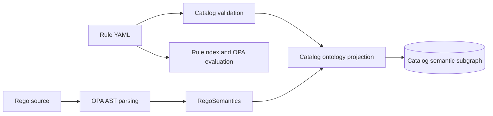
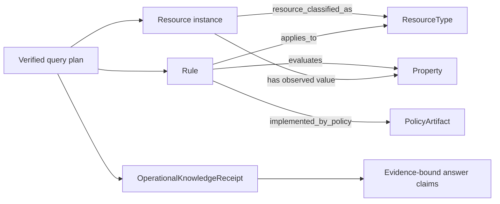
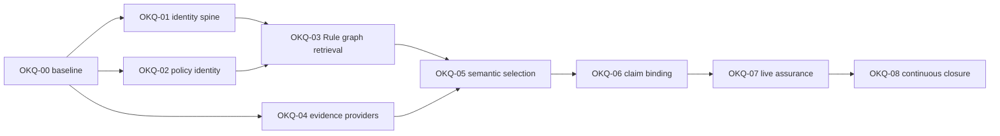

# Operational Knowledge Query Hardening Plan

This analysis explains how FDAI should connect Azure resource state, ontology relationships,
Rule and Rego meaning, and ordinary-language operator questions into one evidence-bound query
path. It distinguishes implemented foundations from integration gaps and defines a staged plan
whose completion can be proved with executable scenarios.

> **Scope:** This is an implementation planning record, not a new ontology authority. Git remains
> authoritative for declarations and policy, provider observations remain authoritative for Azure
> state, and PostgreSQL remains a rebuildable semantic read model.
>
> **Safety boundary:** Search, graph traversal, semantic planning, and narration remain read-only.
> A Rule search result is not a Rego verdict, and an ontology answer never grants approval or
> execution authority.

## What 100% accurate status means

FDAI cannot honestly promise a factual answer to every arbitrary sentence. Sources can be outside
scope, unavailable, stale, incomplete, contradictory, hidden by access control, or incapable of
proving a negative. The release target is therefore **100% epistemic closure**, not 100% forced
answers.

> **Current status:** Not achieved. G11-G18 and the contracts in this section are planned
> remediation, not current runtime guarantees. FDAI must not display or report 100% epistemic
> closure until the exact active manifest has L3 or L4 certification and a current receipt.

Epistemic closure means every accepted operational question terminates with one exact, auditable
status, and no factual claim is emitted unless its claim-specific proof obligation passes. The
contract applies to questions whose operation, concepts, principal scope, time range, and resource
bounds can be represented by the active principal-scoped query manifest. Questions outside that
universe still terminate safely as clarification, unsupported, not authorized, or cancelled.

The result carries one internal `EpistemicStatus` in addition to the existing transport disposition:

| Epistemic status | Meaning | Allowed presentation |
|------------------|---------|----------------------|
| `verified_answer` | Every factual claim passed its proof obligation at one coherent cutoff. | Answer with exact scope, cutoff, and citations. |
| `verified_empty` | A complete closed-world search proved zero matches in the authorized domain. | "No matching objects were observed" with checked scope and completeness receipt. |
| `qualified_answer` | Some claims are verified, while explicitly named lanes are partial and no universal, negative, exact-count, or causal claim depends on them. | Verified subset plus visible limitations. |
| `unknown_incomplete` | Required scope, pagination, relationship, or source coverage is incomplete. | State what was observed and what remains unknown. |
| `unknown_stale` | Required evidence exceeds the question-specific freshness policy. | State the last trusted observation and required refresh. |
| `unknown_conflict` | Authoritative or equally ranked evidence conflicts after declared precedence rules. | Show the conflict without choosing a winner. |
| `unknown_unavailable` | A required provider, projection, generation, or handler is unavailable. | Name the unavailable capability without leaking provider internals. |
| `unknown_temporal_misalignment` | Required sources cannot be aligned to one valid cutoff. | Hold the cross-source conclusion and show each available cutoff. |
| `clarification_required` | Competing interpretations would materially change the plan or answer. | Ask one bounded clarification. |
| `not_applicable` | The resolved concept or Rule does not apply to the verified subject type or period. | Explain the exact applicability mismatch. |
| `unsupported_capability` | The active release has no typed operation for the question. | State the unsupported operation and available nearby capabilities. |
| `not_authorized` | The requested scope or property is not readable by the principal. | Return the public denial shape; retain the exact internal reason only in protected audit. |
| `cancelled` | The accepted turn was cancelled before terminal proof. | Report cancellation without partial factual claims. |

`answered` transport results are allowed only for `verified_answer`, `verified_empty`, or
`qualified_answer`. A `qualified_answer` cannot weaken a proof obligation: it may expose an
independently verified subset, but it cannot say "all", "none", "exactly", "current", or "caused"
when any required lane is partial.

### Bounded question universe

One immutable `QuestionUniverseManifest` should define what the 100% claim covers. It pins the
ontology release, principal manifest, locales, operation classes, ObjectTypes, readable Properties,
LinkType query sides, Functions, Rules, quantifiers, temporal operators, result ceilings, and
supported answer shapes. Its generated coverage receipt records every supported combination or one
typed exclusion reason.

The initial operation classes should include:

- select, identify, project, filter, compare, group, count, and rank;
- existence, zero-match, universal, and explicit negation questions;
- directed and inverse relationship traversal under declared bounds;
- current state, historical state, topology difference, and aligned metric windows;
- Rule applicability, policy explanation, and exact Rego evaluation status;
- ownership, objective, impact, and causal support or refutation;
- draft-only action handoff without execution authority.

"Every question" means every semantic equivalence class generated by this manifest plus one finite,
frozen per-release cohort. The manifest defines finite partitions for Property values, a maximum
path depth and result bound, supported operator arities, and exact counts for paraphrase, ambiguity,
no-match, adversarial, and composition cases. Text strings and runtime values are not enumerated;
they are covered through declared equivalence partitions and deterministic boundary generators.
The denominator and grammar digest are immutable for one release. It never means unconstrained
world knowledge, an unbounded tenant scan, a hidden scope, or a capability absent from the active
release.

### Question understanding receipt

Before planning, produce a candidate-only `QuestionUnderstandingReceipt` that binds:

- normalized utterance digest, locale, conversation-turn references, and active release;
- every resolved subject, predicate, property, relationship side, quantifier, negation, comparison,
  temporal expression, requested scope, and answer shape;
- source text spans and the exact catalog, reviewed alias, or operator-confirmation evidence used
  for each resolution;
- unresolved terms, competing interpretations, and the material plan differences between them;
- principal scope digest, requested versus authorized scope, and redaction posture;
- semantic-atom count, resolved-atom count, and the final verified plan digest.

Every content-bearing source span must be classified as an exact identifier, promoted language
surface, confirmed interpretation, non-operative modifier, or unresolved span. The receipt cannot
self-declare completeness from only the atoms it proposed. Planning proceeds only when source-span
coverage and semantic-atom coverage are both 100%, every material interpretation has been resolved,
and the selected descriptors are an exact subset of the full principal manifest. Model, lexical,
and vector outputs remain candidates. A model-only mapping is not a promoted language surface and
requires operator confirmation when it can change the plan. Agreement between models is not proof
of intent; an unresolved material difference requires clarification.

### Claim proof obligations

Each `AnswerClaim` declares a claim kind. A deterministic verifier applies the matching proof rule:

| Claim kind | Required proof before narration |
|------------|---------------------------------|
| Positive existence | Exact subject identity plus at least one fresh authoritative observation. |
| Property value or state | Reviewed Property semantics, authoritative lane, canonical value, freshness, and subject revision. |
| Relationship or path | Every directed edge, endpoint type, cutoff, verification receipt, and bounded traversal closure. |
| Empty or negative | Complete authorized domain, exhausted pagination, no truncation, no hidden-scope ambiguity, and explicit non-edge or complete-snapshot evidence. |
| Universal `all` or `none` | Closed population definition, complete enumeration, predicate result for every member, and zero unresolved members. |
| Exact count or aggregate | Complete input domain, canonical grouping and units, no truncation, and deterministic aggregation receipt. |
| `current` or `latest` | Trusted clock, source-specific freshness policy, newest complete generation, and no later unprocessed watermark. |
| Historical or changed | Retained `as_of` and `known_at` evidence, tombstones, complete intervals, and no unsupported history gap. |
| Causal support or refutation | Temporal order, aligned complete windows, mechanism evidence, falsifiers, competing explanations, and no claim stronger than the evidence. |
| Rule applicability | Verified Resource classification, exact active Rule, `applies_to` path, assignment, exemption, and override state. |
| Rego verdict | Exact decision path, OPA artifact and parser identity, normalized semantic digest, input evidence digest, and evaluation receipt. |
| Ownership or authority | Authoritative ownership source, effective interval, principal-visible scope, and conflict-free current revision. |

The verifier rejects any claim kind that has no registered proof rule. Each principal-visible
factual sentence is rendered from one typed `NarrationSentence` whose subject, predicate, value,
scope, time, certainty, and claim id are copied from exactly one verified `AnswerClaim`. A
claim-kind localization catalog may change word order and grammar only. It cannot add examples,
modal language, implications, causes, scope unions, or explanatory predicates. Multiple claims use
separate sentences, and adjacency never implies causation. A byte-final sentence-to-claim receipt
is validated before emission. This structured claim renderer is not a phrase-specific fixed answer;
it is the enforcement surface that prevents free-form narration from adding facts.

### Universal and negative closure

A `ClosedPopulationReceipt` is mandatory for empty, negative, universal, exact-count, aggregate,
superlative, and exhaustive-list claims. It defines the ObjectType or Interface, requested and
authorized scope, principal, source, generation, `as_of`, `known_at`, source watermark, pagination
exhaustion, traversal depth, candidate and result limits, truncation, redaction posture, and exact
ordered population digest.

Every population member must have either a predicate-evaluation receipt or a mechanical exclusion
reason that makes the member outside the claim domain. Stale, hidden, conflicting, unreadable, or
unobserved members are not exclusions and prevent closure. The receipt is bound to the exact
snapshot and principal and cannot be reused after either changes.

If closure fails, the system cannot emit `verified_empty`, a universal or negative claim, an exact
count, or a superlative. It may emit a `qualified_answer` containing only independently verified
positive members and an explicit lower bound, followed by the exact `unknown_*` status for the
unclosed remainder.

### ACL and redaction contract

Access control is applied before question-domain completeness is assessed. Principal-visible
claims refer only to the explicitly named authorized domain. A global or tenant-wide claim requires
a principal whose authorized scope is itself proven complete for that domain.

- Public responses never say that a named hidden object or edge exists, was redacted, or changed the
  result. They return the same bounded denial shape for nonexistent and non-visible identities.
- The protected audit record retains the exact requested identity, denial reason, hidden-effect
  flag, and policy receipt. Those fields never enter model or narration context for that principal.
- Absence claims name the authorized scope they cover. The answer never implies that an authorized
  visible domain equals the tenant-wide domain.
- Non-edge versus unobserved-edge distinctions remain visible only when the principal is authorized
  for the complete relationship domain. Otherwise the public result is `not_authorized` or
  `unknown_incomplete` without an existence signal.

### Completeness and conflict ledger

Add a `KnowledgeCompletenessLedger` to the operational knowledge receipt. Every registered source
lane appears exactly once, either with a receipt or with a typed `not_required`, `not_queried`,
`partial`, `stale`, `conflict`, or `unavailable` marker. Queried lanes record source identity,
authority class, requested and authorized scope digests, generation, `as_of`, `known_at`, watermark,
pagination exhaustion, observed count, truncation, dropped-reason counts, redaction effect,
freshness result, and conflicts.

A proof rule declares its required lanes. Dependency, topology, change, historical, metric, or
causal claims require their corresponding cutoffs and cannot accept `not_queried`. If a required
lane was not queried, the claim fails as `unknown_unavailable`; omission of a lane from the receipt
is a contract error.

Completeness is claim-relative. A complete resource inventory does not prove complete metrics,
history, ownership, or relationships. A query that crosses sources requires a snapshot barrier or
an explicit compatibility proof between cutoffs. If no coherent cutoff exists, the result is
`unknown_temporal_misalignment` rather than a best-effort join.

Conflicts are resolved only by a reviewed authority and freshness precedence rule. An unresolved
tie remains `unknown_conflict`; last write wins, model preference, and highest retrieval score are
not conflict-resolution rules. Redaction also affects proof: an unprivileged caller may receive a
complete answer only over the explicitly authorized visible domain. The system must not imply that
the visible domain equals the tenant-wide domain or disclose whether hidden objects exist.

## Executive assessment

FDAI already has most of the required primitives, but they currently form adjacent pipelines rather
than one operational knowledge path.

- **Azure inventory is projected safely:** complete promoted inventory generations become typed
  `Resource` objects and verified `contains`, `attached_to`, `depends_on`, `routes_to`, and
  `peered_with` links. Incomplete or unverified relationships are dropped with explicit reasons.
- **Rule and Rego meaning is projected:** catalog startup creates `Rule`, `PolicyArtifact`,
  `ResourceType`, `SignalType`, `Property`, and `ActionType` objects plus typed links between them.
- **Ordinary language has a verified execution kernel:** semantic turns can produce an exact-release
  query DAG, execute bounded ObjectSet and function nodes, and return evidence-bound dispositions.
- **The missing piece is the join:** a provider-observed `Resource` carries its normalized type as a
  property, but has no typed relationship to the catalog-owned `ResourceType`. Therefore the graph
  cannot directly compose `Resource -> ResourceType <- Rule -> PolicyArtifact`.
- **Production capability composition is narrower than the contracts:** current semantic runtime
  composition registers current ObjectSet reads, set algebra, projection, aggregation, network-path,
  and Pod-telemetry functions. Historical topology, metric series, causal evidence joins, ownership,
  and Rule search are not registered in that runtime.
- **Documentation status has drifted:** the Rule semantic retrieval design says
  `catalog.search_rules` is production-bound, but no declaration or runtime registration with that
  identifier exists in the current source tree. `/rules/search` has an Operator route contract, but
  that route alone is not evidence of a Core semantic function or end-to-end execution.
- **Release proof is still fixture-based:** the committed ontology query competency record uses
  `deterministic_fixture` receipts. It proves contract behavior, not the visible Console path over
  live provider-backed evidence.

The recommended strategy is to keep PostgreSQL as the relational graph store and close the typed
joins, exact citations, provider bindings, and receipts. A new graph database would add an
operational surface without repairing any of these semantic gaps.

## Current truth model

| Layer | Authority | Current representation | What it proves |
|-------|-----------|------------------------|----------------|
| Ontology declarations | Reviewed Git | `ObjectType`, `LinkType`, `ActionType`, `FunctionType`, `Interface`, immutable `OntologyRelease` | Allowed meaning and exact schema identity |
| Rule and policy catalog | Reviewed Git | Rule YAML, Rego source, parsed `RegoSemantics`, semantic manifests | Authored applicability and deterministic policy logic |
| Catalog semantic graph | Rebuildable projection | Catalog-owned ontology objects and links in PostgreSQL | Queryable Rule, policy, property, signal, type, and action relationships |
| Azure current state | Provider observation | Promoted inventory generation projected as `Resource` objects and verified topology links | Bounded current observed state and relationship evidence |
| Historical topology | Append-only provider evidence | Bitemporal contracts, migrations, `graph_at`, and `topology_diff` primitives | Point-in-time reconstruction only when the production reader and publisher are bound |
| Semantic retrieval | Rebuildable projection | Catalog search generation contracts and an in-memory semantic index | Candidate ranking, never policy truth |
| Conversational query | Principal-scoped read | Semantic frame, verified query DAG, node receipts, terminal projection | What the authorized query actually read and whether it completed |
| Rego decision | OPA over exact evidence | T0 evaluation and audit | Whether one exact active Rule matched one schema-valid resource observation |

## Current end-to-end paths

### Azure resource projection

The projection is conservative. A missing endpoint, incomplete generation, unregistered link type,
synthetic state, conflicting duplicate, or unverified relationship cannot become an active edge.
This is the right safety posture and should remain unchanged.

### Rule and Rego projection

The catalog graph currently supports these semantic paths:

- `Rule -> implemented_by_policy -> PolicyArtifact`
- `Rule -> applies_to -> ResourceType`
- `Rule -> triggered_by -> SignalType`
- `Rule -> evaluates -> Property`
- `Rule -> remediates -> ActionType`

The `PolicyArtifact` records the Rego reference, package, title, description, and content digest.
It does not record an exact decision entrypoint, parser identity, parser version, or a normalized
semantic digest distinct from the source-file digest.

### Ordinary-language query

This path correctly rejects stale releases, hidden properties, unavailable node kinds, invalid
function arguments, mismatched roles and purposes, and unverified execution. Its current production
handler set cannot yet answer the full question classes described by the ontology design. Plans
that contain historical topology, metric-series, or evidence-join nodes are rejected during
verification because those implemented and tested handlers are absent from `available_kinds` and
the production executor registration.

## Root gaps

| ID | Priority | Gap | Observable consequence |
|----|----------|-----|------------------------|
| G1 | Critical | No typed `Resource -> ResourceType` classification edge | A query cannot traverse from an observed Azure instance to applicable Rules without an ad hoc property join. |
| G2 | Critical | No one receipt pins catalog, inventory, search, topology, and metric generations | An answer can cite node receipts but cannot prove that all joined facts came from one coherent operational cutoff. |
| G3 | High | Rule search is not a registered semantic query capability | Rule questions cannot participate in the same verified DAG as resource and relationship questions. |
| G4 | High | Rego citation stops at package and file digest | An answer cannot cite the exact OPA decision path and parser semantics that produced or explain a verdict. |
| G5 | High | Implemented historical topology, metric, and causal handlers are not registered in the production semantic runtime | Their contracts, implementations, and unit tests exist, but they are absent from the production verifier and executor registration, so ordinary-language turns cannot invoke them. |
| G6 | High | Business service, workload, ownership, and objective mappings lack an authoritative deployment projection | Resource impact questions stop at infrastructure topology instead of reaching operational meaning. |
| G7 | Medium | Semantic generation and descriptor selection are not durably production-bound | The planner receives the complete manifest and does not use one validated active generation to narrow concepts. |
| G8 | Medium | Catalog and inventory projectors have separate lifecycle manifests | Catalog release changes and retained local instance rows can become incompatible, requiring manual stale-projection recovery. |
| G9 | Medium | Evidence is attached to execution nodes, not verified answer claims | A final sentence can be evidence-adjacent without a mechanical claim-to-receipt mapping. |
| G10 | Medium | Assurance reports implementation fixtures and an outdated live baseline separately | There is no current release gate proving the visible Console path across Rule, state, relationship, history, and causal cohorts. |
| G11 | Critical | No bounded `QuestionUniverseManifest` defines the denominator for "all questions" | A 100% claim can be made over an arbitrary hand-authored cohort while declarations, quantifiers, or compositions remain untested. |
| G12 | Critical | No question-understanding receipt proves every semantic atom reached the plan | A well-grounded answer can still answer the wrong interpretation of the operator's question. |
| G13 | Critical | Claim kinds have no deterministic proof-obligation registry | A citation can support a nearby fact without proving a negative, universal, exact count, current state, or causal statement. |
| G14 | Critical | No claim-relative completeness ledger exists across source lanes | Empty and aggregate answers can be emitted from truncated, hidden, stale, or partially paged domains. |
| G15 | High | Conflict and temporal-misalignment states are not first-class answer outcomes | Runtime may choose one source or join incompatible cutoffs without exposing uncertainty. |
| G16 | High | RBAC and redaction do not formally constrain closed-world claims | "No resources" can accidentally mean "no resources visible to this principal" and leak or misstate tenant-wide status. |
| G17 | High | Negation, quantifier, aggregate, and superlative questions lack explicit closure rules | The hardest operational questions have weaker guarantees than positive object lookup. |
| G18 | High | Assurance cohorts are curated instead of release-generated | A new declaration or relationship can enter production without automatically creating positive, negative, mutation, and bilingual tests. |

## Target query spine

The target should make this path explicit and executable:

### Resource classification

Add a reviewed `resource_classified_as` LinkType from `Resource` to `ResourceType`. The inventory
projector should own these links because it owns normalized provider observations. Each link should
pin the inventory generation, provider mapping revision, source type, normalized type, verification
receipt, and state-fact metadata. Unknown provider types remain resources with an explicit
`unmapped_resource_type` disposition and no fabricated link.

This creates a deterministic Rule path without duplicating Rule applicability on every resource.
The path remains valid only while the exact inventory generation and catalog release are compatible.

### Operational knowledge receipt

Introduce a read-only `OperationalKnowledgeReceipt` carried by every multi-source semantic answer.
It should pin:

- ontology release digest;
- catalog projection digest and revision;
- inventory generation and completeness;
- active semantic search generation;
- topology `as_of` and `known_at` cutoffs or an explicit `topology_not_required` marker;
- metric concept registry and complete window receipts when used;
- document or ownership projection revisions when used;
- principal scope, role, purpose, redaction summary, and query-plan digest;
- ordered dependency receipt digests and one final receipt digest.
- question-universe and question-understanding receipt digests;
- completeness-ledger digest and the terminal epistemic status;
- ordered AnswerClaim digests and their proof-obligation receipts.

The receipt does not copy provider payloads and grants no authority. It proves which coherent set of
read models supported the answer and exposes explicit `unknown`, `stale`, `incomplete`, and
`unavailable` lanes.

### Exact policy citation

Extend `PolicyArtifact` and the deterministic Rule semantic manifest with:

- canonical decision path, for example `data.fdai.object_storage.blob_versioning.deny`;
- Rego language and OPA parser version;
- source content digest and normalized semantic digest;
- exact property reads and normalized predicates;
- Rule version, ontology release digest, and policy activation revision;
- redistribution and provenance constraints.

OPA evaluation receipts should cite the same identity. Rule retrieval remains candidate-only, while
an evaluation result proves the exact decision path and input-evidence digest.

## Work packages

### OKQ-00 - Re-baseline executable reality

**Objective:** Replace status prose with a machine-derived capability inventory.

**Changes:**

- Generate a matrix for every `FunctionType`, query node kind, handler, provider binding, route, and
  visible Console disposition.
- Mark each capability as `declared`, `implemented`, `composed`, `live_proven`, or `unavailable`.
- Add a docs-code parity check for claims such as `catalog.search_rules` production binding.
- Freeze bilingual competency cohorts for resource, relation, Rule, Rego, state, history, metric,
  causal, ownership, ambiguity, and unsupported questions.
- Build `QuestionUniverseManifest` and generate a deterministic test grammar from every readable
  declaration, Property semantic, LinkType side and cardinality, Function schema, Rule/Rego path,
  quantifier, aggregate, temporal operator, role, purpose, and locale.
- Generate positive, zero-match, negative, universal, conflict, stale, truncated, partial-source,
  unauthorized, cross-version, multi-hop, and action-boundary cases with mechanical oracles.
- Freeze the exact finite denominator, equivalence partitions, path and result bounds, and curated
  cohort counts in the release manifest before implementation testing starts.

**Exit criteria:** Every shipped declaration and supported composition has one generated executable
disposition or typed exclusion reason. The grammar coverage receipt is complete, every oracle is
mechanical rather than prose-scored, and no design document claims `composed` or `production`
without a named test or live receipt.

### OKQ-01 - Build the resource-to-catalog identity spine

**Objective:** Make observed resources traversable to their semantic types and applicable Rules.

**Changes:**

- Add `resource_classified_as` to the LinkType catalog with exact endpoint and evidence semantics.
- Extend the reviewed Azure resource-type mapping catalog with normalized type identity and digest.
- Project inventory-owned classification links only for exact verified mappings.
- Add cross-projection ownership tests so catalog replacement cannot delete inventory-owned links.
- Add migration behavior for stale release digests instead of requiring manual row deletion.
- Emit classification population completeness, mapping coverage, unrecognized-type counts, and
  pagination/source watermarks into the completeness ledger.

**Exit criteria:** For every resource in a complete supported inventory generation, the graph returns
exactly one verified classification or one typed unmapped reason. Traversing through `applies_to`
returns the same Rule set as the deterministic `RuleIndex` for that normalized type.

### OKQ-02 - Make Rule and Rego semantics exact

**Objective:** Support deterministic discovery and exact policy explanation without conflating them.

**Changes:**

- Add canonical Rego decision paths and parser identity to semantic extraction.
- Validate that the decision path exists in the parsed OPA AST and is the path used by T0.
- Separate source digest from normalized semantic digest.
- Project exact policy identity and provenance into `PolicyArtifact`.
- Emit an evaluation receipt that binds Rule, policy decision path, input evidence, result, and OPA
  artifact identity.
- Generate mutation cases for every normalized predicate and prove that semantic changes alter the
  semantic digest while formatting-only changes do not.

**Exit criteria:** A Rule explanation cites one exact active Rule and policy decision path. A policy
format-only change can be distinguished from a semantic predicate change. Retrieval alone never
produces a pass or fail verdict.

### OKQ-03 - Compose Rule retrieval into the semantic DAG

**Objective:** Let one verified plan join resources, relationships, Rules, policies, and findings.

**Changes:**

- Declare and register `catalog.search_rules` as a read-only exact-release `FunctionType`.
- Add `catalog.rules_for_resources` for verified Resource-to-ResourceType-to-Rule traversal.
- Bind the active catalog semantic generation with lexical degradation and typed stale reasons.
- Return both retrieval and function-invocation receipts.
- Keep `/rules/search` as a relay over the same Core capability instead of a separate authority path.
- Prove `verified_empty`, universal applicability, exact counts, assignments, exemptions, and
  overrides against a complete catalog domain before narration.

**Exit criteria:** "Which Rules apply to this storage resource, and which Rego property does each
read?" executes as one verified DAG and returns exact Rule, `PolicyArtifact`, `Property`, generation,
and evidence identities.

### OKQ-04 - Complete current, historical, and operational evidence providers

**Objective:** Answer state and change questions with explicit temporal completeness.

**Changes:**

- Compose PostgreSQL topology history reading and inventory-promotion publishing.
- Register `topology_at`, `topology_diff`, metric-series, and evidence-join handlers with closed
  schemas and purpose-scoped providers.
- Project reviewed service, workload, ownership, objective, and resource mappings from deployment
  configuration or authoritative systems.
- Expand Azure relationship coverage through reviewed mappings, not provider-specific branches in
  core logic.
- Preserve non-edge evidence so complete absence and unobserved absence remain distinguishable.
- Add a source-lane completeness ledger and coherent-cutoff barrier across inventory, topology,
  metrics, ownership, documents, and catalog projections.
- Preserve conflicting values and incompatible cutoffs as typed states instead of resolving them by
  arrival order.

**Exit criteria:** Current-state, before-and-after, ownership, dependency, and causal-support
questions either return complete evidence at named cutoffs or one typed evidence gap. Missing edges
never become proof of health, isolation, or cause.

### OKQ-05 - Add bounded semantic descriptor retrieval and entity resolution

**Objective:** Resolve ordinary language to exact ontology identities without sending an unbounded
manifest or inventing resource identity.

**Changes:**

- Add a durable PostgreSQL semantic generation adapter and scheduled Mimir-owned publisher.
- Select bounded descriptors by exact identity, reviewed aliases, ontology neighborhood, lexical
  rank, and vector rank, then verify the selected subset against the full principal manifest.
- Resolve resource mentions through secured inventory reads and principal scope.
- Preserve competing candidates and ask one clarification when ambiguity changes the query plan.
- Evaluate English and Korean independently with hard negatives and no-match cohorts.
- Produce and verify `QuestionUnderstandingReceipt`, including quantifiers, negation, time, scope,
  answer shape, semantic-atom closure, and material competing interpretations.

**Exit criteria:** Full and incremental generations produce identical retrieval results for the
frozen cohort. Every resolved entity exists in the secured query result, and every unresolved or
ambiguous entity produces clarification or hold before graph execution.

### OKQ-06 - Bind answer claims to evidence

**Objective:** Make the final answer mechanically auditable, not merely accompanied by links.

**Changes:**

- Introduce a bounded `AnswerClaim` projection with subject, predicate, object or value, temporal
  scope, confidence posture, and supporting receipt digests.
- Validate claim type, direction, cutoff, freshness, completeness, and contradiction before
  narration.
- Require each factual sentence to map to one or more verified claims.
- Render unknown and incomplete evidence explicitly in English and Korean.
- Persist only bounded, redacted claim and receipt projections for replay.
- Register proof obligations for every claim kind and reject unregistered claim kinds.
- Restrict `qualified_answer` so partial lanes cannot support negative, universal, exact-count,
  current, superlative, or causal claims.

**Exit criteria:** Every factual answer sentence has at least one valid claim-to-receipt mapping.
Contradictory, stale, truncated, or cross-scope evidence changes the disposition to hold or a
qualified answer and cannot be hidden by narration.

### OKQ-07 - Prove the visible path and cut over

**Objective:** Promote by measured cross-service evidence rather than component completion.

**Changes:**

- Run the same authenticated Console cohort through Operator outbox, event bus, Core semantic
  runtime, PostgreSQL projections, terminal result topic, and Console rendering.
- Record per-cohort answerability, correctness, clarification precision, evidence completeness,
  latency, stale handling, and unsupported-claim counts.
- Shadow compare old and new release generations before activation.
- Activate generations atomically and retain an N-1 compatible rollback target.
- Make the continuous gate fail when a new ontology declaration, relationship mapping, Rule, or
  query function lacks a competency disposition.
- Run independent seeded-oracle and live-read cohorts. Human or model judges may assess usefulness,
  but they cannot override mechanical intent, scope, evidence, completeness, or claim gates.

**Exit criteria:** All accepted turns terminate with a typed disposition; every answered turn pins
the exact operational knowledge receipt; unsupported claims and unauthorized execution are zero;
and each critical cohort meets its frozen pre-promotion threshold without aggregate masking.

### OKQ-08 - Enforce continuous epistemic closure

**Objective:** Keep the 100% status guarantee true as ontology releases, providers, Rules, and
language surfaces change.

**Changes:**

- Generate the complete question grammar and oracle corpus for every candidate ontology release.
- Run property-based tests over Property bounds, LinkType cardinality and direction, Function
  schemas, temporal cutoffs, pagination, freshness, and RBAC projection.
- Run metamorphic tests for equivalent set algebra, reversible query sides, normalized values,
  equivalent English/Korean questions, and full versus incremental generations.
- Run mutation tests that alter identifiers, directions, quantifiers, negation, cutoffs, role,
  release digest, evidence digest, and Rego predicates. Every unsafe mutant must be detected.
- Define each mutation in a separately reviewed `MutationOracle` before execution. The oracle pins
  the base artifact, mutation operator, expected valid disposition set, forbidden dispositions, and
  required receipt differences. Detection means the observed result matches that pre-authorized
  oracle, never that the implementation reports its own mutation as unsafe.
- Run compositional tests across Resource, ResourceType, Rule, PolicyArtifact, Property, ownership,
  topology, metric, and causal paths under explicit hop and result bounds.
- Maintain an append-only unresolved-question ledger grouped by missing concept, unsupported
  function, provider gap, ambiguity, stale evidence, conflict, redaction, and planner defect.
- Block activation when a candidate release has an unaccounted grammar case, stale oracle, semantic
  divergence between locales, ungrounded claim, hidden-scope leak, or undetected mutation.
- Certify releases in levels: L0 declared, L1 deterministic synthetic proof, L2 cross-service proof,
  L3 authenticated provider-backed proof, and L4 continuous production proof. Product surfaces may
  advertise 100% epistemic closure only at L3 or L4 for the exact certified manifest.
- Define L4 as two required independent streams. A frozen provider-backed cohort runs mechanically
  checkable questions against current authorized instances and treats resource churn as a new
  generation requiring a refreshed oracle. In parallel, real Console turns run through a candidate
  shadow path whose output is not shown to users. Every shadow `verified_*` result passes mechanical
  intent, claim, completeness, and receipt gates; human or model review may assess only usefulness
  and `unknown_*` classification quality. Failure demotes the manifest to L3 or lower and records
  the exact reason.
- Block activation at the semantic-generation pointer, not only at merge or deployment. Any
  unaccounted grammar case, stale oracle, mechanical failure, locale divergence, hidden-scope leak,
  or unsafe mutation leaves the prior generation active. An emergency waiver requires two distinct
  authorized humans, records the waived criteria and expiry, exposes the affected capability as
  unavailable, and cannot advertise L3 or L4.
- Define N-1 compatibility as additive wire/schema compatibility, separately versioned provider and
  truth-model bindings, successful replay of the N-1 frozen cohort, and a tested atomic pointer
  rollback. New optional declarations may be absent in N-1 and must return typed unavailable rather
  than reinterpret an old record.

**Exit criteria:** The candidate release has 100% generated-case disposition, semantic-atom closure,
claim proof, and completeness accounting; zero unsafe mutation survivors, hidden-scope leaks,
unsupported factual claims, and locale semantic divergences; and an exact rollback-compatible N-1
receipt.

## Dependency order and parallel lanes

- **Lane A - semantic identity:** OKQ-01 and OKQ-02 can proceed in parallel after OKQ-00.
- **Lane B - temporal evidence:** OKQ-04 can proceed in parallel with Lane A.
- **Join 1 - executable knowledge graph:** OKQ-03 joins classification and exact policy identity.
- **Join 2 - whole-turn planning:** OKQ-05 joins Rule retrieval and operational evidence.
- **Join 3 - release proof:** OKQ-06 and OKQ-07 are serial because visible narration must consume
  the same claims that assurance measures.
- **Continuous gate:** OKQ-08 regenerates and reruns the proof corpus for every subsequent release.

With two implementation lanes plus one integration owner, the expected sequence is 8 to 12
engineering weeks. This is an effort band, not a delivery commitment. OKQ-00 should establish the
measured baseline before assigning calendar dates or answer-rate targets.

## Acceptance scenarios

| Scenario | Required plan | Required evidence | Safe incomplete result |
|----------|---------------|-------------------|------------------------|
| Which Rules apply to this storage account? | Resource selection -> classification -> inverse `applies_to` -> Rule | inventory generation, mapping digest, catalog release | Unmapped resource type or stale catalog hold |
| Which Rego logic checks encryption? | Rule -> `implemented_by_policy` -> Property -> exact decision path | Rule version, policy and semantic digests, parser identity | Candidate list without verdict |
| What depends on this database? | Secured root -> inverse typed dependency traversal | complete relationship generation and edge receipts | Partial dependency graph, no absence claim |
| What is the current state of these resources? | Secured ObjectSet -> projected state and metadata | provider source, observed time, freshness, completeness | Unknown or stale per resource |
| What changed since 09:00 UTC? | `topology_at` before and after -> `topology_diff` | retained generations, `as_of`, `known_at`, tombstones | Historical evidence unavailable |
| Did the peering change stop writes? | topology diff + aligned metric windows + evidence join | complete windows, change point, competing explanations | Correlation only or hold, never unsupported causation |
| Who owns the affected service? | Resource -> workload -> service -> ownership | authoritative mapping and ownership revision | Ownership unavailable, no inferred owner |
| Fix the failing Rule | Read plan plus draft-only ActionType handoff | all read receipts and a separate action-draft digest | Draft or approval path only, no direct execution |
| Are there no unencrypted storage accounts? | Complete authorized storage population -> encryption predicate for every member | population closure, no truncation, property freshness for every member | `unknown_incomplete`, never "none" |
| Do all production workloads have an owner? | Complete production workload population -> ownership relation for every member | environment scope, population closure, current ownership revisions | Verified exceptions or unknown members listed separately |
| How many resources depend on this database? | Complete inverse dependency traversal -> distinct exact count | relationship coverage, traversal closure, no hidden-scope ambiguity | Lower bound only as `qualified_answer`, never exact count |
| What is the latest state? | Newest complete generation under trusted clock and source watermark | freshness policy, pending-generation watermark, recorded and effective time | `unknown_stale` with last trusted time |
| Source A and source B disagree. Which is correct? | Authority/freshness precedence evaluation | both facts, source classes, effective intervals, precedence receipt | `unknown_conflict` when no reviewed winner exists |
| Does this tenant have a hidden resource? | Principal-scope and redaction evaluation | authorization receipt only | Public `not_authorized` without existence disclosure |
| English and Korean equivalent questions | Independent planning and execution for each locale | identical semantic frame, plan, object set, claims, and evidence digests | Release-blocking locale divergence |

## Release measures

| Measure | Release expectation |
|---------|---------------------|
| Structural declaration disposition | 100% represented or typed unavailable |
| Generated question-universe accounting | 100% of active manifest combinations generated or typed excluded |
| Question semantic-atom closure | 100% before plan execution |
| Supported resource classification accounting | 100% classified or explicitly unmapped |
| Relationship completeness accounting | 100% of dropped or absent candidates carry a typed reason |
| Exact Rule and Rego citation | 100% of answered policy questions |
| Claim-to-evidence coverage | 100% of factual answer claims |
| Claim proof-obligation pass rate | 100% of narrated factual claims |
| Negative, universal, and exact-count closure | 100% carry complete-domain proof; otherwise no such claim is emitted |
| Source-lane completeness accounting | 100% of required lanes carry complete, partial, stale, conflict, or unavailable status |
| Terminal turn disposition | 100% of accepted semantic turns |
| Exact epistemic-status disposition | 100% of accepted semantic turns |
| Unsupported operational claims | 0 |
| Ungrounded or wrong-question factual claims | 0 |
| Unresolved conflicts hidden by narration | 0 |
| Unauthorized existence or hidden-scope leakage | 0 |
| Unsafe mutation survivors | 0 |
| English/Korean semantic-plan divergence on equivalent generated cases | 0 |
| Unauthorized execution from query path | 0 |
| Cross-scope or stale receipt acceptance | 0 |
| Answer quality and latency | Reported per frozen cohort; promotion thresholds set from OKQ-00 baseline |

## Explicit non-goals

- Do not add Neo4j, AGE, or another graph database before measured PostgreSQL traversal limits
  justify it.
- Do not duplicate Rule applicability on each Resource instance.
- Do not infer Azure links from names, IP prefixes, DNS suffixes, or missing data.
- Do not treat vector similarity or model confidence as a policy verdict.
- Do not let Operator Service import Core implementations or bypass the event-bus semantic turn.
- Do not repair query coverage with phrase-specific routes or fixed answer templates.
- Do not let ontology data grant approval, promotion, mutation, or execution authority.

## First implementation slice

The smallest discriminating slice is OKQ-00 plus the read-only portion of OKQ-01 and OKQ-03:

1. Build the first `QuestionUniverseManifest` with positive, zero-match, negative, universal,
  stale, conflict, redaction, English, and Korean storage-Rule cases.
2. Add the `resource_classified_as` declaration and verified inventory projection with population
  completeness accounting.
3. Add `catalog.rules_for_resources` as an exact-release read-only function over secured graph
   results.
4. Register it in the production semantic runtime.
5. Add `QuestionUnderstandingReceipt`, claim-kind proof, and completeness-ledger fields required by
  this bounded path.
6. Add one cross-service scenario from authenticated question to exact Resource, ResourceType, Rule,
  PolicyArtifact, Property, AnswerClaim, and final evidence receipt.
7. Keep historical, metric, ownership, and action behavior explicitly unavailable in this slice and
  prove their generated questions terminate with the correct typed status.

This slice directly tests the root hypothesis. If it cannot answer the storage Rule scenario without
an ad hoc join, the proposed identity spine is insufficient and should be revised before broader
delivery.

## Related documents

| Topic | Design owner |
|-------|--------------|
| Operating objects, relationships, identity, and evidence | [FDAI Operating Ontology](docs/roadmap/architecture/operating-ontology.md) |
| Exact releases, ObjectSets, typed functions, and write authority | [FDAI Ontology Safety Infrastructure](docs/roadmap/architecture/operating-ontology-platform.md) |
| Full ordinary-language query program | [Ontology Query Coverage Implementation Plan](docs/roadmap/interfaces/ontology-query-coverage-implementation-plan.md) |
| Live randomized baseline | [Ontology Query Randomized Assurance](docs/roadmap/interfaces/ontology-query-randomized-assurance.md) |
| Rule retrieval and semantic generations | [Rule Semantic Retrieval](docs/roadmap/rules-and-detection/rule-semantic-retrieval.md) |
| Rule lookup storage | [Rule Lookup Ontology Storage](docs/roadmap/architecture/rule-lookup-ontology-storage.md) |
