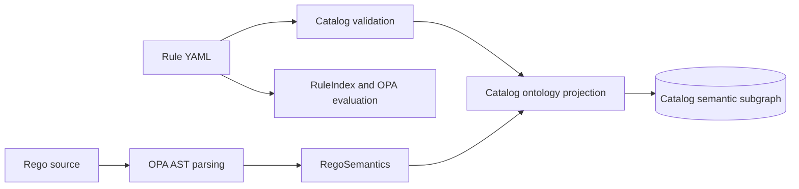
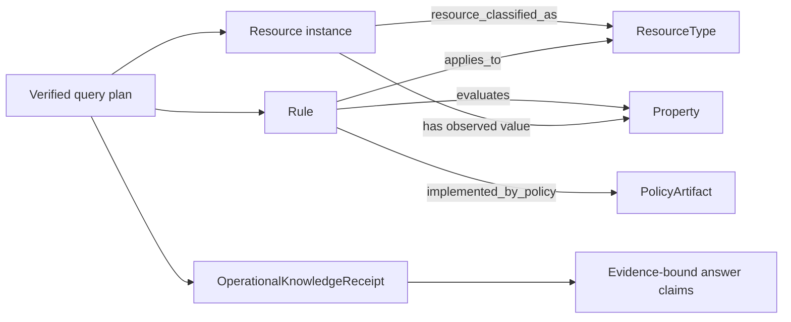
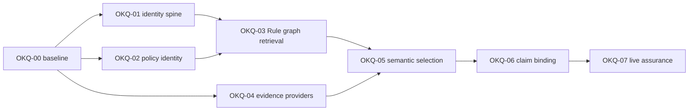

# Operational Knowledge Query Hardening Plan

This analysis explains how FDAI should connect Azure resource state, ontology relationships,
Rule and Rego meaning, and ordinary-language operator questions into one evidence-bound query
path. It distinguishes implemented foundations from integration gaps and defines a staged plan
whose completion can be proved with executable scenarios.

> **Scope:** This is an implementation planning record, not a new ontology authority. Git remains
> authoritative for declarations and policy, provider observations remain authoritative for Azure
> state, and PostgreSQL remains a rebuildable semantic read model.
>
> **Safety boundary:** Search, graph traversal, semantic planning, and narration remain read-only.
> A Rule search result is not a Rego verdict, and an ontology answer never grants approval or
> execution authority.

## Executive assessment

FDAI already has most of the required primitives, but they currently form adjacent pipelines rather
than one operational knowledge path.

- **Azure inventory is projected safely:** complete promoted inventory generations become typed
  `Resource` objects and verified `contains`, `attached_to`, `depends_on`, `routes_to`, and
  `peered_with` links. Incomplete or unverified relationships are dropped with explicit reasons.
- **Rule and Rego meaning is projected:** catalog startup creates `Rule`, `PolicyArtifact`,
  `ResourceType`, `SignalType`, `Property`, and `ActionType` objects plus typed links between them.
- **Ordinary language has a verified execution kernel:** semantic turns can produce an exact-release
  query DAG, execute bounded ObjectSet and function nodes, and return evidence-bound dispositions.
- **The missing piece is the join:** a provider-observed `Resource` carries its normalized type as a
  property, but has no typed relationship to the catalog-owned `ResourceType`. Therefore the graph
  cannot directly compose `Resource -> ResourceType <- Rule -> PolicyArtifact`.
- **Production capability composition is narrower than the contracts:** current semantic runtime
  composition registers current ObjectSet reads, set algebra, projection, aggregation, network-path,
  and Pod-telemetry functions. Historical topology, metric series, causal evidence joins, ownership,
  and Rule search are not registered in that runtime.
- **Documentation status has drifted:** the Rule semantic retrieval design says
  `catalog.search_rules` is production-bound, but no declaration or runtime registration with that
  identifier exists in the current source tree. `/rules/search` has an Operator route contract, but
  that route alone is not evidence of a Core semantic function or end-to-end execution.
- **Release proof is still fixture-based:** the committed ontology query competency record uses
  `deterministic_fixture` receipts. It proves contract behavior, not the visible Console path over
  live provider-backed evidence.

The recommended strategy is to keep PostgreSQL as the relational graph store and close the typed
joins, exact citations, provider bindings, and receipts. A new graph database would add an
operational surface without repairing any of these semantic gaps.

## Current truth model

| Layer | Authority | Current representation | What it proves |
|-------|-----------|------------------------|----------------|
| Ontology declarations | Reviewed Git | `ObjectType`, `LinkType`, `ActionType`, `FunctionType`, `Interface`, immutable `OntologyRelease` | Allowed meaning and exact schema identity |
| Rule and policy catalog | Reviewed Git | Rule YAML, Rego source, parsed `RegoSemantics`, semantic manifests | Authored applicability and deterministic policy logic |
| Catalog semantic graph | Rebuildable projection | Catalog-owned ontology objects and links in PostgreSQL | Queryable Rule, policy, property, signal, type, and action relationships |
| Azure current state | Provider observation | Promoted inventory generation projected as `Resource` objects and verified topology links | Bounded current observed state and relationship evidence |
| Historical topology | Append-only provider evidence | Bitemporal contracts, migrations, `graph_at`, and `topology_diff` primitives | Point-in-time reconstruction only when the production reader and publisher are bound |
| Semantic retrieval | Rebuildable projection | Catalog search generation contracts and an in-memory semantic index | Candidate ranking, never policy truth |
| Conversational query | Principal-scoped read | Semantic frame, verified query DAG, node receipts, terminal projection | What the authorized query actually read and whether it completed |
| Rego decision | OPA over exact evidence | T0 evaluation and audit | Whether one exact active Rule matched one schema-valid resource observation |

## Current end-to-end paths

### Azure resource projection

The projection is conservative. A missing endpoint, incomplete generation, unregistered link type,
synthetic state, conflicting duplicate, or unverified relationship cannot become an active edge.
This is the right safety posture and should remain unchanged.

### Rule and Rego projection

The catalog graph currently supports these semantic paths:

- `Rule -> implemented_by_policy -> PolicyArtifact`
- `Rule -> applies_to -> ResourceType`
- `Rule -> triggered_by -> SignalType`
- `Rule -> evaluates -> Property`
- `Rule -> remediates -> ActionType`

The `PolicyArtifact` records the Rego reference, package, title, description, and content digest.
It does not record an exact decision entrypoint, parser identity, parser version, or a normalized
semantic digest distinct from the source-file digest.

### Ordinary-language query

This path correctly rejects stale releases, hidden properties, unavailable node kinds, invalid
function arguments, mismatched roles and purposes, and unverified execution. Its current production
handler set cannot yet answer the full question classes described by the ontology design. Plans
that contain historical topology, metric-series, or evidence-join nodes are rejected during
verification because those implemented and tested handlers are absent from `available_kinds` and
the production executor registration.

## Root gaps

| ID | Priority | Gap | Observable consequence |
|----|----------|-----|------------------------|
| G1 | Critical | No typed `Resource -> ResourceType` classification edge | A query cannot traverse from an observed Azure instance to applicable Rules without an ad hoc property join. |
| G2 | Critical | No one receipt pins catalog, inventory, search, topology, and metric generations | An answer can cite node receipts but cannot prove that all joined facts came from one coherent operational cutoff. |
| G3 | High | Rule search is not a registered semantic query capability | Rule questions cannot participate in the same verified DAG as resource and relationship questions. |
| G4 | High | Rego citation stops at package and file digest | An answer cannot cite the exact OPA decision path and parser semantics that produced or explain a verdict. |
| G5 | High | Implemented historical topology, metric, and causal handlers are not registered in the production semantic runtime | Their contracts, implementations, and unit tests exist, but they are absent from the production verifier and executor registration, so ordinary-language turns cannot invoke them. |
| G6 | High | Business service, workload, ownership, and objective mappings lack an authoritative deployment projection | Resource impact questions stop at infrastructure topology instead of reaching operational meaning. |
| G7 | Medium | Semantic generation and descriptor selection are not durably production-bound | The planner receives the complete manifest and does not use one validated active generation to narrow concepts. |
| G8 | Medium | Catalog and inventory projectors have separate lifecycle manifests | Catalog release changes and retained local instance rows can become incompatible, requiring manual stale-projection recovery. |
| G9 | Medium | Evidence is attached to execution nodes, not verified answer claims | A final sentence can be evidence-adjacent without a mechanical claim-to-receipt mapping. |
| G10 | Medium | Assurance reports implementation fixtures and an outdated live baseline separately | There is no current release gate proving the visible Console path across Rule, state, relationship, history, and causal cohorts. |

## Target query spine

The target should make this path explicit and executable:

### Resource classification

Add a reviewed `resource_classified_as` LinkType from `Resource` to `ResourceType`. The inventory
projector should own these links because it owns normalized provider observations. Each link should
pin the inventory generation, provider mapping revision, source type, normalized type, verification
receipt, and state-fact metadata. Unknown provider types remain resources with an explicit
`unmapped_resource_type` disposition and no fabricated link.

This creates a deterministic Rule path without duplicating Rule applicability on every resource.
The path remains valid only while the exact inventory generation and catalog release are compatible.

### Operational knowledge receipt

Introduce a read-only `OperationalKnowledgeReceipt` carried by every multi-source semantic answer.
It should pin:

- ontology release digest;
- catalog projection digest and revision;
- inventory generation and completeness;
- active semantic search generation;
- topology `as_of` and `known_at` cutoffs when used;
- metric concept registry and complete window receipts when used;
- document or ownership projection revisions when used;
- principal scope, role, purpose, redaction summary, and query-plan digest;
- ordered dependency receipt digests and one final receipt digest.

The receipt does not copy provider payloads and grants no authority. It proves which coherent set of
read models supported the answer and exposes explicit `unknown`, `stale`, `incomplete`, and
`unavailable` lanes.

### Exact policy citation

Extend `PolicyArtifact` and the deterministic Rule semantic manifest with:

- canonical decision path, for example `data.fdai.object_storage.blob_versioning.deny`;
- Rego language and OPA parser version;
- source content digest and normalized semantic digest;
- exact property reads and normalized predicates;
- Rule version, ontology release digest, and policy activation revision;
- redistribution and provenance constraints.

OPA evaluation receipts should cite the same identity. Rule retrieval remains candidate-only, while
an evaluation result proves the exact decision path and input-evidence digest.

## Work packages

### OKQ-00 - Re-baseline executable reality

**Objective:** Replace status prose with a machine-derived capability inventory.

**Changes:**

- Generate a matrix for every `FunctionType`, query node kind, handler, provider binding, route, and
  visible Console disposition.
- Mark each capability as `declared`, `implemented`, `composed`, `live_proven`, or `unavailable`.
- Add a docs-code parity check for claims such as `catalog.search_rules` production binding.
- Freeze bilingual competency cohorts for resource, relation, Rule, Rego, state, history, metric,
  causal, ownership, ambiguity, and unsupported questions.

**Exit criteria:** Every shipped declaration has one executable disposition, and no design document
claims `composed` or `production` without a named test or live receipt.

### OKQ-01 - Build the resource-to-catalog identity spine

**Objective:** Make observed resources traversable to their semantic types and applicable Rules.

**Changes:**

- Add `resource_classified_as` to the LinkType catalog with exact endpoint and evidence semantics.
- Extend the reviewed Azure resource-type mapping catalog with normalized type identity and digest.
- Project inventory-owned classification links only for exact verified mappings.
- Add cross-projection ownership tests so catalog replacement cannot delete inventory-owned links.
- Add migration behavior for stale release digests instead of requiring manual row deletion.

**Exit criteria:** For every resource in a complete supported inventory generation, the graph returns
exactly one verified classification or one typed unmapped reason. Traversing through `applies_to`
returns the same Rule set as the deterministic `RuleIndex` for that normalized type.

### OKQ-02 - Make Rule and Rego semantics exact

**Objective:** Support deterministic discovery and exact policy explanation without conflating them.

**Changes:**

- Add canonical Rego decision paths and parser identity to semantic extraction.
- Validate that the decision path exists in the parsed OPA AST and is the path used by T0.
- Separate source digest from normalized semantic digest.
- Project exact policy identity and provenance into `PolicyArtifact`.
- Emit an evaluation receipt that binds Rule, policy decision path, input evidence, result, and OPA
  artifact identity.

**Exit criteria:** A Rule explanation cites one exact active Rule and policy decision path. A policy
format-only change can be distinguished from a semantic predicate change. Retrieval alone never
produces a pass or fail verdict.

### OKQ-03 - Compose Rule retrieval into the semantic DAG

**Objective:** Let one verified plan join resources, relationships, Rules, policies, and findings.

**Changes:**

- Declare and register `catalog.search_rules` as a read-only exact-release `FunctionType`.
- Add `catalog.rules_for_resources` for verified Resource-to-ResourceType-to-Rule traversal.
- Bind the active catalog semantic generation with lexical degradation and typed stale reasons.
- Return both retrieval and function-invocation receipts.
- Keep `/rules/search` as a relay over the same Core capability instead of a separate authority path.

**Exit criteria:** "Which Rules apply to this storage resource, and which Rego property does each
read?" executes as one verified DAG and returns exact Rule, `PolicyArtifact`, `Property`, generation,
and evidence identities.

### OKQ-04 - Complete current, historical, and operational evidence providers

**Objective:** Answer state and change questions with explicit temporal completeness.

**Changes:**

- Compose PostgreSQL topology history reading and inventory-promotion publishing.
- Register `topology_at`, `topology_diff`, metric-series, and evidence-join handlers with closed
  schemas and purpose-scoped providers.
- Project reviewed service, workload, ownership, objective, and resource mappings from deployment
  configuration or authoritative systems.
- Expand Azure relationship coverage through reviewed mappings, not provider-specific branches in
  core logic.
- Preserve non-edge evidence so complete absence and unobserved absence remain distinguishable.

**Exit criteria:** Current-state, before-and-after, ownership, dependency, and causal-support
questions either return complete evidence at named cutoffs or one typed evidence gap. Missing edges
never become proof of health, isolation, or cause.

### OKQ-05 - Add bounded semantic descriptor retrieval and entity resolution

**Objective:** Resolve ordinary language to exact ontology identities without sending an unbounded
manifest or inventing resource identity.

**Changes:**

- Add a durable PostgreSQL semantic generation adapter and scheduled Mimir-owned publisher.
- Select bounded descriptors by exact identity, reviewed aliases, ontology neighborhood, lexical
  rank, and vector rank, then verify the selected subset against the full principal manifest.
- Resolve resource mentions through secured inventory reads and principal scope.
- Preserve competing candidates and ask one clarification when ambiguity changes the query plan.
- Evaluate English and Korean independently with hard negatives and no-match cohorts.

**Exit criteria:** Full and incremental generations produce identical retrieval results for the
frozen cohort. Every resolved entity exists in the secured query result, and every unresolved or
ambiguous entity produces clarification or hold before graph execution.

### OKQ-06 - Bind answer claims to evidence

**Objective:** Make the final answer mechanically auditable, not merely accompanied by links.

**Changes:**

- Introduce a bounded `AnswerClaim` projection with subject, predicate, object or value, temporal
  scope, confidence posture, and supporting receipt digests.
- Validate claim type, direction, cutoff, freshness, completeness, and contradiction before
  narration.
- Require each factual sentence to map to one or more verified claims.
- Render unknown and incomplete evidence explicitly in English and Korean.
- Persist only bounded, redacted claim and receipt projections for replay.

**Exit criteria:** Every factual answer sentence has at least one valid claim-to-receipt mapping.
Contradictory, stale, truncated, or cross-scope evidence changes the disposition to hold or a
qualified answer and cannot be hidden by narration.

### OKQ-07 - Prove the visible path and cut over

**Objective:** Promote by measured cross-service evidence rather than component completion.

**Changes:**

- Run the same authenticated Console cohort through Operator outbox, event bus, Core semantic
  runtime, PostgreSQL projections, terminal result topic, and Console rendering.
- Record per-cohort answerability, correctness, clarification precision, evidence completeness,
  latency, stale handling, and unsupported-claim counts.
- Shadow compare old and new release generations before activation.
- Activate generations atomically and retain an N-1 compatible rollback target.
- Make the continuous gate fail when a new ontology declaration, relationship mapping, Rule, or
  query function lacks a competency disposition.

**Exit criteria:** All accepted turns terminate with a typed disposition; every answered turn pins
the exact operational knowledge receipt; unsupported claims and unauthorized execution are zero;
and each critical cohort meets its frozen pre-promotion threshold without aggregate masking.

## Dependency order and parallel lanes

- **Lane A - semantic identity:** OKQ-01 and OKQ-02 can proceed in parallel after OKQ-00.
- **Lane B - temporal evidence:** OKQ-04 can proceed in parallel with Lane A.
- **Join 1 - executable knowledge graph:** OKQ-03 joins classification and exact policy identity.
- **Join 2 - whole-turn planning:** OKQ-05 joins Rule retrieval and operational evidence.
- **Join 3 - release proof:** OKQ-06 and OKQ-07 are serial because visible narration must consume
  the same claims that assurance measures.

With two implementation lanes plus one integration owner, the expected sequence is 8 to 12
engineering weeks. This is an effort band, not a delivery commitment. OKQ-00 should establish the
measured baseline before assigning calendar dates or answer-rate targets.

## Acceptance scenarios

| Scenario | Required plan | Required evidence | Safe incomplete result |
|----------|---------------|-------------------|------------------------|
| Which Rules apply to this storage account? | Resource selection -> classification -> inverse `applies_to` -> Rule | inventory generation, mapping digest, catalog release | Unmapped resource type or stale catalog hold |
| Which Rego logic checks encryption? | Rule -> `implemented_by_policy` -> Property -> exact decision path | Rule version, policy and semantic digests, parser identity | Candidate list without verdict |
| What depends on this database? | Secured root -> inverse typed dependency traversal | complete relationship generation and edge receipts | Partial dependency graph, no absence claim |
| What is the current state of these resources? | Secured ObjectSet -> projected state and metadata | provider source, observed time, freshness, completeness | Unknown or stale per resource |
| What changed since 09:00 UTC? | `topology_at` before and after -> `topology_diff` | retained generations, `as_of`, `known_at`, tombstones | Historical evidence unavailable |
| Did the peering change stop writes? | topology diff + aligned metric windows + evidence join | complete windows, change point, competing explanations | Correlation only or hold, never unsupported causation |
| Who owns the affected service? | Resource -> workload -> service -> ownership | authoritative mapping and ownership revision | Ownership unavailable, no inferred owner |
| Fix the failing Rule | Read plan plus draft-only ActionType handoff | all read receipts and a separate action-draft digest | Draft or approval path only, no direct execution |

## Release measures

| Measure | Release expectation |
|---------|---------------------|
| Structural declaration disposition | 100% represented or typed unavailable |
| Supported resource classification accounting | 100% classified or explicitly unmapped |
| Relationship completeness accounting | 100% of dropped or absent candidates carry a typed reason |
| Exact Rule and Rego citation | 100% of answered policy questions |
| Claim-to-evidence coverage | 100% of factual answer claims |
| Terminal turn disposition | 100% of accepted semantic turns |
| Unsupported operational claims | 0 |
| Unauthorized execution from query path | 0 |
| Cross-scope or stale receipt acceptance | 0 |
| Answer quality and latency | Reported per frozen cohort; promotion thresholds set from OKQ-00 baseline |

## Explicit non-goals

- Do not add Neo4j, AGE, or another graph database before measured PostgreSQL traversal limits
  justify it.
- Do not duplicate Rule applicability on each Resource instance.
- Do not infer Azure links from names, IP prefixes, DNS suffixes, or missing data.
- Do not treat vector similarity or model confidence as a policy verdict.
- Do not let Operator Service import Core implementations or bypass the event-bus semantic turn.
- Do not repair query coverage with phrase-specific routes or fixed answer templates.
- Do not let ontology data grant approval, promotion, mutation, or execution authority.

## First implementation slice

The smallest discriminating slice is OKQ-00 plus the read-only portion of OKQ-01 and OKQ-03:

1. Add the `resource_classified_as` declaration and verified inventory projection.
2. Add `catalog.rules_for_resources` as an exact-release read-only function over secured graph
   results.
3. Register it in the production semantic runtime.
4. Add one cross-service scenario from authenticated question to exact Resource, ResourceType, Rule,
   PolicyArtifact, Property, and final evidence receipt.
5. Keep historical, metric, ownership, and action behavior unavailable in this slice.

This slice directly tests the root hypothesis. If it cannot answer the storage Rule scenario without
an ad hoc join, the proposed identity spine is insufficient and should be revised before broader
delivery.

## Related documents

| Topic | Design owner |
|-------|--------------|
| Operating objects, relationships, identity, and evidence | [FDAI Operating Ontology](docs/roadmap/architecture/operating-ontology.md) |
| Exact releases, ObjectSets, typed functions, and write authority | [FDAI Ontology Safety Infrastructure](docs/roadmap/architecture/operating-ontology-platform.md) |
| Full ordinary-language query program | [Ontology Query Coverage Implementation Plan](docs/roadmap/interfaces/ontology-query-coverage-implementation-plan.md) |
| Live randomized baseline | [Ontology Query Randomized Assurance](docs/roadmap/interfaces/ontology-query-randomized-assurance.md) |
| Rule retrieval and semantic generations | [Rule Semantic Retrieval](docs/roadmap/rules-and-detection/rule-semantic-retrieval.md) |
| Rule lookup storage | [Rule Lookup Ontology Storage](docs/roadmap/architecture/rule-lookup-ontology-storage.md) |
