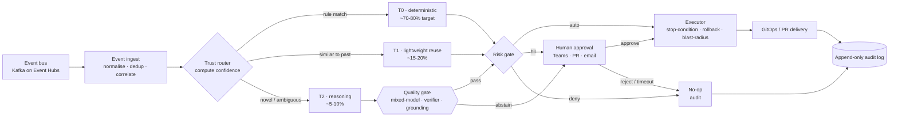

import { Card, CardGrid } from "@astrojs/starlight/components";
import TrustTierFunnel from "../../components/TrustTierFunnel.astro";
import ActionOntologyExplorer from "../../components/ActionOntologyExplorer.astro";

## How AIOpsPilot resolves events

A single control loop: normalise, route by confidence, gate by risk, and always audit. LLMs only see the residual minority that the deterministic tiers explicitly abstain on.

<TrustTierFunnel />

## What autonomy earns you (design targets)

<ul class="impact-list">
  <li>
    ↳
    <strong>~70-80% of events resolved deterministically.</strong> Rules,
    policies, and checklists decide the repeatable majority. No model call.
  </li>
  <li>
    ↳
    <strong>~15-20% resolved by lightweight pattern reuse (T1).</strong>
    Embedding similarity to past resolved incidents, small classifiers, no
    frontier model.
  </li>
  <li>
    ↳
    <strong>Only ~5-10% reach the reasoning tier (T2).</strong> Mixed-model
    cross-check plus deterministic verifier - the model proposes, the
    verifier disposes.
  </li>
  <li>
    ↳
    <strong>Every autonomous action carries four invariants.</strong>
    Stop-condition · rollback path · blast-radius limit · audit-log entry.
    Missing any of the four ⇒ the action is HIL, not AUTO.
  </li>
  <li>
    ↳
    <strong>New capabilities land in shadow, never as a surprise.</strong>
    Promotion to enforce is a separate, measurable gate against the Phase 0
    baseline.
  </li>
  <li>
    ↳
    <em>All figures above are design targets, not measured results.</em>
    AIOpsPilot never claims a multiplier without a paired baseline
    measurement.
  </li>
</ul>

## Three domains, one control plane

Each domain shares the same event-driven, risk-gated core; they differ only in the rules and actions they load.

<CardGrid stagger>
  <Card title="Change Safety · Phase 1" icon="pencil">
    Rule catalog, T0 policy gate, remediation PRs. Change gate lands in shadow first, then promotes to enforce.
  </Card>
  <Card title="Resilience · Phase 3" icon="rocket">
    Scheduled resilience testing, DB DR drills, blast-radius-bounded chaos experiments - always with a stop-condition and rollback path.
  </Card>
  <Card title="Cost Governance · Phase 3" icon="approve-check">
    Cost anomaly detection, right-sizing PRs, budget guardrails per resource group. Auto vs HIL by risk classification.
  </Card>
</CardGrid>

## The action ontology

<ActionOntologyExplorer />

## Delivery phases

Strictly sequential - each phase names its predecessor. Read the reference docs first, then the phases in order.

<ol class="phase-timeline">
  <li>
    
    
Phase 0

    
Instrument &amp; unblock

    
KPI dashboard, baseline report, identity and policy blockers resolved.

    
<strong>Exit:</strong> reproducible baseline exists.

  </li>
  <li>
    
    
Phase 1

    
Rule catalog &amp; T0

    
Rule catalog normalised, T0 policy gate live, remediation PRs generated automatically.

    
<strong>Exit:</strong> change gate runs in shadow across the target scope.

  </li>
  <li>
    
    
Phase 2

    
Quality gate &amp; T1

    
Continuous rule update, LLM quality gate with mixed-model cross-check, embedding-based pattern reuse (T1).

    
<strong>Exit:</strong> auto-resolution rate validated vs the Phase 0 baseline.

  </li>
  <li>
    
    
Phase 3

    
Integrated autonomy

    
Unified control loop, DR/Chaos scheduler with DB DR drills, FinOps auto-actions with risk-gated approvals.

    
<strong>Exit:</strong> autonomous MVP across all three domains.

  </li>
  <li class="future">
    
    
Phase 4 · TBD

    
Scale

    
Continuous measurement, pattern-library growth, model cost/quality tracking, scalability. Multi-cloud expansion is TBD.

  </li>
</ol>

:::note[Scope reminder]
This repo is **generic and customer-agnostic**. Everything is parameterised;
per-customer values live in a fork. Azure is the only implemented target - non-Azure
providers and Phase 4 multi-cloud expansion are TBD.
:::
