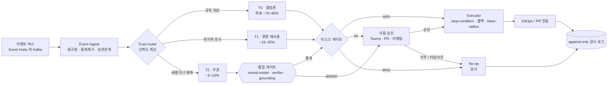

import { Card, CardGrid } from "@astrojs/starlight/components";

## AIOpsPilot 이 이벤트를 해소하는 방식

하나의 제어 루프: 정규화하고, 신뢰도로 라우팅하고, 리스크로 게이팅하고, 항상 감사합니다. LLM 은 결정론 티어들이 명시적으로 abstain 한 잔여 소수만 봅니다.

## 자율성이 여러분에게 주는 것 (설계 목표)

<ul class="impact-list">
  <li>
    ↳
    <strong>이벤트의 ~70–80% 가 결정론적으로 해소.</strong> 규칙 · 정책 ·
    체크리스트가 반복 가능한 다수를 결정. 모델 호출 없음.
  </li>
  <li>
    ↳
    <strong>~15–20% 는 경량 패턴 재사용(T1) 으로 해소.</strong> 과거 해소된
    인시던트와의 임베딩 유사도, 소형 분류기, frontier 모델 없음.
  </li>
  <li>
    ↳
    <strong>추론 티어(T2) 에 도달하는 것은 ~5–10% 뿐.</strong> mixed-model
    교차 검증 + 결정론 verifier — 모델은 제안하고, verifier 가 처분합니다.
  </li>
  <li>
    ↳
    <strong>모든 자율 액션은 네 불변식을 지닌다.</strong> stop-condition ·
    롤백 경로 · blast-radius 제한 · 감사 로그 항목. 넷 중 하나라도 없으면
    액션은 AUTO 가 아니라 HIL 로 갑니다.
  </li>
  <li>
    ↳
    <strong>새 능력은 shadow 로 시작하며, 결코 깜짝 등장하지 않는다.</strong>
    Enforce 로의 승격은 Phase 0 기준선 대비 별도의 측정 가능한 게이트입니다.
  </li>
  <li>
    ↳
    <em>위 수치는 모두 설계 목표이지 측정된 결과가 아닙니다.</em>
    AIOpsPilot 은 짝을 이룬 기준선 측정 없이 배수를 주장하지 않습니다.
  </li>
</ul>

## 세 도메인, 하나의 제어 평면

세 도메인 모두 같은 이벤트 기반 · 리스크 게이트 코어를 공유한다. 다른 것은 각 도메인이 로드하는 규칙과 액션뿐이다.

<CardGrid stagger>
  <Card title="Change Safety · Phase 1" icon="pencil">
    규칙 카탈로그, T0 정책 게이트, remediation PR. Change 게이트는 먼저 shadow로 도입한 뒤 enforce로 승격한다.
  </Card>
  <Card title="Resilience · Phase 3" icon="rocket">
    스케줄링된 회복력 검증, DB DR 훈련, blast-radius 제한 카오스 실험 — 항상 stop-condition과 롤백 경로를 갖춘다.
  </Card>
  <Card title="Cost Governance · Phase 3" icon="approve-check">
    비용 이상 탐지, 라이트사이징 PR, 리소스 그룹별 예산 가드레일. 리스크 분류에 따라 auto vs HIL로 나뉜다.
  </Card>
</CardGrid>

## 배포 단계 (Delivery Phases)

엄격한 순차 진행 — 각 단계는 이전 단계를 지명한다. 참조 문서를 먼저 읽고 단계 문서를 순서대로 따라가세요.

<ol class="phase-timeline">
  <li>
    
    
Phase 0

    
Instrument &amp; unblock

    
KPI 대시보드, 기준선 보고서, 아이덴티티 · 정책 블로커 제거.

    
<strong>Exit:</strong> 재현 가능한 기준선(reproducible baseline) 확보.

  </li>
  <li>
    
    
Phase 1

    
Rule catalog &amp; T0

    
규칙 카탈로그 정규화, T0 정책 게이트 가동, remediation PR 자동 생성.

    
<strong>Exit:</strong> Change 게이트가 대상 스코프에서 shadow 모드로 운영.

  </li>
  <li>
    
    
Phase 2

    
Quality gate &amp; T1

    
규칙 지속 업데이트, mixed-model 교차 검증 LLM 품질 게이트, 임베딩 기반 패턴 재사용(T1).

    
<strong>Exit:</strong> Phase 0 기준선 대비 자동해소율 검증.

  </li>
  <li>
    
    
Phase 3

    
Integrated autonomy

    
통합 제어 루프, DR/Chaos 스케줄러(DB DR 훈련 포함), 리스크 게이트가 승인 흐름을 감독하는 FinOps 자동 액션.

    
<strong>Exit:</strong> 세 도메인 전반의 자율 MVP.

  </li>
  <li class="future">
    
    
Phase 4 · TBD

    
Scale

    
지속 측정, 패턴 라이브러리 성장, 모델 비용/품질 추적, 확장성. 멀티 클라우드 확장은 TBD.

  </li>
</ol>

:::note[스코프 안내]
이 리포지토리는 **범용이자 고객 비의존적(customer-agnostic)** 이다. 모든 값은
매개변수화되어 있으며 고객별 값은 포크(fork)에 존재한다. **Azure만 구현 대상**이며,
비-Azure 프로바이더와 Phase 4 멀티 클라우드 확장은 TBD.
:::
