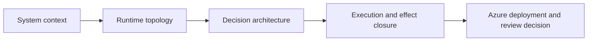

# FDAI Target Architecture deck plan

이 계획은 FDAI Target Architecture 25장 덱을 아키텍처 중심으로 다시 구성합니다. 기존의
카드형 설명을 줄이고 시스템 경계, 런타임 토폴로지, 데이터와 이벤트 흐름, 신원과 권한,
실행과 복구, Azure 배치를 발표 화면에서 읽을 수 있는 연결 다이어그램으로 설명합니다.

> **검토 범위:** 이 덱은 Azure 목표 아키텍처 기준선의 조건부 수락을 돕습니다. 프로덕션
> 배포 승인과 적용 모드 권한은 별도 근거가 필요하며 현재 차단 상태를 유지합니다.

## Audience and decision

- **대상 독자:** 아키텍트, 플랫폼 책임자, 보안 검토자, SRE 및 운영 책임자입니다.
- **문제:** 현재 덱은 안전 원칙과 상태 설명은 많지만 구성 요소의 위치, 연결, 데이터 흐름,
  책임 경계를 한눈에 추적할 아키텍처 보기가 부족합니다.
- **결정:** 시스템 경계, 5개 서비스, 제어 루프, 실행 경계와 Azure day-zero 배치가 하나의
  일관된 기준선인지 조건부 승인, 수정 후 재검토, 판단 보류 중 하나를 선택합니다.
- **여정 및 수준:** Architecture & Validation, L200, 25장, 40분입니다.

## Architecture story

각 장은 앞 장의 구성 요소를 확대합니다. 같은 이름은 슬라이드가 바뀌어도 같은 책임과 색을
유지합니다. 논리 아키텍처와 Azure 배치 아키텍처를 섞지 않고, 마지막 장에서만 두 보기를
검토 결정으로 다시 결합합니다.

## Slide plan

| Slide | Primary question | Diagram | Required architecture content | State |
|-------|------------------|---------|-------------------------------|-------|
| 1 | 이 덱은 무엇을 설명합니까? | Sparse title | 제목, 한 줄 부제, 최소 메타데이터 | Review |
| 2 | FDAI 전체 구조는 어떻게 연결됩니까? | L0 reference architecture | 운영자, 신호, 제어 영역, 종속 기능, 실행, 관측 | Contract |
| 3 | FDAI 시스템 경계 밖과 안에는 무엇이 있습니까? | C4 system context | 사람 접점, 외부 시스템, FDAI, 관리 대상 클라우드 | Contract |
| 4 | 다섯 아키텍처 레이어는 어떤 계약을 공유합니까? | Layer stack | Console, ChatOps, control plane, delivery, catalog | Contract |
| 5 | 하나의 신호는 어떻게 검증된 효과로 닫힙니까? | Closed control loop | ingest, tier, quality, risk, approval, execute, observe, audit | Contract |
| 6 | 다섯 배포 서비스는 어디에 놓입니까? | Runtime container topology | Core, Operator, Ingestion API, Worker, Executor | Validated |
| 7 | 서비스 사이는 어떻게 연결됩니까? | Inter-service event topology | HTTPS ingress, Kafka topics, commands, receipts, projections | Validated |
| 8 | Core 내부 구성 요소는 어떤 방향으로 의존합니까? | Component architecture | ingest, trust router, tiers, gates, orchestration, providers | Current |
| 9 | 15개 에이전트는 어떤 객체 흐름을 소유합니까? | Agent data-flow map | all 15 agents, single writer, fan-out, authority roles | Contract |
| 10 | 상태와 근거는 누가 쓰고 누가 읽습니까? | Data ownership map | PostgreSQL roles, audit, ontology projection, case history | Validated |
| 11 | 외부 사실은 어떻게 판단 근거가 됩니까? | Evidence admission architecture | authoritative sources, receipt checks, context, DecisionCase | Current |
| 12 | 온톨로지는 무엇을 연결하고 무엇을 하지 않습니까? | Semantic graph | scope, intent, reality, decision, effect, authority outside graph | Contract |
| 13 | 시간과 리비전은 재생을 어떻게 보장합니까? | Temporal architecture | event time, recorded time, cutoff, immutable v1 and v2 | Contract |
| 14 | T0, T1, T2는 어떻게 선택됩니까? | Tier routing diagram | deterministic path, verified reuse, T2 quality gate, hold | Current |
| 15 | 최종 실행 상한은 어떻게 계산됩니까? | Unified RiskGate diagram | first-match table, six ceilings, health and kill switch, min result | Current |
| 16 | 적격 작업은 어떤 전달 경로를 택합니까? | Execution dispatch diagram | PR-native, direct API, PR-manual, tool call | Current |
| 17 | 실제 변경은 어디에서만 발생합니까? | Isolated Executor architecture | command, seven safeguards, lock, identity, provider, receipt | Validated and gap |
| 18 | 사람과 서비스 신원은 어디서 분리됩니까? | Trust-zone diagram | Entra, Console, Operator, Core, Executor, provider scopes | Validated |
| 19 | 성공은 누가 확인합니까? | Effect-verification loop | ExpectedEffect, ActionRun, independent observer, outcome, audit | Gap |
| 20 | 의존성 장애는 권한을 어떻게 낮춥니까? | Degradation and recovery topology | Saga, Vidar, Forseti, Var, Heimdall, Executor failure paths | Contract |
| 21 | Azure 세부 구현은 Core에서 어떻게 격리됩니까? | Ports and adapters architecture | eight provider-neutral contracts and Azure adapters | Current |
| 22 | Azure day-zero 배치는 어떤 네트워크 경계를 가집니까? | Azure deployment topology | region, VNet, subnets, Container Apps, Event Hubs, PostgreSQL | Target and validated parts |
| 23 | Azure 안팎의 요청과 데이터는 어떤 경로로 이동합니까? | Numbered network/data-flow diagram | browser, Entra, private ingress, event, data, model, Git, ChatOps | Status-separated |
| 24 | 코드 배포와 기능 승격은 왜 다른 경로입니까? | Release and promotion architecture | signed image, exact plan, service rollout, separate shadow promotion | Status-separated |
| 25 | 어떤 기준선을 승인하고 무엇을 차단합니까? | Architecture decision map | accepted boundary, eight production blockers, three decisions | Decision |

## Diagram rules

- 슬라이드 2-24 중 최소 18장은 구성 요소, 시스템 또는 신뢰 경계와 방향이 있는 연결선을
  포함합니다.
- 주요 다이어그램은 카드 나열이 아니라 하나의 좌표계 안에서 노드, 그룹 경계, 포트,
  연결선, 방향, 범례를 함께 렌더링합니다.
- 연결선은 `request`, `event`, `approval`, `mutation`, `observation`, `audit`, `rollback`을
  색과 선 모양, 텍스트 라벨로 함께 구분합니다.
- Core, Operator, Ingestion, Worker, Executor, Event Bus, PostgreSQL, Git, ChatOps는 모든
  슬라이드에서 같은 의미와 시각 식별자를 유지합니다.
- 목표 요소는 점선, 현재 구현은 실선, 보존된 검증은 상태 배지로 구분합니다. 색만으로
  상태를 전달하지 않습니다.
- 핵심 본문은 24px 이상, 슬라이드 제목은 37-43px, 근거는 13-16px를 유지합니다.

## Consistency contract

- 15개 에이전트는 15개 Azure 서비스가 아닙니다. Core 내부의 책임 소유자입니다.
- 다섯 독립 서비스만 런타임 배포 단위로 표시합니다.
- Core와 Console은 관리 대상 리소스 변경 신원을 갖지 않습니다.
- Isolated Executor만 승인된 effect role의 유일한 적격 보유자로 표시합니다.
- T2만 mixed-model quality gate를 통과하고 모든 Tier는 공통 RiskGate를 통과합니다.
- 사람 승인은 typed event로 런타임에 다시 들어가며 Executor를 직접 호출하지 않습니다.
- 온톨로지는 의미와 읽기 맥락을 제공하지만 판단, 승인, 실행 권한을 만들지 않습니다.
- API 응답, broker 수락 또는 PR 병합은 성공이 아닙니다. 독립 관측이 효과를 마감합니다.
- Azure는 유일한 구현 대상입니다. 비Azure adapter는 구현 완료로 표시하지 않습니다.
- 5개 서비스 분해와 실행 신원 분리는 보존된 검증 근거로 표시합니다.
- Workflow 및 Isolated Executor의 일곱 안전장치와 독립 효과 마감의 종단 동등성은 진행
  중으로 표시합니다.
- 자동 환경 승격, traffic-split canary, SLO rollback, Console blue/green은 목표 상태입니다.
- 설계 검토는 conditional이고 프로덕션 승인은 blocked입니다.

## Evidence map

| Concern | Primary source |
|---------|----------------|
| Constitution and authority | `docs/roadmap/architecture/fdai-constitution.md` |
| Canonical architecture views | `docs/user-guide/architecture.md` |
| Headless app shape | `.github/instructions/app-shape.instructions.md` |
| Five services | `docs/roadmap/architecture/service-decomposition-execution-plan.md` |
| Agent ownership | `docs/roadmap/agents/agent-pantheon.md` |
| Semantic read model | `docs/roadmap/architecture/operating-ontology.md` |
| Tier and RiskGate | `docs/roadmap/decisioning/execution-model.md` |
| Identity and safeguards | `docs/roadmap/architecture/security-and-identity.md` |
| Provider contracts | `docs/roadmap/architecture/csp-neutrality.md` |
| Azure deployment | `docs/roadmap/deployment/deployment.md` |
| Review decision | `docs/roadmap/architecture/architecture-review-board.md` |
| Machine review state | `config/architecture-review.yaml` |

## Visual hardening revision - 2026-09-11

현재 아키텍처 문서와 기계 검토 상태를 다시 대조한 결과, 25장의 시스템 경계, 다섯 서비스,
신원 분리, 실행 상한, 독립 효과 검증, Azure 구현 상태에는 권한 또는 사실성 정정이 필요한
모순이 없었습니다. 이번 리비전은 의미를 바꾸지 않고 다음 발표 결함을 수정합니다.

- 긴 제목과 오른쪽 위 슬라이드 번호를 서로 다른 세로 영역으로 분리합니다.
- 좁은 시스템 경계의 label, title, status를 한 줄에 압축하지 않고 명확한 위계로 쌓습니다.
- 레이어, 제어 루프, 서비스 표지의 행 높이를 본문 24px 기준으로 다시 배분합니다.
- 짧은 connector gap을 침범하던 중복 라벨은 제거하고 방향, 선 종류, 범례로 의미를
  유지합니다. 관계 이름이 아키텍처 의미인 semantic graph의 edge label은 유지합니다.
- 제목 슬라이드에는 `catalog.json`의 실제 `lastEditedAt` 날짜를 표시합니다.

시각 검사는 자동 bounds 결과만으로 종료하지 않습니다. 25장 데스크톱 렌더를 실제 크기로
직접 읽고, 이후 tablet, mobile, fullscreen, print를 실행합니다. 자동 검사는 최상위 슬라이드
번호 영역과 제목 영역 사이의 겹침도 별도 semantic region 충돌로 판정합니다.

## Clipping remediation - 2026-09-11

The operator's second review exposed a gap in the earlier evidence: text can fit a node or the
overall visual while a containing boundary clips its last row. The shared browser also uses
different font metrics from local Chromium. A green local screenshot check is not proof that the
same fixed-height rows fit both font environments.

This revision keeps all 25 slides and the existing authority statements. It gives content-heavy
boundaries intrinsic row heights, makes dense summary labels less repetitive, and reserves clear
space for semantic edge names. Short topic summaries on the service overview can be removed because
the next slide owns the complete channel explanation. Detached, unmeasured auxiliary arrows can be
removed; indispensable relationships stay in the text or use a measured connection. Node counts are
not a reason to retain misleading decorative edges.

Check every painted text range against every clipping ancestor, including labels marked
`aria-hidden`. Check container scroll dimensions as well as glyph bounds, and reject an inspection
that sees no text during a hidden or animated frame. Before reviewing the deck, prove that the
checker detects deliberately clipped nested rows and overlapping edge labels at desktop and scaled
sizes. Inspect all 25 screenshots individually, repeat the geometry check in the shared browser,
and retain the default DRAFT state until the operator confirms the revised manual.

## Critique and validation

1. Compare every architecture node, edge, status, and authority label with its source.
2. Run at least 25 executable critique rounds covering all slides and cross-slide consistency.
3. Render all slides at 1440x900 and inspect every slide at full size before responsive work.
4. Measure canvas, text, region, contrast, and every named connector endpoint.
5. Render at 993x641, 390x844, real fullscreen, and print.
6. Export 25 PDF pages and verify every MediaBox is 1152x648.
7. Ask an independent read-only reviewer to search for factual contradictions and misleading state.
8. Record only the final digest-bound checks that actually passed.
